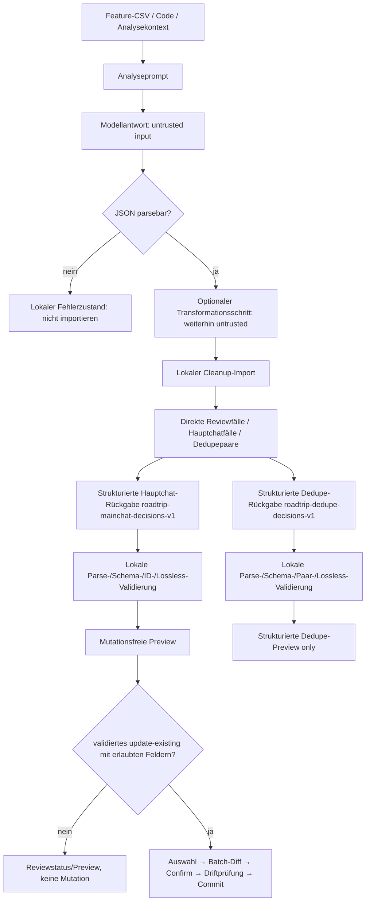
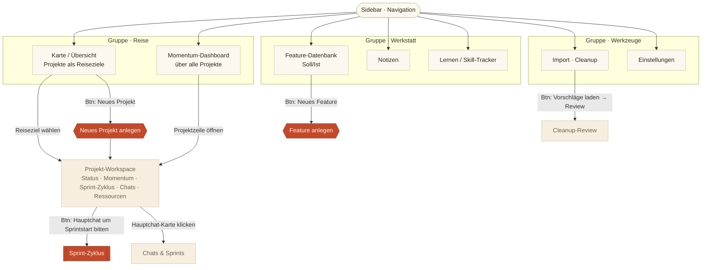
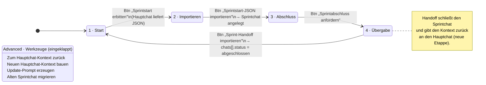
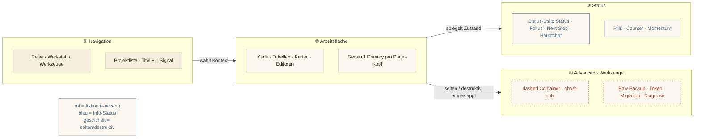

# Roadtrip · Atlas — Architektur-Diagramme

> Aktualisierung 2026-07-18: Diese Datei beschreibt nicht mehr nur die
> Atlas-Skin-Navigation aus Sprint 25, sondern zusätzlich den aktuellen
> Roadtrip-Architektur- und Workflow-Contract. Mermaid-Diagramme unten bleiben
> Design-/IA-Referenz; Roadmap-Hinweise sind nicht als implementiert zu lesen.

## Aktueller Architektur-Refresh vom 18.07.2026

Diese Ergänzung beschreibt den aktuellen Produkt- und Architekturstand. Die älteren
Atlas-Mermaid-Diagramme darunter bleiben IA-/Designreferenz, aber nicht vollständige
Beschreibung des heutigen Analyse-/Cleanup-Pfads.

### State-, Config- und Runtime-Schichten

Der kanonische persistente State wird in `index.html` über `defaultState()`
initialisiert und beim Laden/Import/Merge normalisiert. Aktuell umfasst er neben
Metadaten (`version`, `createdAt`, lokale Save-/Export-/Sync-Zeitstempel) die
Arrays `projects`, `features`, `notes`, `analyses`, `chats`, `importVersions`,
`pullRequests`, `unmatchedNotes` sowie `deletedIds` für Tombstone-/Löschschutz.
Diese Liste ist ein Codebeleg zum Stand 18.07.2026, kein Freibrief für beiläufige
Schemaänderungen.

Config ist getrennt vom State und enthält u. a. Theme/Font, Gist-/Raw-Gist-IDs und
Tokens, OpenAI-Modellvorgabe sowie Trello-Key/-Token/-Board. UI-/Runtime-State liegt
überwiegend im nicht-kanonischen `ui`-Objekt: Import-Drafts, Cleanup-Review-Inputs,
Hauptchat-/Dedupe-Preview, Auswahlzustände, Kanban-Toggles und temporäre
Prompt-Ausgaben. Export-/Backup-Artefakte sind abgeleitete Übergabeformen
(JSON/CSV/ZIP/Markdown) und nicht automatisch neue kanonische Persistenzmodelle.

### Implementierte Funktionsbereiche aus dem Code

- IndexedDB-first mit localStorage-Fallback, JSON Import/Export, ZIP-Backup und
  optionalem verschlüsseltem Gist-Sync.
- Projekt-, Feature-, Notes-, Analyse-, Chat-, Sprint-/Handoff- und Importversionen.
- Pull-Request-Bezüge als eigener State-Bereich und als Chat-/Projektkontext.
- Feature- und Notes-CSV-Exporte, projektbezogene CSV-Dateien im ZIP-Backup sowie
  Feature-CSV-Pfade für Code-/Cleanup-Analyse.
- Optionales `featureFlow` mit Mermaid-/Feature-Flow-Preview.
- Obsidian-Kanban-Markdown-Export für Projekt- und Sprintkarten.

### Analyse-/Cleanup-End-to-End-Pfad

### Trust Boundaries

- Jede Modellantwort ist untrusted input, auch wenn der Prompt ausschließlich
  gültiges JSON verlangt.
- Parse, Schema-/Projekt-/Feature-ID-Validierung, Normalisierung und Lossless-
  Guards laufen lokal vor jeder Preview.
- Preview ist keine Mutation. Ein erfolgreicher Preview-Check darf nicht als
  angewendete Featureänderung dokumentiert werden.
- Die strukturierte Dedupe-Rückgabe über `roadtrip-dedupe-decisions-v1` ist
  Preview-only: Aus dieser Preview gibt es keinen Apply-, Merge-, Archivierungs-,
  Lösch-, Status-, Pool- oder Duplicate-Markierungs-Pfad. Der davon getrennte
  direkte Cleanup-Review-Papierkorbpfad für konkret identifizierte Dubletten ist
  ein bestehender bestätigungspflichtiger Sonderpfad; im CSV-Transformationsmodus
  bleibt diese direkte Aktion Review-only.
- Hauptchat-Entscheidungen dürfen nur über `roadtrip-mainchat-decisions-v1` in die
  lokale Preview. Fälle ohne Feature-ID dürfen keine fremden Featurebindungen
  einführen. Teilantworten und ein leeres `decisions`-Array sind gültig und
  mutationsfrei; zurückgegebene `caseId`s müssen bekannt und innerhalb der Antwort
  eindeutig sein.
- Dedupe-Entscheidungen dürfen nur über `roadtrip-dedupe-decisions-v1` in die
  lokale strukturierte Preview; A/B-IDs und `canonicalFeatureId`/`duplicateFeatureId`
  sind auf das lokale Paar begrenzt. Teilantworten und ein leeres
  `dedupeDecisions`-Array sind gültig und mutationsfrei; zurückgegebene `pairId`s
  müssen bekannt und innerhalb der Antwort eindeutig sein.

### Confirm-/Commit-MVP

Der bestehende Commitpfad ist eng begrenzt:

- Status: code-seitig implementiert und statisch geprüft.
- Eingang: nur validierte Hauptchat-Entscheidungen `update-existing`.
- Felder: nur `title`, `description`, `category`.
- Ablauf: explizite Auswahl, Batch-Diff, menschlicher Confirm, Driftprüfung,
  Kandidaten-State, Schutzlistenprüfung, `saveAsync()` und Rollback bei Fehlern.
- Nicht enthalten: Status, Pool, Promotion, Create, Split, Merge, Archivierung,
  Löschung oder strukturierter Dedupe-Apply.
- Noch offen: natürlicher Browser-Realnachweis für Commit, Driftprüfung,
  Hard-Reload-Persistenz und Batchatomarität.

### Persistente Cleanup-Workbench — Patch-1-Grundlage

Der Cleanup-Arbeitsstand bleibt überwiegend temporärer Runtime-/UI-State; lokale
Previews, Auswahl, Textareas und Commit-Kandidaten werden weiterhin nicht als
nach-Reload-commitfähiger Zustand persistiert.

Patch 1 der Cleanup-Workbench speichert gültig importierte Cleanup-Ergebnisse als
Analyse-Records in `S.analyses` mit `type: 'cleanup-workbench-p1'` und
`schemaVersion: 'roadtrip-cleanup-workbench-v1'`. Der Record enthält schlanke
`source`-Metadaten, normalisierte `result`-Daten (`summary`, `proposals`,
`openQuestions`), stabile lokale `caseId`/`pairId` sowie `reviewState.runStatus`
und eine Case-Map für spätere Fallentscheidungen. Die bestehende analyses-Schiene
trägt diese Records dadurch automatisch durch JSON-Export/-Import, ZIP-Backup,
Gist-Sync/-Merge, Tombstones und projektbezogene Löschung; es gibt keine neue
Root-Collection.

Noch nicht Teil von Patch 1 sind persistierte menschliche Entscheidungen,
Filter/Zähler nach Fallstatus, neue Mutationspfade oder eine neue Commit-Engine.
Validierte `update-existing`-Fälle dürfen weiterhin ausschließlich über den
bestehenden Diff-/Confirm-/Commitpfad laufen; Dedupe bleibt Preview-only.

### Weiterhin geschützte, aber nicht aktuelle Hauptpriorität

Sync, Backup, Tombstones, Trello, Import/Export und Gist-Verschlüsselung bleiben
Schutzbereiche. Historische Sync-Safety-Audits bleiben relevant für spätere enge
Sync-Sprints, dominieren aber nicht die aktuelle Produktpriorität nach dem
Cleanup-Realbetrieb vom 18.07.2026.

## Historischer Architektur-Contract aus der Atlas-/Sprint-39-Dokumentation

Roadtrip ist eine browserbasierte Single-File-HTML-/Vanilla-JS-App. Der produktive
App-Code liegt in `index.html`; es gibt keinen Framework- oder Build-Step.

### Technische Grundrichtung

- Single-File HTML mit Vanilla JS und CSS Custom Properties.
- Lokal-first: IndexedDB-first mit localStorage-Fallback.
- JSON Export/Import für portable Datenübergaben.
- ZIP-Backup als Sicherheits- und Archivierungsweg.
- Optionaler verschlüsselter bidirektionaler GitHub-Gist-Sync.
- Tombstone-Löschschutz gegen versehentliche Wiederbelebung gelöschter Daten.
- Optionale Trello-Anbindung.

### Kernbereiche und Flüsse

- Projekte bilden den Hauptkontext für Features, Chats, Sprints, Notes und
  Ressourcen.
- Feature-Datenbank trennt planned und implemented Features und stützt
  Soll-/Ist-Arbeit.
- Planned Features enthalten Detailfelder `purpose`, `workflowContext`,
  `acceptanceCriteria` und `sourceContext`.
- `featureFlow` ist ein optionales Textfeld für Mermaid-/Feature-Flow-Quelltext.
- Mermaid Preview ist eine rein visuelle, defensive Preview-Schicht für befülltes
  `featureFlow`; sie ist keine Datenmodelländerung und darf den gespeicherten Text
  nicht verändern.
- Notes Workspace bleibt eigener Arbeitsbereich mit geschütztem Datenmodell.
- Chat-Struktur unterscheidet Hauptchat-, Sprintchat- und weitere Arbeitskontexte.
- Sprint-/Handoff-Workflow führt Kontext zwischen Roadtrip, Hauptchat, Sprintchat
  und zurück in Roadtrip.

### Schutzbereiche

Diese Bereiche nur mit explizitem Auftrag und eigenem Review anfassen:

- Sync und Gist-Sync-Algorithmus
- Verschlüsselung
- ZIP-Backup
- Tombstones
- JSON Import-/Export-Verträge
- Sprintstart-/Handoff-Verträge
- Chat-Workflow-Verträge
- Projekt-Schema und State-Schema
- Notes-Workspace-Datenmodell
- `featureFlow`-/Mermaid-Preview-Vertrag

### Docs-only-Sprint-Regel

Docs-only-Sprints ändern keine Codepfade:

- kein `index.html`
- keine HTML-/JS-/CSS-App-Code-Dateien
- keine App-Feature-Implementierung
- keine Handoff-, Import-/Export-, Sync- oder Datenmodell-Vertragsänderung
- Checks über Diff, Dateiliste und Nachweis unveränderter App-Dateien statt
  JS-Syntaxcheck, sofern wirklich kein App-Code geändert wurde

### Architektur-/Workflow-Roadmap

Folgende Punkte sind Ausblick, nicht implementierte Architektur:

- Sprintabschluss soll Codeanalyse-Bedarf einschätzen statt reflexhaft
  Voll-Codeanalyse empfehlen.
- Sprint-Handoffs können später auf wiederverwendbare SOPs geprüft werden.
- Normaler Sprintstart kann später eine kleine Hauptchat→Feature-Database-Mitnahme
  unterstützen; der große Hauptchat-Abgleich bleibt separat.
- Open Questions Workspace für Fragen aus Projekten, Features, Handoffs und
  Backfills.
- Selektives Feature-Merge für übersprungene Import-Kandidaten mit Feldvergleich
  und Review-Aktionen.

---

> Mermaid-Quellcode. In jedem Mermaid-fähigen Renderer (GitHub, VS Code, Obsidian, mermaid.live) anzeigbar.
> Drei Diagramme: (a) Informationsarchitektur/Navigation · (b) Sprint-Zyklus als Statusdiagramm · (c) Modi-Trennung.

---

## (a) Informationsarchitektur & Navigationshierarchie

Zeigt die neue Sidebar-Gruppierung, den ruhigen Startpunkt **Karte**, und welche Aktion (Button) welchen Übergang auslöst.

**Kerngedanke:** Die Sidebar führt nur **Navigation**. Alle Projekt-Metadaten erscheinen erst im **Projekt-Workspace** nach Auswahl. Akzent-Buttons (rot) sind die genau einen Primäraktionen pro Bereich.

---

## (b) Sprint-Zyklus als Statusdiagramm

Der lineare Vier-Etappen-Zyklus. Jeder Übergang ist an genau einen Primary-Button gebunden.

**Regel:** Immer dieselbe Reihenfolge, immer genau ein Primary an der aktuellen Etappe. Migrations-/Kontext-Werkzeuge liegen eingeklappt im Advanced-Footer, nie auf Primary-Ebene.

---

## (c) Modi-Trennung · Navigation / Arbeitsfläche / Status / Advanced

Die vier UI-Modi und welche Komponenten in welchen Modus gehören.

**Lesart:** Navigation wählt den Kontext, die Arbeitsfläche trägt genau eine Primäraktion, der Status spiegelt ruhig den Zustand (Pills/Strip), und Advanced bündelt alles Seltene/Destruktive eingeklappt. Farbe trennt die Bedeutung: **Rot ist immer Aktion**, niemals Dekoration.

---

*Roadtrip · Architektur · Atlas-Skin · Sprint 25*

### Persistente Cleanup-Workbench — Fallentscheidungen, Filter und Abschluss

Der zweite P1-Schritt erweitert die bestehende `S.analyses`-Workbench additiv:
Cases in `reviewState.cases` tragen jetzt kanonische menschliche Reviewstatus
`open`, `reviewed`, `rejected` oder `deferred` plus `updatedAt`, ohne Feature-,
Pool-, Queue-, Papierkorb-, Tombstone- oder Commitpfade zu berühren. Frische
Modellimporte bleiben untrusted input; Status, Zeitstempel, lokale IDs und
Runtimeflags werden daraus nicht übernommen.

Die Review-UI leitet bei jedem Render Fallgruppen, Statusfilter, Fortschritts-
zähler, nächste Aktionen und Abschlussfähigkeit aus dem normalisierten Run ab.
Gespeichert werden nur echte menschliche Mutationen: Fallentscheidungen,
Abschluss oder explizite Wiederöffnung. Das bloße Öffnen beziehungsweise Wieder-
aufnehmen gespeicherter Runs ist read-only, hydriert nur die UI und verändert weder
`resumedAt` noch `updatedAt`. JSON-Export/-Merge, ZIP-Backup/-Restore,
Gist-Payload/-Merge, Tombstonefilterung und projektbezogene Löschung laufen dadurch
weiterhin über die bestehende analyses-Schiene. Gleichzeitige Bearbeitung desselben
Runs bleibt ein Whole-Record-Merge-Risiko.

Abschluss ist geschlossen definiert: Kein normalisierter Case darf `open` sein.
Zurückgestellte Fälle und globale offene Fragen blockieren nicht. Open Questions
werden als globale Sektion dargestellt und nicht als künstliche Cases gespeichert.
Ein gültiger Run ohne Proposals ist abschließbar und wird in der UI eindeutig als
gültiger leerer Cleanup-Run dargestellt. Abgeschlossene Runs sind lesbar,
deaktivieren direkte Fallentscheidungen und benötigen eine explizite Wiederöffnung,
die Case-Zustände und Case-Zeitstempel unverändert lässt.
