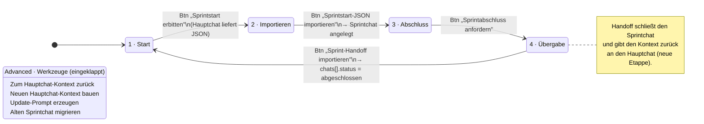
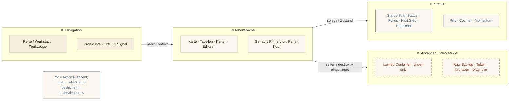

# Roadtrip · Atlas — Architektur-Diagramme

> Mermaid-Quellcode. In jedem Mermaid-fähigen Renderer (GitHub, VS Code, Obsidian, mermaid.live) anzeigbar.
> Drei Diagramme: (a) Informationsarchitektur/Navigation · (b) Sprint-Zyklus als Statusdiagramm · (c) Modi-Trennung.

---

## (a) Informationsarchitektur & Navigationshierarchie

Zeigt die neue Sidebar-Gruppierung, den ruhigen Startpunkt **Karte**, und welche Aktion (Button) welchen Übergang auslöst.

**Kerngedanke:** Die Sidebar führt nur **Navigation**. Alle Projekt-Metadaten erscheinen erst im **Projekt-Workspace** nach Auswahl. Akzent-Buttons (rot) sind die genau einen Primäraktionen pro Bereich.

---

## (b) Sprint-Zyklus als Statusdiagramm

Der lineare Vier-Etappen-Zyklus. Jeder Übergang ist an genau einen Primary-Button gebunden.

**Regel:** Immer dieselbe Reihenfolge, immer genau ein Primary an der aktuellen Etappe. Migrations-/Kontext-Werkzeuge liegen eingeklappt im Advanced-Footer, nie auf Primary-Ebene.

---

## (c) Modi-Trennung · Navigation / Arbeitsfläche / Status / Advanced

Die vier UI-Modi und welche Komponenten in welchen Modus gehören.

**Lesart:** Navigation wählt den Kontext, die Arbeitsfläche trägt genau eine Primäraktion, der Status spiegelt ruhig den Zustand (Pills/Strip), und Advanced bündelt alles Seltene/Destruktive eingeklappt. Farbe trennt die Bedeutung: **Rot ist immer Aktion**, niemals Dekoration.

---

*Roadtrip · Architektur · Atlas-Skin · Sprint 25*
