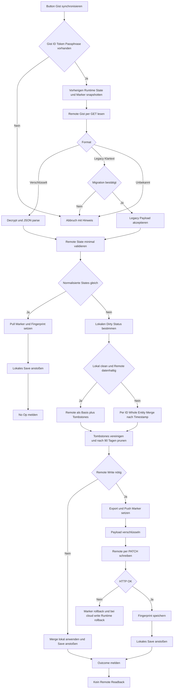
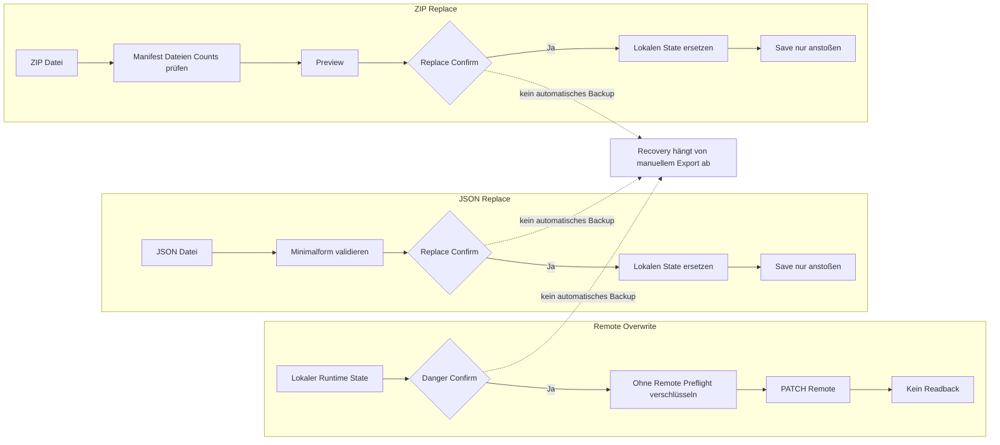
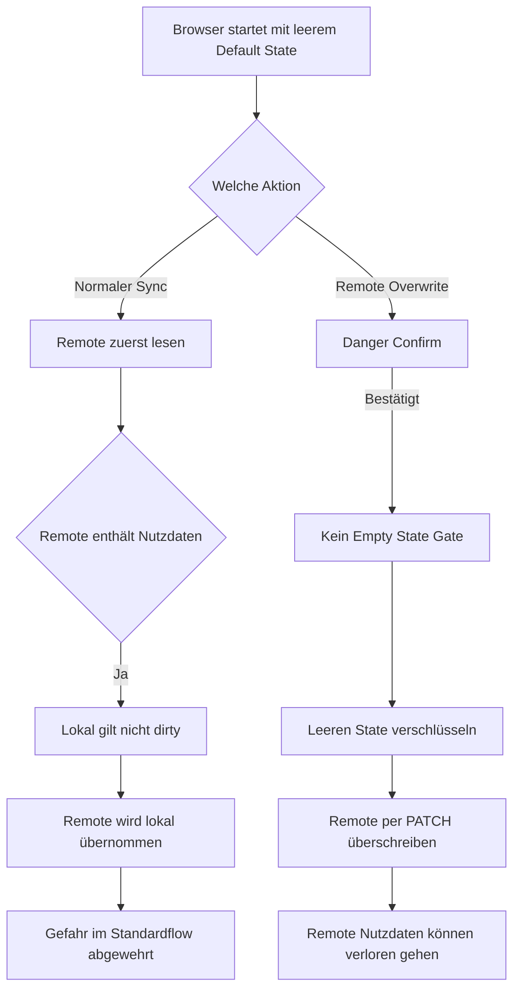
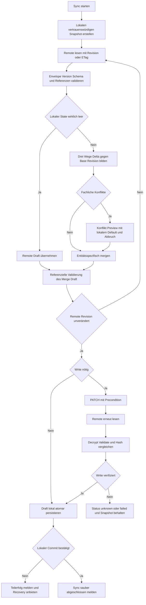
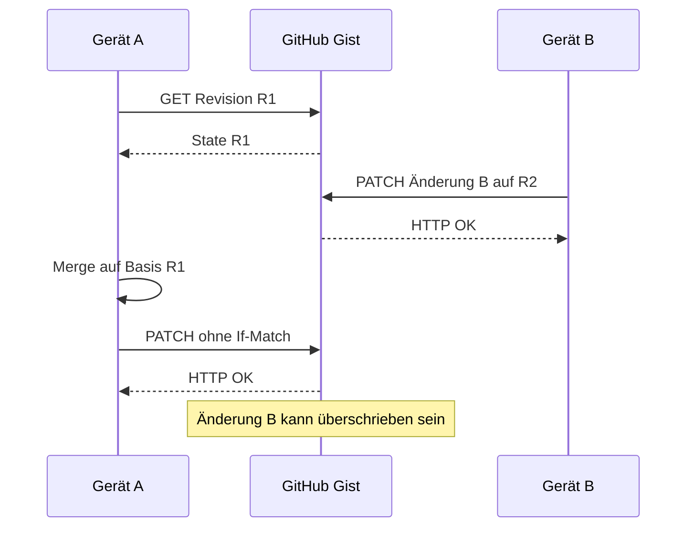

# Roadtrip Sync Safety Audit

> **Stand:** 7. Juni 2026
> **Scope:** ausschließlich lokale Persistenz, GitHub-Gist-Sync, Merge-/Replace-Flows, Tombstones, JSON-/ZIP-Backup und Recovery in Roadtrip.
> **Vergleichsbasis:** `docs/reference/daily-log-sync-reference.md`.
> **Arbeitsmodus:** Docs-only; keine App-Code-Änderung, kein Remote-Aufruf, kein Gist-Write und kein Laufzeittest mit echten Daten.
>
> Aussagen mit **Ableitung:** sind Schlussfolgerungen aus dem statisch gelesenen Kontrollfluss. **Nicht gefunden:** bezeichnet eine im untersuchten Repository nicht vorhandene Schutzfunktion. **Unklar:** bezeichnet Verhalten, das ohne Laufzeittest oder reale historische Payloads nicht abschließend belegbar ist. **Risiko unklar:** bezeichnet eine theoretisch plausible Gefährdung, für die der Code allein keinen Eintrittsnachweis liefert.

## Kurzfassung

Roadtrip besitzt bereits mehrere wichtige Sync-Schutzschichten:

- IndexedDB ist der bevorzugte lokale Hauptspeicher; `localStorage` dient als Fallback und als Speicher für Config-/Storage-Metadaten.
- Der normale Haupt-Gist-Flow liest Remote **vor** einem möglichen Write, entschlüsselt AES-GCM-Payloads, erkennt Legacy-Klartext und merged Tombstones.
- Ein wirklich leerer lokaler State wird im normalen Sync nicht blind über einen datenhaltigen Remote-State geschrieben, sondern übernimmt Remote.
- Normale Gist-Writes benötigen eine Passphrase; direkte Remote-Überschreibung ist mit einem deutlichen Confirm-Gate versehen.
- Push-Zeitstempel werden bei erkannten Fehlern zurückgesetzt; beim normalen Sync wird bei explizit als `cloud-write:` markierten Fehlern zusätzlich der Runtime-State restauriert.
- JSON-Import bietet selektives additives Merge; ZIP-Import besitzt Dry-Run, Count-Vergleich und ein zweites Replace-Confirm.
- Projektlöschungen erzeugen Tombstones für Projekt und verknüpfte Features, Notizen, Chats, Importversionen und Analysen.

Die Architektur ist dennoch **nicht race-sicher und nicht transaktional**. Die wichtigsten Befunde sind:

1. **P0 – direkte Remote-Überschreibung ohne Preflight/CAS:** `gistPush()` liest Remote nicht unmittelbar vor dem PATCH. Ein bestätigter, aber veralteter Browser kann neuere Remote-Daten vollständig überschreiben.
2. **P0 – normaler Read-Merge-Write ohne Revision/CAS:** `gistSync()` liest zwar Remote vor dem Write, schützt aber nicht gegen eine Änderung durch ein zweites Gerät zwischen GET und PATCH. Der letzte PATCH gewinnt.
3. **P1 – kein Remote-Readback:** Nach einem erfolgreichen PATCH wird weder der tatsächlich gespeicherte Gist erneut gelesen noch entschlüsselt, validiert und mit dem erwarteten Zustand verglichen.
4. **P1 – unvollständiger Fehler-Rollback im normalen Sync:** Nur Fehler mit Präfix `cloud-write:` restaurieren den vorherigen Runtime-State. Ein Netzwerkfehler des PATCH selbst, ein Verschlüsselungsfehler oder andere Write-Phase-Ausnahmen können nach bereits angewendetem Merge einen veränderten Runtime-State stehen lassen, obwohl die Meldung „Sync fehlgeschlagen beim Abrufen“ lautet.
5. **P1 – Erfolg vor bestätigter lokaler Persistenz:** `save()` stößt IndexedDB-Writes asynchron über eine Queue an und meldet dem Aufrufer bereits „angestoßen“. Sync-, JSON-Replace- und ZIP-Replace-Flows zeigen Erfolg, bevor der IndexedDB-Write abgeschlossen und verifiziert ist.
6. **P1 – stille Whole-Entity-LWW-Konflikte:** Der normale Merge entscheidet automatisch pro ID und ersetzt das vollständige Objekt anhand des ersten gültigen Zeitstempels aus `updatedAt`, `createdAt`, `importedAt`, `completedAt`. Es gibt weder Feldmerge noch Sync-Konflikt-UI noch referenzielle Nachprüfung.
7. **P1 – schwache Remote-Schema-Validierung:** Ein Payload gilt schon dann als Roadtrip-artig, wenn irgendein erwartetes Array oder `deletedIds` vorhanden ist. Payload-Version, Entitätsschema, IDs, Beziehungen und unbekannte/zu neue Felder werden nicht streng validiert.
8. **P2 – keine automatischen Pre-Destruction-Snapshots:** JSON Replace, ZIP Replace, Demo Replace und direkte Remote-Überschreibung empfehlen/fordern teilweise manuelle Backups, erzeugen aber keinen automatischen Snapshot.
9. **P2 – Tombstones nur zeitbasiert:** `deletedIds` wird nach 90 Tagen ohne Geräte-Acknowledgement, Remote-Revision oder „alle Geräte haben gesehen“-Nachweis entfernt.
10. **P2 – Recovery ist kanalweise, aber nicht revisionsbezogen:** Es gibt vollständiges JSON, ZIP, Notizen-Export und Raw-Gist-Backup, jedoch keine automatische Snapshot-Historie, kein Restore des unmittelbar vorherigen Sync-Zustands und keine verifizierte Remote-Version zum Zurückrollen.

**Gesamturteil:** Der normale Gist-Button ist deutlich sicherer als ein blinder Push, weil er Remote zuerst liest, leere lokale Erstzustände schützt, per ID merged und Tombstones berücksichtigt. Er ist aber noch kein sicherer Multi-Device-Sync: Konflikte werden still auf vollständiger Entitätsebene entschieden, Writes sind nicht revisionsgebunden, Erfolg ist nicht durch Remote-Readback und lokale Persistenzbestätigung abgesichert, und destruktive Aktionen besitzen keine automatischen Snapshots.

## Bewertungsampel

| Bereich | Bewertung | Risiko | Empfehlung |
| --- | --- | --- | --- |
| Lokale Persistenzgrundlage | 🟡 Gelb | IndexedDB-first und Fallback sind vorhanden; Writes sind für aufrufende Flows nicht awaitbar/abschließend bestätigt | Separaten awaitbaren Persistenzabschluss für riskante Flows definieren |
| Frischer/leerer Browser | 🟢 Grün mit Restunsicherheit | Normaler Sync erkennt bedeutungslosen lokalen State und übernimmt datenhaltiges Remote | Guard als explizite Invariante testen; Load-Fehler sichtbar von „wirklich leer“ trennen |
| Normaler Read-Merge-Write | 🟡 Gelb | Remote wird gelesen, aber ohne CAS und ohne Konflikt-UI | Revision/ETag-Precondition und isolierten Merge-Draft ergänzen |
| Direkter Push / Remote Overwrite | 🔴 Rot | Kein Remote-Preflight; vollständiger Remote-Datenverlust möglich | Nur als Force-Aktion belassen; Preflight, Revision-Gate und automatisches Remote-/Lokalsnapshot einführen |
| Remote-Validierung | 🔴 Rot | Form-/Versionsprüfung zu schwach | Versioniertes Envelope und strikten Validator einführen |
| Write-Verifikation | 🔴 Rot | Kein GET/Decrypt/Validate/Hash-Vergleich nach PATCH | Readback-Verify als Voraussetzung für „erfolgreich“ |
| Merge-Semantik | 🔴 Rot | Whole-entity Last-Writer-Wins, lokale Tie-Breaks, keine Feldregeln | Entitätsspezifische Konfliktregeln und Konflikt-Preview |
| Referenzielle Integrität | 🔴 Rot | Keine systematische Prüfung nach Sync-/Import-Merge | Validator für Projekt-/Feature-/Notiz-/Chat-/Analyse-Beziehungen |
| Tombstones | 🟡 Gelb | Gute ID-basierte Löschsperre, aber global und 90-Tage-pruned ohne Acknowledgement | Entitätstyp/Löschkontext dokumentieren; Pruning revisionsgebunden machen |
| Feature-Papierkorb | 🟡 Gelb | Recoverable `trashedAt`; getrennt von Tombstones, aber Konflikte werden trotzdem Whole-entity entschieden | Restore-/Trash-Regeln als monotone oder explizit konfliktfähige Felder definieren |
| JSON Import | 🟡 Gelb | Selektives additives Merge ist konservativ; Replace ohne Autosnapshot und ohne Persistenzabschluss | Pre-Import-Snapshot, Referenzcheck, awaitbarer Abschluss |
| ZIP Backup/Restore | 🟡 Gelb | Struktur, Manifest, Dry-Run und Counts sind stark; Restore ist Full Replace ohne Autosnapshot | Snapshot und Validierung aller Entitäten/Referenzen vor Apply |
| Raw Backup Gist | 🔴 Rot für Vertraulichkeit / 🟡 für Recovery | Unverschlüsselt, nur Notes/Analyses, kein Readback, kein Restore-Flow | Nicht als private Vollsicherung bezeichnen; separaten verschlüsselten Recovery-Sprint planen |
| Statusmeldungen | 🟡 Gelb | Outcome-Texte sind differenziert, aber Phase/Verify/Persistenz fehlen | Strukturierte Resultate und Statusmaschine `read/merge/write/verify/persisted` |
| Recovery | 🟡 Gelb | Mehrere manuelle Exporte existieren | Automatische lokale Snapshots und gezielte Vorher-Version-Wiederherstellung |

## Geprüfte Dateien und Funktionen

### Primärquellen

| Datei | Geprüfte Bereiche |
| --- | --- |
| `index.html` | `defaultState()`, `defaultConfig()`, IndexedDB-/localStorage-Helfer, `load()`, `save()`, Gist-Verschlüsselung, Payload-Erkennung, Fingerprints, Dirty-Erkennung, `mergeRemoteStateForGistPull()`, `gistPush()`, `gistSync()`, `gistRawBackup()`, Tombstones, selektiver JSON-Merge, JSON Replace, ZIP Export/Analyse/Replace, Projekt-/Notiz-/Chat-Löschung, Feature-Papierkorb, Settings-UX |
| `docs/reference/daily-log-sync-reference.md` | Daily-Log-Istbild, Sicherheitsinvarianten, bekannte Schwächen, Roadtrip-Hinweise und übertragbare Prinzipien |
| `DECISIONS.md` | finale Projektentscheidungen und Schutzbereiche |
| `docs/ARCHITECTURE.md` | Persistenz-, Sync-, Import-/Export- und Schutzbereichsübersicht |
| `docs/DESIGN.md` | Danger-Zonen, UX-Semantik und visuelle Priorisierung riskanter Aktionen |
| `AGENTS.md` | Docs-only-Vertrag und Schutzliste |

### Zentrale Roadtrip-Funktionen

- Lokaler State: `defaultState()`, `load()`, `ensureDefaults()`, `save()`.
- Remote-Format: `encryptRoadtripGistPayload()`, `decryptRoadtripGistPayload()`, `isRoadtripEncryptedGistPayload()`, `isLegacyPlainRoadtripGistPayload()`, `buildGistPayload()`, `getGistPayloadState()`.
- Freshness/Dirty: `getPayloadTimestamp()` (vorhanden, im normalen Entscheidungsflow nicht verwendet), `getStateLatestEntityTimestamp()`, `hasRoadtripUserData()`, `normalizeStateForSyncCompare()`, `createGistSyncFingerprint()`, `isLocalDirtySinceLastGistSync()`.
- Hauptsync: `mergeRemoteStateForGistPull()`, `readGistFileJson()`, `gistSync()`, Alias `gistPull()`.
- Force-Write: `gistPush()`.
- Recovery/Backup: `gistRawBackup()`, `exportJson()`, `exportRoadtripZipBackup()`, `exportFullEmergencyJson()`, `exportCompactJson()`, `exportRawNotes()`.
- Import/Replace: `normalizeImportedState()`, `showImportDialog()`, `applySelectiveMerge()`, `analyzeRoadtripZipBackupFile()`, `confirmRoadtripZipImport()`.
- Löschschutz: `recordDeletion()`, `mergeDeletedIds()`, `pruneDeletedIds()`, `isDeleted()`, `deleteProject()`, `deleteNote()`, `deleteChat()`.
- Feature-Recovery: `trashFeature()`, `restoreFeatureFromTrash()`.

**Nicht gefunden:** ein automatischer Haupt-Gist-Push nach normalen Saves. Der untersuchte Haupt-Gist-Write wird nur über `gistSync()` nach vorigem GET oder über den expliziten Danger-Button `gistPush()` ausgelöst. Trello-Sync ist ein separater, featurebezogener Integrationsflow und nicht Teil des Full-State-Gist-Audits.

## Aktuelles Roadtrip-Sync-Zielbild

Roadtrip arbeitet praktisch mit fünf Ebenen:

| Ebene | Inhalt | Mechanismus | Rolle |
| --- | --- | --- | --- |
| Lokaler Hauptstate | Projekte, Features, Notizen, Analysen, Chats, Importversionen, unmatched Notes, Tombstones und globale Zeitmarker | IndexedDB `roadtrip_db_v1` / Store `state` / Key `main` | primäre Arbeitskopie |
| Lokaler Fallback | derselbe State in `roadtrip_v0_1` | `localStorage` | Fallback/Migrationsquelle |
| Lokale Config/Sync-Metadaten | Tokens, Gist-IDs, Theme, Trello-Konfiguration; Storage-Modus und letzter Gist-Fingerprint | `localStorage` | gerätespezifisch, nicht im Gist-Payload |
| Remote-Hauptkopie | verschlüsselter Full-State-Snapshot in `roadtrip_data.json` | GitHub Gist | gemeinsamer Geräte-Snapshot |
| Portable/sekundäre Backups | JSON, strukturiertes ZIP, Raw-Notes-Datei, optionaler Raw-Gist | Download bzw. separater Gist | manuelle Recovery |

Der primäre Nutzerweg ist der Button „Gist synchronisieren“. Er ruft `gistSync()` auf und folgt grundsätzlich **Read → Decrypt/Validate → Compare → Merge/Adopt → optional Write**. Der Danger-Bereich enthält getrennt „Remote mit lokalem Stand überschreiben“, das `gistPush()` direkt ausführt.

**Ableitung:** Das Zielbild ist local-first und snapshot-basiert. Es gibt kein serverseitiges Änderungsjournal, keine per-entity Revision und keinen gemeinsam bestätigten Base-Stand. Der lokal gespeicherte Fingerprint ist daher nur eine gerätespezifische Dirty-Heuristik, kein Concurrency-Token.

## Roadtrip-Sync-Datenmodell

### Vollständig synchronisierte Bereiche

`buildGistPayload()` legt `state: S` in den verschlüsselten Payload. Damit werden grundsätzlich alle serialisierbaren Felder von `S` synchronisiert, insbesondere:

- `projects`
- `features`
- `notes`
- `analyses`
- `chats`
- `importVersions`
- `unmatchedNotes`
- `deletedIds`
- globale Metadaten wie `version`, `createdAt`, `_lastLocalSaveAt`, `_lastExported`, `_lastGistPushAt`, `_lastGistPullAt` und Save-Fehlerfelder, soweit im aktuellen `S` vorhanden

Die normalisierte Sync-Vergleichssicht berücksichtigt die sieben Entitätsarrays, `version` und `deletedIds`, ignoriert aber globale Save-/Push-/Pull-Zeitmarker. Das verhindert, dass reine Sync-Metadaten Endlosschleifen erzeugen.

### Nicht synchronisierte oder gerätespezifische Bereiche

- `C` wird nicht Teil des Gist-Payloads. Gist-/Raw-Gist-/Trello-Tokens und IDs bleiben lokal.
- UI-State in `ui` und `roadtrip.ui.*` bleibt lokal.
- `storageMeta`, einschließlich `lastGistSyncFingerprint`, bleibt lokal im Browser.
- Die optionale Session-Passphrase bleibt im Runtime-Speicher und wird standardmäßig nicht dauerhaft gespeichert.

Diese Trennung ist sicherheitsseitig positiv, weil Secrets nicht im Full-State-Gist repliziert werden.

### IDs und Verknüpfungen

Die Arrays sind überwiegend ID-basiert. Relevante Beziehungen umfassen mindestens:

- `feature.projectId → project.id`
- `note.projectId → project.id`
- `chat.projectId → project.id`
- `importVersion.projectId → project.id`
- `analysis.projectId → project.id`
- Sprint-/Chat-Beziehungen wie Hauptchat-, Quellchat- oder Handoff-Bezüge
- Feature-Quellen wie `sourceNoteIds`
- Merge-/Trash-Bezüge wie `mergedIntoFeatureId`
- Trello-Unterobjekte mit externen Card-/List-/Label-IDs

**Nicht gefunden:** eine zentrale referenzielle Validierung, die nach Gist-Merge, JSON-Merge oder Replace alle Cross-Entity-Bezüge prüft und verwaiste IDs meldet oder quarantänisiert.

### Timestamps

Viele, aber nicht zwingend alle Entitäten besitzen `createdAt` und/oder `updatedAt`. Zusätzlich existieren fachliche Zeitpunkte wie `importedAt` und `completedAt`. Der Gist-Merge nimmt pro Entität den **ersten parsebaren** Wert in dieser Reihenfolge:

1. `updatedAt`
2. `createdAt`
3. `importedAt`
4. `completedAt`

Das ist besser als die in der Daily-Log-Referenz kritisierte Priorisierung von `createdAt` vor `updatedAt`. Es bleiben aber folgende Grenzen:

- Fehlt `updatedAt`, kann ein alter `createdAt` spätere fachliche Änderungen verdecken.
- Ein einzelner Timestamp entscheidet über das vollständige Objekt.
- Gleichstand oder ungültige Zeitstempel lassen lokal gewinnen.
- Zeitstempel sind Client-Uhren und nicht revisionsgebunden.
- Verschachtelte Felder besitzen keine eigenen Änderungsmarker.

### Revisionen, ETags und Checksums

**Nicht gefunden:**

- ETag- oder `If-Match`-Nutzung;
- Remote-Revision oder `baseRevision`;
- Geräte-ID/`updatedByDevice`;
- serverseitige Compare-and-Swap-Semantik;
- kanonischer Hash im Remote-Envelope;
- per-entity Revision;
- Remote-Write-Readback mit Hashvergleich.

Der lokale kanonische Fingerprint ist nützlich für „seit letztem erfolgreichen Sync lokal geändert?“, aber kein Schutz vor einem parallelen Gerät.

### Sync-kritische Datenbereiche

Besonders kritisch sind:

- Projekte als Elternobjekte;
- Features mit Status, Pool, Detailfeldern, Quellen, Trash- und Trello-Unterzustand;
- Chats/Sprints/Handoffs mit langen Texten, Statusmaschinen und Rückführungsverträgen;
- Analysen und Importversionen mit großen Rohfeldern;
- Notizen und deren Projekt-/Feature-Bezüge;
- `deletedIds`, weil ein fehlerhafter Tombstone echte Entitäten auf allen Geräten entfernen kann;
- globale Sync-Metadaten, weil falsche Marker Dirty-/Clean-Entscheidungen beeinflussen können.

Automatisches Whole-object-Überschreiben ist vor allem bei langen Handoffs, verschachtelten Feature-Details und Status-/Beziehungsfeldern riskant.

## Lokale Persistenz

### Speicherorte und Autorität

Roadtrip lädt zuerst aus IndexedDB. Nur wenn dort kein gültiges Objekt gefunden wurde, wird `roadtrip_v0_1` aus `localStorage` geladen. Ein geladener localStorage-State wird nach Möglichkeit nach IndexedDB migriert; die Altdaten bleiben als Sicherheitskopie bestehen.

Zusätzlich speichert Roadtrip:

- Config unter `roadtrip_v0_1_config`;
- Storage-Metadaten unter `roadtrip_v0_1_storage_meta`;
- UI-Präferenzen unter `roadtrip.ui.*`.

### Lade- und Fehlerverhalten

Positive Eigenschaften:

- Nicht-Objekte und Arrays werden als Hauptstate abgelehnt.
- `Object.assign(defaultState(), loadedState)` ergänzt fehlende Top-Level-Defaults.
- `ensureDefaults()` normalisiert Kernarrays und `deletedIds`.
- IndexedDB-Fehler führen zu einem localStorage-Fallback-Versuch.
- Save-Fehler werden typisiert und mit einer Notfall-Export-Empfehlung angezeigt.
- localStorage-Writes werden durch Readback und JSON-Parse verifiziert.

Grenzen:

- Wenn sowohl IndexedDB-Lesen als auch localStorage-Parse scheitern, bleibt der frisch erzeugte Default-State aktiv.
- Der Fehler wird nur in der Konsole protokolliert; es gibt keinen persistenten „Load fehlgeschlagen, State ist nicht vertrauenswürdig“-Guard für den späteren Sync.
- **Ableitung:** Der Empty-State-Guard im normalen Sync verhindert in diesem Fall zwar grundsätzlich das Überschreiben eines datenhaltigen Remote-State. Trotzdem ist „wirklich neuer Browser“ nicht von „lokaler Speicher beschädigt/unlesbar“ unterscheidbar. Für UX und Recovery wäre diese Unterscheidung wichtig.

### Save-Semantik

`save()` erstellt einen Snapshot, aktualisiert `_lastLocalSaveAt` und queued IndexedDB-Writes. Bei IndexedDB wird `stateSaved = true` bereits nach dem Einreihen gesetzt, nicht erst nach Transaktionsabschluss. Ein späterer Fehler wird asynchron behandelt und löst einen Fallback-Versuch aus.

Folgen:

- Aufrufende Flows können den tatsächlichen Abschluss nicht `await`en.
- UI-Texte können „gespeichert“ bzw. „Import abgeschlossen“ anzeigen, obwohl der IndexedDB-Write noch läuft.
- Bei erfolgreichem localStorage-Fallback ist der State wahrscheinlich gerettet; dennoch ist die vorangegangene Erfolgsmeldung nicht phasengenau.
- **Risiko unklar:** Wenn ein Nutzer unmittelbar nach einer Erfolgsmeldung den Tab schließt und der queued IndexedDB-Write noch nicht abgeschlossen ist, hängt die Haltbarkeit vom Browser und einem möglichen Fallback-Fehler ab.

### Schutz gegen leeren Browserzustand

`hasRoadtripUserData()` betrachtet Entitätsobjekte oder Tombstones als bedeutungsvolle Daten. Beim normalen Sync gilt:

- lokal leer + remote datenhaltig → lokal ist nicht dirty → Remote wird bevorzugt;
- lokal datenhaltig + remote leer → lokal gilt dirty → lokaler State wird gepusht;
- beide gleich → No-Op;
- beide leer → No-Op.

Damit ist die kritische Daily-Log-Invariante „Default-State darf guten Remote-State nicht überschreiben“ im normalen `gistSync()` grundsätzlich erfüllt.

**Wichtige Ausnahme:** Der Danger-Flow `gistPush()` verwendet diesen Empty-State-Guard nicht. Ein Nutzer kann nach Confirm einen leeren lokalen State direkt über Remote schreiben.

## Remote-/Gist-Struktur

### Haupt-Gist

- Datei: `roadtrip_data.json`
- äußerer Envelope: `roadtrip-encrypted-v1`
- KDF: PBKDF2-SHA256, 250.000 Iterationen
- Cipher: AES-GCM 256
- zufälliger 16-Byte-Salt und 12-Byte-IV
- Base64-Felder für Salt, IV und Ciphertext
- Envelope-Metadaten: `format`, `app`, `kdf`, `cipher`, `iterations`, `createdAt`
- entschlüsselter Inhalt: `{ version: 1, exported: ISO timestamp, state: S }`

Positive Eigenschaften:

- Haupt-Gist-Writes sind ohne Passphrase blockiert.
- Falsche Passphrase oder beschädigtes Ciphertext-Envelope führt vor Merge/Write zum Abbruch.
- Passphrase wird standardmäßig nicht dauerhaft gespeichert.
- Große/truncated Gist-Dateien werden über `raw_url` nachgeladen.

### Legacy-Klartext

Roadtrip erkennt sowohl `{ state: ... }` als auch flache Roadtrip-artige Klartextobjekte. Vor der einmaligen Migration wird bestätigt; anschließend erzwingt der normale Flow einen verschlüsselten Write.

**Risiko:** Die Shape-Erkennung ist großzügig. Bereits ein einziges erwartetes Array oder `deletedIds` kann ein Objekt als Roadtrip-artig qualifizieren. Ein versehentlich falscher Gist mit partieller Struktur könnte daher als migrierbar gelten.

### Remote-Validierung

Vorhanden:

- HTTP-Statusprüfung beim GET;
- JSON-Parse;
- Envelope-Minimalprüfung;
- AES-GCM-Authentifizierung beim Decrypt;
- Prüfung, dass ein State-Objekt vorhanden ist.

**Nicht gefunden:**

- unterstützte `schemaVersion` mit Reject/Migration;
- Vollständigkeitsprüfung aller Kernarrays;
- Entitätsschema-Validierung;
- eindeutige/stabile ID-Prüfung;
- Referenzprüfung;
- Maximalgrößen-/Plausibilitätsprüfung;
- Hash oder Signatur über den kanonischen State zusätzlich zur AES-GCM-Authentifizierung;
- Prüfung eines erwarteten Remote-Base-Standes.

### Raw-Backup-Gist

- Datei: `roadtrip_raw_notes.json`
- Inhalt: `exported`, `notes`, `analyses`
- unverschlüsseltes JSON
- PATCH ohne vorherigen GET, Confirm oder Readback
- fallbackweise werden Haupt-Gist-ID und Haupttoken verwendet, wenn keine separaten Raw-Credentials gesetzt sind

Die UI warnt ausdrücklich, den Raw-Gist für private Daten bis zu einem späteren Patch nicht zu verwenden. Technisch bleibt die Aktion dennoch verfügbar.

**Nicht gefunden:** ein zugehöriger Raw-Gist-Restore-/Merge-Flow in Roadtrip. Das Raw-Gist ist daher derzeit ein externer Rohdatenanker, aber kein in der App geschlossener Recovery-Pfad.

## Normaler Sync-Flow

### Schritt-für-Schritt-Istfluss

1. Gist-ID, Token und Passphrase werden geprüft.
2. Vorherige globale Export-/Push-/Pull-Zeitmarker und der vollständige Runtime-State werden gesnapshottet.
3. Roadtrip liest den Gist per GET.
4. Die bevorzugte Datei oder ersatzweise die erste Gist-Datei wird gelesen; truncated Content wird über `raw_url` nachgeladen.
5. Der Inhalt wird als verschlüsseltes Envelope entschlüsselt oder nach Confirm als Legacy-Klartext akzeptiert.
6. Der State wird extrahiert; eine strikte Schema-/Versionsvalidierung findet nicht statt.
7. Lokaler und Remote-State werden kanonisiert und per Fingerprint verglichen.
8. Bei Gleichheit wird `_lastGistPullAt` gesetzt, der Fingerprint gespeichert und lokal gespeichert; Ergebnis ist No-Op.
9. Bei Unterschied wird lokaler Dirty-Status bestimmt:
   - vorhandener lokaler Sync-Fingerprint → aktueller lokaler Fingerprint dagegen;
   - ohne Fingerprint → letzter Sync-Marker gegen neuesten Entitäts-/Tombstone-Zeitpunkt;
   - lokaler State ohne Nutzdaten → nicht dirty.
10. Wenn lokal clean und Remote datenhaltig ist, wird Remote als Basis übernommen; lokale und Remote-Tombstones werden dennoch vereinigt.
11. Andernfalls werden beide Seiten pro Entitäts-ID vereinigt; bei gleicher ID gewinnt Remote nur bei strikt neuerem gewählten Zeitstempel.
12. Tombstones werden vereinigt, nach 90 Tagen gepruned und anschließend aus allen sieben Entitätsarrays herausgefiltert.
13. `_lastGistPullAt` wird im Runtime-State aktualisiert.
14. Ein Write erfolgt, wenn Legacy migriert werden muss, lokale Änderungen gegenüber Remote bestehen, lokal ohne Merge gewinnt oder der Remote-Vorzugsflow durch lokale Tombstones korrigiert werden muss.
15. Vor dem PATCH werden `_lastExported` und `_lastGistPushAt` gesetzt, der gesamte State verschlüsselt und `roadtrip_data.json` gepatcht.
16. Bei HTTP-Fehlern wird ein `cloud-write:`-Fehler erzeugt.
17. Bei Erfolg wird der lokale Fingerprint aktualisiert; falls State oder Remote geändert wurden, wird lokal gespeichert.
18. UI und Alert melden No-Op, initiale Remote-Übernahme, Remote-Übernahme, lokalen Push, Legacy-Migration oder Merge+Push.

### Was als No-Op gilt

Ein No-Op liegt vor, wenn die normalisierten Nutzdatenarrays, `version` und `deletedIds` identisch sind. Globale Save-/Export-/Pull-/Push-Zeitmarker zählen nicht zum Vergleich. Das ist sinnvoll und verhindert Marker-bedingte Scheindifferenzen.

### Strukturierter Return

**Nicht gefunden:** `gistSync()` und `gistPush()` liefern kein strukturiertes Ergebnis wie `{ ok, phase, outcome, readRevision, wrote, verified, persisted, error }`. Erfolgs-/Fehlersemantik wird primär über Alerts, Statusfelder und Control Flow ausgedrückt.

### Kann Erfolg erscheinen, obwohl ein Teilschritt fehlgeschlagen ist?

- Ein erkannter PATCH-HTTP-Fehler führt nicht zu einer Erfolgsmeldung.
- Ein Fehler im abschließenden `save()` ist jedoch asynchron möglich, nachdem der Remote-Write bereits als erfolgreich behandelt wurde.
- Ein erfolgreicher PATCH ohne anschließenden Remote-Readback kann als Erfolg gelten, obwohl der erwartete Inhalt nicht verifiziert wurde.
- JSON-/ZIP-Replace meldet Erfolg unmittelbar nach `save()`-Aufruf, nicht nach bestätigter IndexedDB-Persistenz.
- **Ableitung:** Ein „Remote geschrieben, lokal noch nicht haltbar bestätigt“-Teilerfolg wird nicht als eigener Zustand sichtbar.

### Fehlerpfad des normalen Sync

Bei Fehlern mit Präfix `cloud-write:` wird der vorherige Runtime-State restauriert; alle drei globalen Zeitmarker werden auf vorherige Werte gesetzt. Das ist ein guter Freshness-Rollback.

Problematisch ist die enge Präfixbedingung:

- Ein nicht-OK-HTTP-Response wird korrekt als `cloud-write:` markiert.
- Ein `fetch()`-Reject des PATCH (z. B. Netzwerkabbruch), ein Fehler beim Verschlüsseln oder ein anderer Fehler in der Write-Phase erhält dieses Präfix nicht automatisch.
- Zu diesem Zeitpunkt kann `S` bereits auf den Merge-Draft gesetzt und Tombstone-Pruning angewendet worden sein.
- Der Catch setzt dann nur Marker zurück, lässt den veränderten Runtime-State bestehen und meldet pauschal „Sync fehlgeschlagen beim Abrufen des Gist.“

**Ableitung:** Dieser Pfad kann einen fehlgeschlagenen Write mit einem lokal veränderten, zunächst nicht gespeicherten Merge-State hinterlassen. Jede spätere lokale Aktion mit `save()` kann diesen State persistieren. Das ist kein belegter Remote-Datenverlust, aber ein hohes Risiko für einen schwer verständlichen lokalen Zustandswechsel.

## Pull-/Push-/Replace-/Force-Aktionen

### Aktionsmatrix

| Aktion | Liest | Schreibt | Confirm | Auto-Backup | Remote-Preflight | Readback/Validate | Status | Hauptrisiko |
| --- | --- | --- | --- | --- | --- | --- | --- | --- |
| Normaler `gistSync()` | Remote Full-Gist | optional Remote + lokal | Legacy-Migration ja; normal nein | nein | ja, ein GET | nein | mehrere Outcome-Alerts | Race zwischen GET und PATCH; stille Konflikte |
| `gistPull()` | identisch zu `gistSync()` | identisch zu `gistSync()` | wie Sync | nein | ja | nein | wie Sync | Name suggeriert Pull, Funktion ist Zwei-Wege-Sync |
| `gistPush()` / Remote Overwrite | lokal | Remote Full-Gist + lokale Marker | deutlicher Danger-Confirm | nein | **nein** | nur PATCH-Response-Shape, kein GET | „überschrieben“ | veralteter/leerer Browser überschreibt Remote |
| Force Pull | — | — | — | — | — | — | **Nicht gefunden** | kein expliziter Remote→Lokal-Replace-Pfad |
| Force Push | lokal | Remote | ja | nein | nein | nein | vorhanden als `gistPush()` | vollständiger Remote-Verlust möglich |
| Lokales Restore aus Gist | — | — | — | — | — | — | **Nicht gefunden** als getrennte Aktion | normaler Sync ist kein reines Restore |
| JSON selektiv mergen | lokale Datei | lokal | Auswahl, kein zweites Confirm | nein | n/a | Input-Shape minimal | „Merge abgeschlossen“ | keine Updates bestehender IDs; keine Referenzprüfung |
| JSON komplett ersetzen | lokale Datei | lokal | ja | nein | n/a | Input-Shape minimal | „Import abgeschlossen“ | vorhandener State ohne Snapshot verloren |
| ZIP Import/Replace | ZIP-Datei | lokal | Preview + Confirm | nein | n/a | Manifest, required JSON, Counts | „erfolgreich importiert“ | Full Replace; keine Entity-/Referenzvalidierung |
| Raw Backup Gist | Notes/Analyses lokal | unverschlüsselter Raw-Gist | nein | n/a | nein | nein | Anzahl der Objekte | Vertraulichkeit; kein integrierter Restore |
| JSON Full Emergency Export | Runtime-State | Download | nein | n/a | n/a | Browserdownload nicht verifiziert | keine explizite Abschlussprüfung | Nutzer muss Datei selbst sichern |
| Compact Export | geklonter/gekürzter State | Download | nein | n/a | n/a | keine | keine | absichtlich verlustbehaftete Rohfelder |
| Demo Replace | Default/Demo | lokal | ja | nein | n/a | nein | implizit | lokaler State wird ersetzt |

### Normaler Sync versus Pull

Der UI-Button und `gistPull()` rufen beide `gistSync()` auf. Es gibt daher keinen echten „nur lesen und lokal mergen, niemals Remote schreiben“-Modus.

**UX-Risiko:** Ein Funktionsname oder Nutzerverständnis „Pull“ wäre technisch falsch, weil der Flow je nach Dirty-/Merge-Ergebnis Remote patchen kann.

### Direkter Push / Remote Overwrite

Sicherheitspositiv:

- räumlich in der Danger-Zone;
- explizite Warnung vor Verlust neuerer Daten auf anderen Geräten;
- Passphrase-Pflicht;
- Marker-Rollback bei Fehler;
- PATCH-Response muss die erwartete Datei enthalten.

Kritisch:

- kein GET unmittelbar vorher;
- kein ETag/Revision-Gate;
- kein Empty-State-Block;
- kein automatisches lokales oder Remote-Backup;
- kein Readback/Decrypt/Compare;
- Response-Shape beweist nicht, dass genau der erwartete entschlüsselte State dauerhaft gespeichert ist.

### JSON Import

Selektiver Merge:

- übernimmt nur neue Einträge;
- lokale IDs bzw. bei Projekten auch Titel und bei Features `projectId + title` gewinnen;
- bestehende Einträge werden nicht verändert;
- Tombstones werden unabhängig von der Entitätsauswahl immer vereinigt und anschließend angewendet;
- `analyses` ist standardmäßig nicht ausgewählt;
- `unmatchedNotes` besitzt keine selektive Auswahl und wird im Merge nicht übernommen;
- referenzielle Abhängigkeiten zwischen ausgewählten/nicht ausgewählten Bereichen werden nicht validiert.

**Ableitung:** Der Hinweis „Merge ist sicher“ ist zu absolut. Der Flow ist konservativ gegen Überschreiben bestehender IDs, kann aber neue Kindobjekte ohne zugehöriges Elternobjekt importieren, Tombstones aus einer Datei global anwenden und gewünschte Updates still überspringen.

Replace:

- ersetzt den vollständigen lokalen State nach Confirm;
- übernimmt auch Sync-Metadaten aus dem Import;
- erstellt keinen automatischen Vorher-Snapshot;
- zeigt Abschluss vor bestätigtem IndexedDB-Commit.

### ZIP Import

Stärken:

- versioniertes Exportformat `roadtrip-zip-v1`;
- erforderliche Dateien werden geprüft;
- beschädigte JSON-Dateien werden benannt;
- getrennte Rohfelder werden wieder an Chats/Importversionen gehängt;
- Manifest-Counts werden mit rekonstruierten Counts verglichen;
- Preview zeigt Import- und lokale Counts sowie Warnungen;
- Replace benötigt einen weiteren Confirm.

Grenzen:

- Count-Gleichheit ist keine Inhalts- oder Referenzvalidierung;
- Manifest besitzt keinen Datei-Hash;
- unbekannte zusätzliche Felder/Dateien werden nicht als Versionierungsproblem behandelt;
- Full Replace ohne automatisches Snapshot;
- Erfolg vor bestätigter lokaler Persistenz.

### Recovery-Aktionen

Vorhanden sind Downloads für Full JSON, Compact JSON, Raw Notes und ZIP. Save-Fehler empfehlen einen Notfall-Export. Es gibt jedoch keinen in-App Snapshot-Browser, keine automatische „vor Sync/Import“-Version und keinen gezielten Rollback auf den unmittelbar vorherigen Zustand.

## Merge-Strategie

### Normaler Gist-Merge

Der Sync-Merge ist ID-basiert und umfasst:

- Projekte
- Features
- Notizen
- Chats
- Importversionen
- Analysen
- unmatched Notes

Ablauf pro Array:

1. lokale Objekte mit ID in eine Map legen;
2. Remote-Objekte ohne ID ignorieren;
3. Remote-only-ID hinzufügen, sofern nicht tombstoned;
4. bei gleicher ID Zeitstempel vergleichen;
5. Remote nur bei strikt neuerem Timestamp als vollständiges Objekt übernehmen;
6. am Ende alle tombstoned IDs entfernen.

Wenn der lokale Browser als clean gilt, wird stattdessen Remote als vollständige Basis bevorzugt und nur die Tombstone-Menge vereinigt.

### Konfliktgewinner

- Remote gewinnt bei strikt neuerem gewählten Timestamp.
- Lokal gewinnt bei gleich altem Timestamp.
- Lokal gewinnt, wenn mindestens eine Seite keinen parsebaren Timestamp besitzt.
- Es gibt kleine entitätsspezifische Guards für abgeschlossene Chats und Feature-Pool/Status; praktisch bleibt aber auch dort der neuere Timestamp die Kernentscheidung.
- Ein Gewinner ersetzt das vollständige Objekt; nicht nur das konfliktträchtige Feld.

### Feld- und entitätsspezifische Regeln

**Nicht gefunden:**

- Textdiff oder Absatzmerge für Handoffs/Prompts;
- monotone Regeln für abgeschlossene Sprints/Chats;
- feldweise Regeln für Feature-Status, Pool, Priorität, Akzeptanzkriterien oder Trello-Unterzustand;
- Set-Merge für Tags/Quell-IDs;
- Konfliktregeln für Reihenfolgen;
- Drei-Wege-Merge gegen einen gemeinsamen Base-Snapshot;
- Quarantäne für inkompatible Objekte.

### Selektiver JSON-Merge

Der Import-Merge ist absichtlich additiv und lokal-konservativ:

- ID-Kollision → incoming wird übersprungen;
- Projekttitel-Kollision → incoming wird übersprungen;
- Feature-Kollision nach `projectId + normalisiertem Titel` → incoming wird übersprungen;
- keine Feldaktualisierung bestehender Objekte.

Das reduziert Überschreibungsrisiko, ist aber kein fachlicher Sync-Merge. Der Duplicate-Review für Feature-Kandidaten ist ein anderer Workflow und wird hier nicht zur Auflösung von Gist-/Importkonflikten verwendet.

### Referenzielle Integrität

**Nicht gefunden:** eine Validierung nach Merge, die mindestens prüft:

- existiert jedes referenzierte Projekt?
- existieren `sourceNoteIds`?
- zeigt `mergedIntoFeatureId` auf ein vorhandenes Feature?
- sind Hauptchat-/Sprintchat-Bezüge konsistent?
- verweist ein Handoff auf einen gültigen Chat/Sprint?
- sind Analysen/Importversionen ihrem Projekt korrekt zuordenbar?
- erzeugt eine Tombstone-Anwendung verwaiste Kinder?

**Ableitung:** Ein Whole-entity-LWW kann eine Beziehung auf einen Stand zurücksetzen, dessen Zielobjekt auf der anderen Seite gelöscht oder umbenannt wurde. Tombstones verhindern die Wiederaufnahme derselben ID, reparieren aber keine verbleibenden Verweise.

## Tombstones und Löschschutz

### Struktur

`S.deletedIds` ist eine globale Map:

```text
entityId -> deletion timestamp
```

Es gibt keinen separaten Entitätstyp, Löschgrund, Ursprung, Geräte-ID oder Recovery-Payload.

### Welche Entitäten Tombstones erhalten

Explizit belegt:

- Projektlöschung: Projekt plus zugehörige Features, Notes, Chats, Importversionen und Analysen;
- einzelne Notizlöschung;
- einzelne Chatlöschung.

Nicht als Hard Delete behandelt:

- Features werden im untersuchten Hauptworkflow in einen Papierkorb gesetzt (`trashedAt`, `trashedByWorkflow`, optional `mergedIntoFeatureId`) und können restauriert werden.

**Nicht gefunden:** individuelle Hard-Delete-Flows für Analysen, Importversionen oder unmatched Notes außerhalb der Projektkaskade. Falls solche Objekte anderweitig aus Arrays entfernt werden, ist im untersuchten Code kein allgemeiner automatischer Tombstone-Hook vorhanden.

### Tombstone-Merge und Wirkung

- lokale und Remote-Map werden vereinigt;
- pro ID gewinnt der neuere gültige Löschzeitpunkt;
- Tombstones filtern alle sieben Sync-Arrays;
- JSON selective merge vereinigt Tombstones unabhängig von der Auswahl;
- ZIP enthält `deletedIds` und ersetzt sie beim Restore zusammen mit dem State;
- JSON Replace übernimmt die importierte Tombstone-Map.

### Pruning

Tombstones älter als 90 Tage werden gelöscht. Es gibt:

- kein Geräte-Acknowledgement;
- keine Mindest-Remote-Revision;
- keine Liste bekannter Geräte;
- keinen Beleg, dass alle Kopien den Delete gesehen haben;
- keinen archivierten Recovery-Payload am Tombstone.

**Risiko:** Ein Gerät oder altes Backup, das länger als 90 Tage offline war, kann nach Pruning eine alte Entität erneut einbringen. Ob sie tatsächlich wiederaufersteht, hängt vom Dirty-/Merge-Pfad und vorhandenen Zeitstempeln ab.

### Tombstone versus Papierkorb

Die Trennung ist konzeptionell sinnvoll:

- Tombstone: Replikationsschutz für hard-deleted IDs;
- Feature-Papierkorb: recoverable Fachzustand mit vollständigem Featureobjekt.

Anders als Daily Log besitzt der Tombstone selbst keinen Recovery-Payload. Hard-deleted Projekt-/Note-/Chat-Daten sind daher nur über andere Backups wiederherstellbar.

### Gefährliche Tombstone-Eigenschaften

- IDs sind global typunabhängig; eine theoretische ID-Kollision über Entitätstypen würde mehrere Bereiche filtern.
- Selektiver JSON-Merge kann Tombstones importieren, obwohl der zugehörige Entitätsbereich nicht ausgewählt wurde.
- Ein alter ZIP-/JSON-Replace kann neuere Tombstones vollständig entfernen oder alte Tombstones wieder einführen.
- Ein fehlerhafter Tombstone wird automatisch auf alle Geräte weitergetragen und besitzt keine Konflikt-UI.

## Konfliktmanagement

### Erkennung

Roadtrip erkennt keine fachlichen Sync-Konflikte als eigene Objekte. Es erkennt nur:

- gleiche ID auf beiden Seiten;
- Dirty/Clean auf Ebene des gesamten lokalen States;
- Reihenfolge anhand eines Entity-Timestamps;
- Gleichheit des normalisierten Gesamtstates.

### Konflikt-UI

**Nicht gefunden:**

- Liste konfliktbehafteter Entitäten;
- Feldvergleich lokal/remote;
- Nutzerentscheidung pro Konflikt;
- lokaler Default mit Abbruch;
- Dry-Run des Gist-Merge;
- Anzeige des Merge-Deltas vor Apply/Write.

Der Feature-Duplicate-Review gilt für importierte Feature-Kandidaten und ist **keine** Sync-Konflikt-UI.

### Stille Entscheidungen

Still entschieden werden unter anderem:

- welches vollständige Projekt-/Feature-/Chat-/Notizobjekt bei gleicher ID gewinnt;
- ob lokale Änderungen seit dem letzten Fingerprint vorliegen;
- ob Remote vollständig als clean-basierte Autorität übernommen wird;
- ob Tombstones Objekte entfernen;
- welche importierten Objekte wegen ID-/Titelkollision übersprungen werden.

### Datenverlustpfade durch stillen Merge

- Zwei Geräte ändern unterschiedliche Felder derselben Entität: das Objekt mit neuerem Timestamp gewinnt vollständig; die andere Feldänderung geht verloren.
- Zwei Geräte ändern lange Chat-/Handoff-Texte: kein Textdiff, kein Drei-Wege-Merge.
- Ein Gerät aktualisiert Status, das andere Beziehungen/Quellen: Whole-object-LWW.
- Fehlender oder nicht aktualisierter `updatedAt` kann eine fachlich neuere Änderung verlieren lassen.
- Lokaler und Remote-Zeitstempel sind gleich: lokal gewinnt ohne Hinweis.
- Client-Uhrdrift kann Gewinner verfälschen.

## Recovery und Backup

### JSON Export

`exportJson()` exportiert den Runtime-State direkt. Das ist ein vollständiger, leicht prüfbarer Snapshot, aber ohne eigenes Envelope, Dateihash oder automatischen Download-Erfolgsnachweis.

### ZIP Backup

Das ZIP ist der stärkste portable Backup-Pfad:

- versioniertes Manifest;
- getrennte Kernarrays;
- separate Rohfelder für Chats und Importversionen;
- Meta-Datei ohne Tokens;
- Tombstones enthalten;
- Counts und Preview beim Import.

Es fehlen kryptografische Datei-Hashes, automatische Vorher-Snapshots und referenzielle Validierung.

### Emergency/Compact/Raw Exports

- Full Emergency JSON bewahrt den vollständigen Runtime-State.
- Compact JSON ist absichtlich verlustbehaftet für große Rohfelder und Handoff-Historie.
- Raw Notes exportiert nur Notizen.
- Raw Gist exportiert Notes und Analysen unverschlüsselt.

Diese Pfade sollten in der UX klar als **Vollsicherung**, **kompakte Notfallsicherung** oder **Teilbackup** bezeichnet bleiben; sie sind nicht austauschbar.

### Automatische Snapshots

**Nicht gefunden:** automatische lokale Snapshots vor:

- `gistPush()` / Remote Overwrite;
- JSON Replace;
- ZIP Replace;
- Demo Replace;
- Legacy-Gist-Migration;
- normalem Merge+Push.

### Recovery nach fehlerhaftem Pull/Sync

- Bei explizitem `cloud-write:` wird Runtime auf den Vorher-State zurückgesetzt.
- Bei reinem GET-/Decrypt-/Formatfehler wird vor Apply abgebrochen.
- Für andere Write-Phase-Fehler ist der Runtime-Rollback unvollständig.
- Es gibt keinen persistenten „Pre-Sync Snapshot“, auf den der Nutzer später zurückgehen kann.

### Recovery nach fehlerhaftem Push

- Globaler Export-/Push-Marker wird zurückgesetzt.
- Direkter `gistPush()` verändert den Nutzstate nicht, daher ist kein Nutzstate-Rollback nötig.
- Remote-Zustand kann ohne Readback nicht sicher klassifiziert werden, wenn der Client nach Übertragung, aber vor Response ausfällt: Der Write könnte erfolgt sein oder nicht.
- **Nicht gefunden:** ein „Write outcome unknown“-Status mit anschließendem Readback.

### Recovery nach Import/Replace

- Der Nutzer kann nur auf ein zuvor manuell erzeugtes JSON/ZIP zurückgreifen.
- Kein automatischer Undo-Snapshot.
- Kein One-click Restore des unmittelbaren Vorher-State.

## Statusmeldungen und UX

### Vorhandene Statusinformationen

Die Settings zeigen:

- letzten lokalen Save;
- letzten Gist Push;
- letzten Gist Pull;
- letzten Fehlertext.

Der normale Sync unterscheidet Alerts für:

- No-Op;
- ersten Remote-Adopt auf einem Gerät;
- Remote-Adopt;
- lokalen Push;
- Legacy-Migration;
- Merge+Push;
- falsche Passphrase/beschädigten Gist;
- unbekanntes Format;
- Cloud-Schreibfehler;
- allgemeinen Sync-Fehler.

Das ist besser als ein einziges „Sync erfolgreich“.

### Semantische Grenzen

- `lastPull` bedeutet „Remote wurde erfolgreich gelesen und der Flow fortgesetzt“, nicht zwingend „Remote-Daten wurden lokal übernommen“.
- `lastPush` bedeutet „PATCH erhielt einen OK-Response“, nicht „Remote wurde zurückgelesen und validiert“.
- „Merge abgeschlossen“ beim JSON-Import sagt nicht, welche Objekte übersprungen wurden.
- „ZIP-Backup erfolgreich importiert“ sagt nicht, dass IndexedDB bereits committed hat.
- Ein Netzwerkfehler während des PATCH kann als Fehler „beim Abrufen“ erscheinen.
- Es gibt keinen Status „Write outcome unknown“, „remote written but local persistence failed“ oder „partially completed“.
- `gistPull()` als Alias des Zwei-Wege-Sync kann Entwickler-/UX-Verständnis verwischen.

### Danger-Zonen

Positiv:

- Remote Overwrite liegt in einem aufklappbaren Danger-Bereich und nutzt einen Danger-Text/Confirm.
- JSON Replace und ZIP Replace verwenden Danger-Buttons und Confirm-Gates.
- ZIP zeigt eine Vorschau vor Apply.

Verbesserungsbedarf:

- automatisches Backup fehlt trotz Warnung;
- Raw-Gist ist nur eine normale Secondary-Action, obwohl er unverschlüsselt schreibt;
- der Standard-Gist-Button erklärt nicht sichtbar alle Phasen `lesen → mergen → optional schreiben`;
- kein Preview zeigt, welche Seite bei welchen Entitäten gewinnt.

## Vergleich mit Daily-Log-Sync-Referenz

| Daily-Log-Prinzip | Roadtrip-Iststand | Bewertung für Roadtrip |
| --- | --- | --- |
| Local-first | Lokale Bearbeitung und Persistenz sind primär | übernehmen/beibehalten |
| Read-Merge-Write als Standard | normaler Gist-Sync liest zuerst und schreibt optional | gute Basis, aber CAS/Preview/Verify fehlen |
| Schutz frischer/leerer Browser | explizite Nutzdatenprüfung und Remote-Vorzugsregel | vorhanden; gegen Load-Fehlerstatus weiter härten |
| Remote nicht blind überschreiben | Standardflow ja; Danger-Push nein | Standard gut, Force-Flow bleibt P0 |
| Push-Failure-Freshness-Rollback | Marker werden zurückgesetzt | vorhanden; Write-Phase-Rollback muss alle Fehlerklassen erfassen |
| Tombstone vs Papierkorb | globale Tombstones plus Feature-Trash | sinnvolle Trennung; Recovery-/Pruning-Vertrag fehlt |
| Recovery-Pfade | JSON, ZIP, Raw Notes, Raw Gist | breit, aber manuell und ohne automatische Snapshots |
| Confirm-Gates | Force Push, JSON Replace, ZIP Replace, Demo | vorhanden; Backup-Automatik fehlt |
| Force-Aktionen getrennt | Remote Overwrite getrennt; kein Force Pull | grundsätzlich gut |
| Präzise Statusmeldungen | mehrere Outcomes | besser als binär, aber ohne Verify-/Persistenzphase |
| Konfliktlösung | automatische Entity-LWW | schwächer als Daily-Log-Konflikt-UI |
| „Mehr Objekte gewinnt“ | nicht verwendet | richtig; für Roadtrip ungeeignet |
| Revision/ETag/CAS | nicht vorhanden | zentraler gemeinsamer Risikopunkt |
| Remote-Readback | nicht vorhanden | zentraler gemeinsamer Risikopunkt |
| Auto-Push | für Haupt-Gist nicht gefunden | Roadtrip vermeidet dieses Daily-Log-Risiko derzeit |
| Tombstone-Pruning | 90 Tage, ohne Acknowledgement | gemeinsames Langzeitrisiko |
| Strukturierter Sync-Return | nicht vorhanden | sollte übernommen werden |
| Dry-Run | ZIP ja; Gist nein; JSON nur Counts/Auswahl | Gist-Dry-Run und Delta-Preview ergänzen |

### Wichtigste übertragbare Prinzipien

1. Remote vor jedem normalen Write lesen.
2. Empty-State als explizite fachliche Eigenschaft behandeln.
3. Erfolg erst nach Write-Readback **und** bestätigter lokaler Persistenz melden.
4. Sync, Force Overwrite, Restore, Import und Backup semantisch trennen.
5. Automatische Vorher-Snapshots vor destruktiven Aktionen.
6. Strukturierte Resultate und eine phasenbasierte Statusmaschine.
7. Tombstones nicht allein nach Zeit prunen.
8. Remote-Schema versionieren und strikt validieren.
9. Konflikte auf fachlich relevante Felder/Entitäten begrenzen und sichtbar machen.
10. Parallelität über Revision/ETag/Base-Hash absichern.

### Roadtrip-spezifisch bessere Alternative zur „mehr Objekte gewinnt“-Heuristik

Für Roadtrip sollte kein globaler Objektanzahlvergleich entscheiden. Sinnvoller ist eine Kombination aus:

- stabiler per-entity Revision und `updatedAt`;
- gemeinsamem Base-Snapshot oder Base-Hash für Drei-Wege-Konflikterkennung;
- feldspezifischen Regeln für monotone Statusübergänge;
- Set-Merge für Tags und Quell-IDs;
- explizitem Textkonflikt für lange Handoffs/Prompts;
- referenzieller Validierung nach dem Draft-Merge;
- Quarantäne statt Apply bei verwaisten oder schemafremden Entitäten;
- Nutzer-Preview für konfliktbehaftete Deltas;
- CAS/Retry vor dem finalen Remote-Write.

## Antworten auf die 18 kritischen Fragen

| Nr. | Frage | Roadtrip-Befund |
| --- | --- | --- |
| 1 | Liest Roadtrip Remote unmittelbar vor jedem normalen Push? | **Ja** im normalen `gistSync()`: GET vor optionalem PATCH. **Nein** beim Danger-`gistPush()`. Zwischen GET und PATCH bleibt ein Race-Fenster. |
| 2 | Liest Roadtrip Remote unmittelbar vor Auto-Push? | **Nicht gefunden:** kein Auto-Push des Haupt-Gists. |
| 3 | ETag/Revision/CAS? | **Nicht gefunden.** |
| 4 | Remote nach Write erneut lesen/validieren? | **Nein.** Direkter Push prüft nur PATCH-Response-Shape; normaler Sync nicht einmal dieses Shape. |
| 5 | Push-Fehler strukturiert erkannt und Erfolg verhindert? | HTTP-Fehler verhindern Erfolg. **Nein** als strukturierter Return; Netzwerk-/Write-Phase-Fehler sind nicht sauber klassifiziert. |
| 6 | Rollback von Freshness-Markern? | **Ja**, `_lastExported`, `_lastGistPushAt`, `_lastGistPullAt` werden im normalen Sync zurückgesetzt; direkter Push setzt Export/Push zurück. |
| 7 | Frischer/leerer Browser sicher erkannt? | **Ja** für normalen Sync über `hasRoadtripUserData()`. Load-Fehler und echter Erstzustand werden jedoch nicht unterschieden. |
| 8 | Kann leerer lokaler State guten Remote überschreiben? | **Normaler Sync: grundsätzlich nein.** Danger-`gistPush()`: **ja**, nach Confirm. |
| 9 | Automatische Backups vor Force Pull/JSON/ZIP/Remote Replace? | **Nicht gefunden.** Force Pull existiert nicht. |
| 10 | Tombstones für alle relevanten Entitäten? | Projektkaskade, Notes und Chats: ja. Feature-Hauptlöschung ist Trash. Für individuelle Analysen/Importversionen/unmatched Notes **nicht gefunden**. |
| 11 | Werden Tombstones zu früh gepruned? | Nach 90 Tagen ohne Acknowledgement. Für lange Offline-Zeiten potenziell zu früh. |
| 12 | Sync-Konflikt-UI? | **Nicht gefunden.** Automatische Entity-LWW-Entscheidung. |
| 13 | `createdAt` oder `updatedAt`? | Erst `updatedAt`, dann `createdAt`, dann `importedAt`, `completedAt`. Whole-object-Entscheidung. |
| 14 | Referenzielle Validierung nach Merge? | **Nicht gefunden.** |
| 15 | Statusmeldungen präzise genug? | Teilweise differenziert, aber Verify, Persistenz und unbekannter Write-Ausgang fehlen. |
| 16 | Getrennte Recovery-Pfade? | Mehrere Exporte ja; keine automatische Snapshot-Historie und kein gezielter Pre-Sync-Restore. |
| 17 | Sync gestartet/importiert/sauber abgeschlossen getrennt? | **Nein** als Statusmaschine. Alerts bilden nur Endausgänge ab. |
| 18 | Schutz gegen abgebrochene Prozesse, die als abgeschlossen gelten? | HTTP-/Decrypt-Fehler brechen ab; fehlender Readback und asynchrone Persistenz lassen Restlücken. |

## Kritische Datenverlust-Risiken

### R-01 – Blinder Danger-Push überschreibt neueren Remote-State

- **Priorität:** P0
- **Pfad:** `gistPush()` → Confirm → lokales Snapshot verschlüsseln → PATCH.
- **Ursache:** kein Remote-GET/Revision-Check unmittelbar vor dem Write.
- **Verlust:** alle Remote-only-Änderungen seit dem letzten lokalen Stand.
- **Verstärker:** auch ein leerer oder nach lokalem Load-Fehler leer wirkender State kann gepusht werden.
- **Bestehender Schutz:** deutlicher Confirm und Backup-Empfehlung.
- **Empfehlung:** Remote-Preflight + Revision/Hash-Vergleich + automatisches lokales Snapshot + optionales Remote-Rohsnapshot vor Force Write.

### R-02 – Parallelgerät ändert Gist zwischen normalem GET und PATCH

- **Priorität:** P0
- **Pfad:** Gerät A GET → Gerät B PATCH → Gerät A PATCH.
- **Ursache:** kein ETag/If-Match oder Base-Revision-Check.
- **Verlust:** Änderungen von Gerät B können durch den Merge-Snapshot von A überschrieben werden.
- **Bestehender Schutz:** keiner gegen dieses konkrete Race.
- **Empfehlung:** CAS/optimistic concurrency; bei Revision Drift neu lesen und Merge neu berechnen.

### R-03 – Stiller Whole-Entity-Konflikt

- **Priorität:** P1
- **Pfad:** beide Geräte ändern verschiedene Felder derselben ID.
- **Ursache:** vollständiges Objekt gewinnt per Timestamp.
- **Verlust:** Änderung der unterlegenen Seite, obwohl sie ein anderes Feld betraf.
- **Empfehlung:** Drei-Wege-Erkennung, entitätsspezifische Feldregeln, sichtbare Konflikte.

### R-04 – Unvollständiger Runtime-Rollback bei Write-Phase-Fehler

- **Priorität:** P1
- **Pfad:** Merge wird in `S` übernommen → Verschlüsselung/PATCH-Fetch wirft ohne `cloud-write:` → Catch restauriert State nicht.
- **Ursache:** Rollback hängt an Stringpräfix statt an expliziter Phase.
- **Folge:** lokaler Runtime-State kann trotz Sync-Fehler verändert bleiben; spätere Saves können ihn persistieren.
- **Empfehlung:** Merge-Draft nicht vor bestätigtem Write anwenden oder jede Write-Phase-Ausnahme transaktional rollbacken.

### R-05 – Erfolg ohne Remote-Verifikation

- **Priorität:** P1
- **Pfad:** PATCH OK → Erfolgsmeldung.
- **Ursache:** kein GET/Decrypt/Validate/Hash-Vergleich.
- **Folge:** Server-/Proxy-/Dateiauswahl-/Truncation-Probleme bleiben unentdeckt; bei Verbindungsabbruch ist der Ausgang unbekannt.
- **Empfehlung:** Readback und erwarteten kanonischen Hash vergleichen.

### R-06 – Erfolg vor lokaler Persistenz

- **Priorität:** P1
- **Pfad:** `save()` queued IndexedDB → Aufrufer meldet Erfolg.
- **Ursache:** kein awaitbarer Commit-Return.
- **Folge:** Remote kann neuer sein, während lokaler Reload den Zustand noch nicht sicher enthält; Import kann als abgeschlossen gelten, obwohl Save später scheitert.
- **Empfehlung:** riskante Flows warten auf lokale Commit-/Fallback-Bestätigung.

### R-07 – Schwache Remote-/Importvalidierung

- **Priorität:** P1
- **Pfad:** partieller oder schemafremder Payload erfüllt Minimalform → Default-Ergänzung/Merge/Replace.
- **Ursache:** kein strikter Version-/Schema-/Referenzvalidator.
- **Folge:** Felder können fehlen, Beziehungen brechen oder neue Felder verloren gehen.
- **Empfehlung:** Draft validieren, unbekannte neuere Version blockieren, Rohpayload sichern.

### R-08 – Replace ohne automatischen Vorher-Snapshot

- **Priorität:** P2
- **Pfad:** JSON/ZIP/Demo Replace oder Force Push.
- **Ursache:** nur Warnung/Confirm.
- **Folge:** Recovery hängt von Nutzerdisziplin ab.
- **Empfehlung:** lokaler Snapshot vor Apply; Download optional zusätzlich anbieten.

### R-09 – Tombstone-Pruning ohne Gerätekenntnis

- **Priorität:** P2
- **Pfad:** Delete → 90 Tage → Tombstone entfernt → altes Gerät/Backup taucht auf.
- **Folge:** mögliche Wiederauferstehung.
- **Empfehlung:** Pruning erst nach Revision-/Geräte-Acknowledgement oder konservativer Archivstrategie.

### R-10 – Raw-Gist ist unverschlüsselt und unvollständig

- **Priorität:** P1 für Datenschutz, P2 für Recovery
- **Pfad:** Button schreibt Notes/Analysen als Klartext.
- **Folge:** private Inhalte liegen unverschlüsselt; Nutzer könnte es als Vollbackup missverstehen.
- **Empfehlung:** bis zu verschlüsseltem Raw-Backup klarer sperren/klassifizieren; Restore-Vertrag separat planen.

## P0/P1/P2/P3-Prioritätenliste

### P0 – akutes Datenverlustrisiko

1. Direkter Remote-Overwrite ohne Remote-Preflight oder Empty-State-Block.
2. Normaler GET→PATCH-Flow ohne ETag/Revision/CAS gegen parallele Geräte.

### P1 – hohes Risiko falscher Entscheidung oder falscher Erfolgsmeldung

1. Whole-entity-LWW ohne Konflikt-UI oder Drei-Wege-Basis.
2. Fehlender Remote-Readback nach PATCH.
3. Unvollständiger Runtime-Rollback für nicht als `cloud-write:` markierte Write-Phase-Fehler.
4. Erfolgsmeldung vor bestätigter lokaler Persistenz.
5. Schwache Remote-/Import-Schema- und Referenzvalidierung.
6. Unverschlüsselter Raw-Gist für Notes/Analysen.
7. Statusmodell ohne „Ausgang unbekannt“/Teilerfolg.

### P2 – fehlender Recovery-/Schutzmechanismus

1. Keine automatischen Pre-Destruction-Snapshots.
2. Tombstone-Pruning ohne Acknowledgement.
3. Kein expliziter Read-only Pull/Merge-Flow und kein getrenntes Gist-Restore.
4. Kein selektiver Restore einzelner Entitäten aus ZIP/JSON.
5. Keine persistente Sync-Audit-Historie.
6. Keine referenzielle Repair-/Quarantäne-Ansicht.
7. ZIP ohne Datei-Hashes.

### P3 – Polish, Dokumentation und Cleanup

1. `gistPull()`-Alias semantisch dokumentieren oder intern klarer benennen, ohne bestehende Verträge unkontrolliert zu ändern.
2. Statuslabels für `read`, `merged`, `written`, `verified`, `persisted`.
3. JSON-Merge-Hinweis „sicher“ präzisieren.
4. Exportarten als Vollbackup/Teilbackup/kompakt-verlustbehaftet kennzeichnen.
5. „Letzter Pull“ und „letzter erfolgreicher Remote-Verify“ getrennt anzeigen.

## Empfohlene Roadtrip-Sync-Fix-Sprints

### Sprint A: Sync-Ergebnis und Write-Fehlerpfade absichern

- **Ziel:** Kein fehlgeschlagener oder unklarer Write darf als sauber abgeschlossen erscheinen oder einen unkontrollierten Runtime-Merge zurücklassen.
- **Warum zuerst:** kleiner, hochwirksamer Patch ohne sofortige Änderung des Datenmodells.
- **Scope:**
  - explizite Sync-Phasen;
  - strukturierter Return für Push/Sync;
  - alle Write-Phase-Fehler einheitlich klassifizieren;
  - Merge-Draft bis zum bestätigten Write isolieren oder zuverlässig rollbacken;
  - Status „write outcome unknown“.
- **Nicht-Ziele:** neue Merge-Regeln, CAS, neue UI für Feldkonflikte.
- **Akzeptanzkriterien:**
  - kein Stringpräfix entscheidet allein über Rollback;
  - jeder Abbruchpunkt liefert `{ ok: false, phase, remoteWriteState }`;
  - keine Erfolgsmeldung bei fehlgeschlagenem/unklarem Teilschritt;
  - vorheriger Runtime-State bleibt bei nicht bestätigtem Write unverändert.

### Sprint B: Remote-Readback und kanonische Write-Verifikation

- **Ziel:** Ein PATCH gilt erst nach erneutem GET, Entschlüsselung, Validierung und Hashvergleich als erfolgreich.
- **Warum danach:** schließt falsche Sicherheit nach Writes und liefert Basis für Diagnose.
- **Scope:** kanonischer erwarteter Fingerprint, Readback, Ergebnis `verified`.
- **Nicht-Ziele:** Multi-Device-CAS.
- **Akzeptanzkriterien:**
  - beide Haupt-Gist-Writepfade lesen zurück;
  - falsche Datei, Decrypt-Fehler oder Hashabweichung führen nicht zu „erfolgreich“;
  - `lastPushVerifiedAt` oder gleichwertiger lokaler Status wird nur nach Verify gesetzt.

### Sprint C: Force Push mit Preflight und Empty-State-Gate

- **Ziel:** Remote Overwrite bleibt möglich, kann aber nicht mehr blind oder aus leerem Default-State erfolgen.
- **Warum eng geschnitten:** behebt den direktesten P0-Pfad unabhängig vom späteren allgemeinen CAS-Sprint.
- **Scope:** Remote GET unmittelbar vor Force Push, Remote-Zusammenfassung, lokale Empty-State-Sperre, zweistufiger Confirm, automatischer lokaler Snapshot.
- **Nicht-Ziele:** normaler Sync-Merge neu bauen.
- **Akzeptanzkriterien:**
  - leerer lokaler State blockiert standardmäßig;
  - Remote-Änderung seit letztem bekannten Stand wird sichtbar;
  - Nutzer bestätigt konkret die zu überschreibende Revision/den Hash;
  - Vorher-State ist wiederherstellbar.

### Sprint D: Optimistic Concurrency für normalen Sync

- **Ziel:** Änderungen zwischen GET und PATCH erkennen.
- **Scope:** ETag, Gist-History-Version oder eigener `baseRevision`/Hash; Precondition vor Write; bei Drift erneut lesen und Merge-Draft verwerfen.
- **Nicht-Ziele:** vollständige Konflikt-UI.
- **Akzeptanzkriterien:**
  - paralleler Gerätetest kann keinen ungesehenen letzten Write überschreiben;
  - Revision Drift führt zu Retry/Abbruch, nicht zu Last-Writer-Wins;
  - Status zeigt „Remote während Sync geändert“.

### Sprint E: Awaitbare lokale Persistenz für riskante Flows

- **Ziel:** Sync/Import/Restore meldet Abschluss erst nach IndexedDB-Commit oder verifiziertem Fallback.
- **Scope:** additive Persistenz-API für riskante Call Sites; keine allgemeine Persistenz-Neuschreibung.
- **Nicht-Ziele:** IndexedDB-/localStorage-Architektur ersetzen.
- **Akzeptanzkriterien:**
  - JSON Replace, ZIP Replace und Sync Apply warten auf Commit;
  - Fehler erzeugt Teilerfolg/Recovery-Hinweis;
  - unmittelbarer Reload-Test bewahrt bestätigten State.

### Sprint F: Versionierter Validator und referenzielle Dry-Run-Prüfung

- **Ziel:** Nur unterstützte, intern konsistente Payloads dürfen Apply/Write erreichen.
- **Scope:** `schemaVersion`, Validator für Kernarrays/IDs, Cross-Entity-Referenzen, Unknown-Version-Block, Quarantänebericht.
- **Nicht-Ziele:** automatische Reparatur aller historischen Daten.
- **Akzeptanzkriterien:**
  - zu neue Version wird ohne State-Änderung abgelehnt;
  - fehlende/duplizierte IDs und verwaiste Beziehungen werden vor Apply angezeigt;
  - Rohpayload kann lokal exportiert werden.

### Sprint G: Automatische Pre-Destruction-Snapshots

- **Ziel:** JSON/ZIP/Force-Operationen sind ohne vorherige Nutzerdisziplin rückrollbar.
- **Scope:** begrenzte lokale Snapshot-Historie, Snapshot vor Replace/Force Push, Restore-Preview.
- **Nicht-Ziele:** vollwertiges Versionskontrollsystem.
- **Akzeptanzkriterien:**
  - jede destruktive Aktion erzeugt vor Apply einen benannten Snapshot;
  - Snapshot enthält Tombstones und Sync-Metadaten;
  - Restore erfordert Preview und Confirm.

### Sprint H: Entitätsspezifische Konflikt-Preview

- **Ziel:** Roadtrip-spezifische Konflikte sichtbar und kontrollierbar machen.
- **Scope:** zunächst Projekte, Features und Chats/Handoffs; Drei-Wege-Signaturen; Feldgruppen; lokaler Default; Abbruch.
- **Nicht-Ziele:** universeller Texteditor-Merge für alle Rohfelder.
- **Akzeptanzkriterien:**
  - unterschiedliche Felder derselben ID werden nicht mehr still als Whole-object-Konflikt verloren;
  - lange Textkonflikte zeigen beide Seiten;
  - Status-/Pool-/Completion-Regeln sind dokumentiert und getestet.

### Sprint I: Tombstone-Lebenszyklus und Restore-Vertrag

- **Ziel:** Wiederauferstehung nach langen Offline-Zeiten verhindern und Hard Delete von recoverable Trash trennen.
- **Scope:** Entitätstyp/Löschkontext, Pruning-Voraussetzungen, alte Geräte/Backups, selektive Restore-Regeln.
- **Nicht-Ziele:** alle Datenmodelle neu strukturieren.
- **Akzeptanzkriterien:**
  - kein rein zeitbasiertes Pruning ohne dokumentierte Sicherheitsbedingung;
  - selektiver Import erklärt Tombstone-Wirkung;
  - Feature-Trash und Hard-Delete bleiben getrennte Verträge.

### Sprint J: Raw-Backup-Vertraulichkeit und Recovery

- **Ziel:** Raw-Backup ist entweder sicher nutzbar oder technisch klar deaktiviert/isoliert.
- **Scope:** Verschlüsselung, separater Gist, Readback, Restore-/Merge-Preview oder eindeutige Deaktivierung bis zur Umsetzung.
- **Nicht-Ziele:** Full-State-Sync ändern.
- **Akzeptanzkriterien:**
  - keine private Rohdatenübertragung im Klartext aus normaler UI;
  - Teilbackup wird klar als Notes/Analyses-only bezeichnet;
  - Restore-Verhalten ist dokumentiert und testbar.

## Nicht direkt übertragbare Daily-Log-Prinzipien

1. **„Mehr Objekte gewinnt“:** Roadtrip-Qualität lässt sich nicht an Arraylänge messen. Ein einzelner Handoff oder eine Projektbeziehung kann fachlich wichtiger sein als viele ältere Objekte.
2. **Ein Timestamp pro Objekt reicht nicht:** Verschachtelte Feature-/Chat-/Workflow-Felder benötigen Feldgruppen, Revisionen oder Drei-Wege-Basen.
3. **Ganzer Text lokal oder remote:** Für lange Handoffs, Analysen und Prompts ist diese Wahl zu grob; mindestens Diff/Preview ist nötig.
4. **90 Tage Tombstone immer ausreichend:** Roadtrip kann alte Single-File-Kopien, Backups und selten genutzte Geräte haben. Pruning braucht Acknowledgement/Revision statt nur Zeit.
5. **Globaler Exportzeitpunkt als Freshness:** Roadtrip ändert unabhängige, verknüpfte Entitäten. Ein globaler Marker kann keine Kausalität abbilden.
6. **Feste Full-State-Rekonstruktion:** Bei zukünftigen Roadtrip-Schemaerweiterungen können unbekannte Felder verloren gehen. Versionierung und Migrationsvertrag sind wichtiger.
7. **Daily-Log-Konfliktsignaturen unverändert übernehmen:** Roadtrip benötigt fachliche Signaturen pro Projekt, Feature, Note, Chat/Sprint/Handoff und Analyse.

## Offene Fragen

1. Welche historischen Roadtrip-Payload-Versionen existieren real in Gists und Backups?
2. Gibt es Nutzer mit mehreren Geräten, die länger als 90 Tage offline bleiben?
3. Welche Entitätsfelder werden in allen Schreibpfaden zuverlässig mit `updatedAt` aktualisiert?
4. Welche Chat-/Sprint-/Handoff-Beziehungen gelten als harte Invarianten?
5. Soll ein abgeschlossener Sprint/Chat monoton bleiben oder bewusst wieder geöffnet werden dürfen?
6. Sollen Feature-Trash-Einträge beim Merge eher als monotone Löschung, als normaler Status oder als Nutzerkonflikt behandelt werden?
7. Dürfen Tombstones aus einem selektiven JSON-Import wirken, wenn der zugehörige Entitätsbereich nicht ausgewählt wurde?
8. Soll `unmatchedNotes` im selektiven JSON-Import auswählbar sein?
9. Ist der Raw-Gist jemals produktiv mit privaten Daten genutzt worden, und gibt es einen externen Restore-Prozess?
10. Welche Gist-API-Revision eignet sich im Zielsystem am besten: HTTP ETag, Gist-History-Version, eigener Base-Hash oder Kombination?
11. Wie viele lokale Snapshots sind speicherverträglich, ohne IndexedDB-Quota zu gefährden?
12. Soll ein Remote-Write bei erfolgreichem PATCH, aber fehlgeschlagenem Readback als „unknown“ oder als „wahrscheinlich geschrieben“ gelten?
13. Muss ein normaler Sync bei Konflikten komplett atomar abbrechen, oder dürfen konfliktfreie Entitäten separat übernommen werden?
14. Welche unbekannten Felder müssen bei zukünftigen Versionen round-trip erhalten bleiben?
15. Soll Config teilweise synchronisiert werden, oder bleibt sie vollständig gerätespezifisch? Secrets müssen in jedem Fall lokal bleiben.

## Anhang: Ablaufdiagramme

### 1. Roadtrip normaler Sync-Flow



### 2. Riskante Force-/Replace-Aktionen



### 3. Datenverlust-Risiko: leerer lokaler State überschreibt Remote



### 4. Empfohlener sicherer Ziel-Flow nach Audit



### 5. Parallelgeräte-Race im aktuellen Flow



## Audit-Fazit

Roadtrip hat bereits eine vernünftige local-first Basis, verschlüsselt den Haupt-Gist, liest im Standardflow Remote vor dem Schreiben, schützt den frischen Browser und führt Tombstones. Die gefährlichsten Lücken liegen nicht in fehlender Grundfunktionalität, sondern an den **Transaktionsgrenzen**:

- kein Schutz zwischen Remote-Read und Remote-Write;
- kein verifizierter Abschluss nach Remote-Write;
- kein awaitbarer lokaler Abschluss;
- keine sichtbare fachliche Konfliktentscheidung;
- keine automatischen Vorher-Snapshots.

Der nächste Fix sollte deshalb nicht „Sync komplett neu bauen“, sondern zuerst die Ergebnis-/Rollback-Semantik und den Force-Push absichern, danach Readback und optimistic concurrency ergänzen. Erst auf dieser stabilen Basis sollten entitätsspezifische Konfliktregeln und ein umfassender Tombstone-Lebenszyklus folgen.
