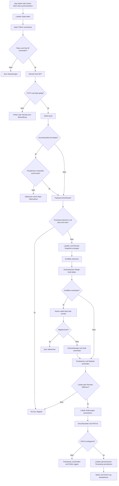
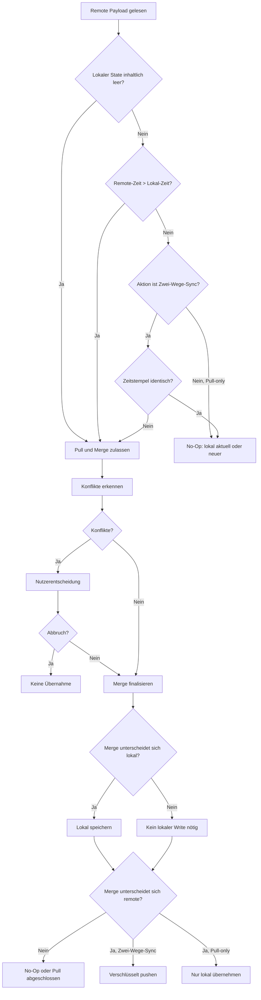
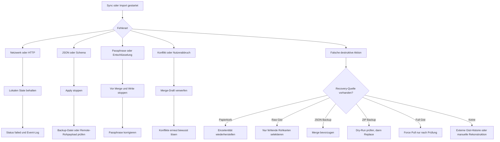
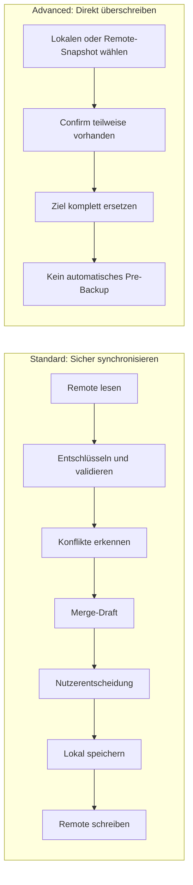
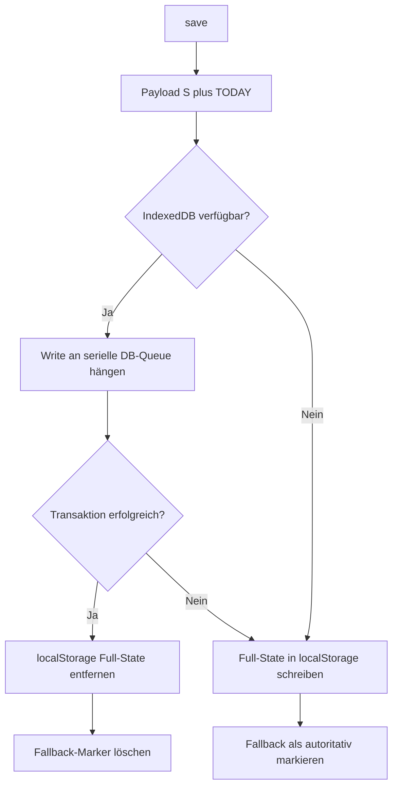
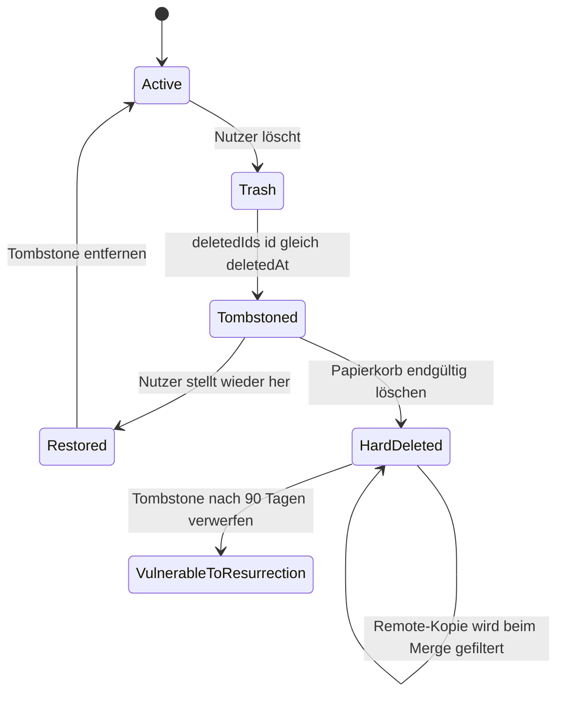

# Daily-Log Sync Reference

> **Zweck dieses Dokuments:** technische Referenz der im Repository vorhandenen Synchronisations-, Persistenz-, Backup- und Recovery-Logik. Der Bericht beschreibt zuerst den Ist-Zustand der Daily-Log-App und leitet danach allgemeine Prinzipien für andere local-first Single-User-Webapps ab.
>
> **Analysierter Stand:** Repository-Arbeitsstand vom 7. Juni 2026. Analysiert wurden ausschließlich `index.html`, `README.md`, `manifest.json` und `sw.js`; die implementierte Sync-Logik befindet sich vollständig in `index.html`.
>
> **Abgrenzung:** Es wurden keine Remote-Aufrufe, keine echten Gist-Schreibvorgänge und keine App-Code-Änderungen durchgeführt. Aussagen mit **Ableitung:** sind Schlussfolgerungen aus dem Kontrollfluss. **Nicht gefunden:** bezeichnet eine im untersuchten Code nicht vorhandene Funktion. **Unklar:** bezeichnet Verhalten, das ohne Laufzeitversuch oder externe Daten nicht abschließend belegbar ist.

## Kurzfassung

Daily Log ist eine local-first Single-File-Webapp mit:

- primärer lokaler Speicherung in IndexedDB und einem ausdrücklich markierten `localStorage`-Fallback;
- einem vollständigen, optional AES-GCM-verschlüsselten GitHub-Gist für `S` und `TODAY`;
- einem separaten, ebenfalls verschlüsselten Raw-Backup-Gist nur für Rohkarten;
- automatischem Zwei-Wege-Sync beim Start;
- verzögertem automatischem **Push** nach lokalen Saves;
- einem konfliktbewussten Merge für Karten, Objekte und ausgewählte Config-Felder;
- Tombstones (`S.deletedIds`) gegen das Wiederauferstehen gelöschter IDs;
- expliziten Konfliktentscheidungen pro Einheit mit lokalem Default;
- separaten Recovery-Kanälen über Papierkorb, Raw-Gist, vollständiges JSON und strukturiertes ZIP.

Die im Alltag robuste Wirkung entsteht vor allem aus der Kombination dieser Schutzschichten:

1. **Lokal bleibt primär:** Änderungen werden zuerst lokal persistiert.
2. **Leerer lokaler Erstzustand zieht Remote:** Ein frischer Browser wird nicht aufgrund eines fehlenden lokalen Zeitstempels als „neuer“ behandelt.
3. **Normaler Sync merged statt pauschal zu ersetzen:** `gistSync()` liest zuerst Remote, erkennt Konflikte, merged und schreibt das Ergebnis zurück.
4. **Gelöschte IDs bleiben für 90 Tage als Tombstones erhalten:** Remote-Kopien werden in dieser Zeit herausgefiltert.
5. **Konflikte blockieren den Abschluss:** Der Nutzer muss wählen oder kann abbrechen; lokal ist vorausgewählt.
6. **Fehlgeschlagene Pushes setzen den lokalen Freshness-Marker zurück:** Der lokale Stand wird nicht fälschlich als erfolgreich exportiert markiert.
7. **Destruktive Pull-/Import-Aktionen haben Confirm-Gates:** Der Standardweg ist Merge, Replace ist sichtbar als riskant markiert.
8. **Recovery ist nicht nur ein Vollrestore:** Rohkarten können selektiv und standardmäßig nur dann importiert werden, wenn sie lokal fehlen.

Die Implementierung hat zugleich relevante Grenzen:

- `gistPush()` führt keinen Remote-Preflight durch und kann einen zwischenzeitlich geänderten Gist blind überschreiben.
- Der 30-Sekunden-Auto-Sync nach `save()` ist technisch ein Auto-**Push**, kein erneuter Zwei-Wege-Sync.
- Es gibt weder ETag/Revision/optimistic concurrency noch Write-Read-Validate nach einem PATCH.
- Die Remote-Validierung prüft JSON und optional Entschlüsselung, aber kein vollständiges Schema und keine unterstützte Payload-Version.
- Der normale Sync kann nach `await gistPush(true)` eine Merge-Erfolgsmeldung setzen, obwohl `gistPush()` intern fehlgeschlagen ist, weil `gistPush()` keinen Erfolgswert liefert und der Aufrufer ihn nicht prüft.
- `mergeById()` bevorzugt `createdAt` vor `updatedAt`; bei Objekten mit beiden Feldern wird dadurch häufig der Erstellzeitpunkt statt des Bearbeitungszeitpunkts verglichen.
- Mehrere Datenbereiche werden heuristisch und nicht feldweise gemerged, insbesondere Tagesplan, historische Tage, Collections, Future Log, Zettel und Papierkorb.
- Vor Force Pull, JSON-Overwrite und ZIP-Overwrite wird kein automatisches lokales Pre-Destruction-Backup erzeugt.

**Gesamturteil:** Daily Log hat eine deutlich sicherere Standardaktion als ein schlichtes „Last write wins“-System: lesen, Konflikte erkennen, mergen, Tombstones anwenden und erst danach schreiben. Die Architektur ist für eine persönliche Single-User-App pragmatisch und nachvollziehbar. Sie ist aber noch keine transaktionale oder revisionssichere Multi-Device-Synchronisation. Vor allem direkte/automatische Pushes und fehlende Remote-Revisionen bleiben Datenverlustrisiken.

## Sync-Zielbild der App

### Systemgrenzen

Die App besitzt kein eigenes Backend. Es gibt drei Persistenzebenen:

| Ebene | Zweck | Mechanismus | Autorität im Normalbetrieb |
|---|---|---|---|
| Lokaler Hauptspeicher | Vollständiger Arbeitszustand | IndexedDB `dailylog_db` / Store `appState` / Key `main` | Primäre Arbeitskopie |
| Lokaler Fallback und Runtime-Metadaten | Fallback-State, Credentials, Geräte-/Sync-Metadaten, UI-Präferenzen | `localStorage` | Fallback bzw. gerätespezifisch |
| Remote-Hauptkopie | Geräteübergreifende Vollsynchronisation | GitHub Gist, Datei `dailylog_v2_data.json` | Gemeinsamer Sync-Stand |
| Remote-Rohkartenbackup | Additives Recovery für Karten | separater GitHub Gist, Datei `dailylog_raw_cards.json` | Recovery-Quelle, nicht Hauptzustand |
| Portable Backups | Manuelle Sicherung/Übertragung | JSON-Datei und strukturiertes ZIP | Nutzerverwaltete Recovery-Quelle |

### Beabsichtigter Standardweg

`index.html` · `init()` lädt zuerst lokal und ruft vor dem ersten sichtbaren Render `gistSync()` auf. Der normale Nutzerbutton „↔ Jetzt synchronisieren“ ruft denselben Zwei-Wege-Flow auf. Der Flow:

1. liest den vollständigen Gist;
2. entschlüsselt ihn gegebenenfalls;
3. vergleicht `remote.exported` mit `S._lastExported`;
4. erkennt semantische Konflikte bei gleichen Karten-/Objekt-IDs und ausgewählten Config-Feldern;
5. merged lokale und entfernte Daten;
6. lässt Konflikte durch den Nutzer auflösen;
7. persistiert lokale Änderungen;
8. pusht das zusammengeführte Ergebnis, falls es sich vom Remote-Zustand unterscheidet.

### Weitere Sync-/Recovery-Wege

- `gistPush(false)`: direkter verschlüsselter Voll-Push ohne vorherigen Remote-Merge.
- `gistPull(false)`: Pull nur, wenn Remote neuer ist oder lokal effektiv leer; standardmäßig Merge mit Konfliktdialog.
- `gistPullOverwrite()`: bestätigter Hard Replace von lokal durch Remote.
- `rawGistPush(false)`: GET-Merge-PATCH für Rohkarten in einem separaten Gist.
- `loadRawRestoreFromGist()` + `importSelectedRawCards()`: selektiver Rohkartenrestore.
- `exportData()` / `importFileAndMerge()` / `importFileAndOverwrite()`: vollständiges JSON.
- `exportZipBackup()` / `startZipBackupImport()` / `confirmZipBackupImport()`: strukturiertes ZIP mit Dry-Run-Vorschau und anschließendem Komplett-Replace.
- Tagesimport über `runDayImport(mode)`: begrenzter Merge oder Overwrite einzelner Tage; dieser Flow ist Import, nicht Gist-Sync.

### Lokal-first-Eigenschaft

`save()` aktualisiert lokal `S._lastExported`, stößt die lokale Persistenz an und plant danach optional Remote-Pushes. Die UI wartet nicht auf Remote-Verfügbarkeit, um lokale Arbeit zu speichern.

**Ableitung:** Die App ist local-first, weil die lokale Datenbank der unmittelbare Schreibpfad ist und der Remote-Gist ein nachgelagerter Replikations-/Recovery-Kanal bleibt. Sie ist nicht offline-sync-fähig im Sinne einer dauerhaften Outbox: Ein fehlgeschlagener Push bleibt zwar durch den lokalen Datenstand recoverbar, wird aber nicht als expliziter Queue-Eintrag mit Retry-Status modelliert.

## Datenmodell

### Vollständig synchronisierter Payload

`index.html` · `gistPayload(syncTs)` erzeugt:

```json
{
  "version": 2,
  "exported": "ISO-8601 timestamp",
  "S": { "...": "global/archive state" },
  "TODAY": { "...": "current day state" }
}
```

Der Payload wird vor dem Gist-Write vollständig verschlüsselt. Der Gist enthält deshalb normalerweise nur das Encryption-Envelope und keine lesbaren Anwendungsdaten.

### Globaler Zustand `S`

Der initiale Zustand enthält:

| Feld | Inhalt | Sync-/Merge-Verhalten |
|---|---|---|
| `days` | Archivierte Tage mit Karten, Objekten, Feed, Review, Plan, ggf. `closedAt` | Merge nach `date`; danach Heuristik nach Objektanzahl bzw. ID-Merge |
| `futurelog` | Zukünftige Aufgaben/Termine | `mergeById(..., 'id')` |
| `migrationPuffer` | Migrationspuffer für Aufgaben | `mergeById(..., 'id')` |
| `feedLastReadwise` | letzter Readwise-Marker | lexikographisch größter String |
| `feedLastRaindrop` | letzter Raindrop-Marker | lexikographisch größter String |
| `feedLastHighlights` | letzter Highlight-Marker | lexikographisch größter String |
| `trash.cards` | gelöschte Karten als Recovery-Einträge | ID-Merge, zugleich durch globale Tombstones filterbar |
| `trash.objects` | gelöschte Objekte als Recovery-Einträge | ID-Merge, zugleich durch globale Tombstones filterbar |
| `zettels` | Zettelkasten-Einträge | ID-Merge |
| `collections` | Sammlungen | ID-Merge |
| `config` | Name, aktiver Kontext, Kontextliste, Prompt-Overrides und ggf. Prompt-Scopes | vier Felder konfliktbewusst; übrige Felder implizit über Objekt-Merge |
| `deletedIds` | `{ id: deletedAtISO }` | Union, je ID neuerer Timestamp; 90 Tage Aufbewahrung |
| `_lastExported` | lokaler Freshness-/Sync-Zeitstempel | Vergleich mit Remote; bei Push gemeinsamer Timestamp |

### Aktueller Tageszustand `TODAY`

`TODAY` ist bewusst außerhalb von `S.days` gehalten:

| Feld | Inhalt | Merge-Regel |
|---|---|---|
| `date` | ISO-Datum | Nur der heutige Tag bleibt `TODAY`; ältere Remote-Tage werden archiviert |
| `cards` | Rohkarten | ID-Merge + Konflikterkennung + Tombstone-Filter |
| `objects` | extrahierte/manuelle Objekte | ID-Merge + Konflikterkennung + Tombstone-Filter |
| `feedItems` | temporäre Feed-Inhalte des Tages | ID-Merge, anschließend Filter auf heutiges Datum |
| `reviewDone` | Review-Flag | boolesches OR |
| `closedAt` | Tagesabschlusszeit | einmal gesetzt, bleibt über OR-ähnliche Auswahl erhalten |
| `plan` | Intentionen, Vermeiden, Aufstehzeit, Ort, Stundenplan, Tasks | kompletter lokaler Plan gewinnt, wenn `local.plan.intentionen` truthy ist; sonst Remote/Fallback |

### IDs

`uid()` kombiniert `Date.now()` mit sechs Zufallsziffern. Karten, Objekte, Zettel, Collections und weitere Array-Entitäten werden überwiegend anhand von `id` zusammengeführt.

**Ableitung:** Die ID-Kollision ist für eine persönliche App unwahrscheinlich, aber es gibt weder UUID-Standard noch Gerätepräfix. Eine echte Kollision würde als „gleiche Entität“ behandelt und könnte einen Konfliktdialog oder eine Gewinnerauswahl auslösen.

### Timestamps und Geräte-Metadaten

Gefundene sync-relevante Zeit-/Metadaten:

- Payload: `exported`.
- Global: `S._lastExported`.
- Entitäten: je nach Typ `createdAt`, `updatedAt`, `closedAt`, `loadedAt`, `backedUpAt`, `deletedAt`.
- Bearbeitungsquelle: `lastEditedByDeviceId`, `lastEditedByDeviceName`, gesetzt über `stampItemEditMeta()`.
- Gerät: persistente lokale `DEVICE_ID_KEY` und `DEVICE_NAME_KEY`.

`compareLocalRemoteItems()` nutzt Geräte-Metadaten nur zur Konfliktbeschreibung, nicht als automatische Gewinnerregel. Konflikte werden anhand materieller Feldsignaturen erkannt.

### Konfliktrelevante Kartenfelder

`comparableCardSignature()` vergleicht:

- normalisierten `text`;
- `type`;
- boolesches `processed`;
- `time`.

### Konfliktrelevante Objektfelder

`comparableObjectSignature()` und `compareLocalRemoteItems()` berücksichtigen:

- `text`, `typ`, `zeit`;
- `kontext`, sortierte `contexts`;
- `energie`, `dauer`;
- `sourceQuote`, `confidence`, `needsReview`;
- `status`, sortierte `signifiers`;
- `reviewNote`;
- sortierte `collectionIds`;
- eine Signatur der Kindobjekt-Texte und -Typen.

Nicht alle möglicherweise vorhandenen Objektfelder sind Teil der Signatur. **Nicht gefunden:** eine generische Deep-Diff-Prüfung aller Entitätsfelder.

### Config-Konflikte

Explizit konfliktbewusst sind:

- `context`;
- `contexts`;
- `promptOverrides`;
- `promptScopes`.

Arrays/Objekte werden für den Vergleich sortiert bzw. nach Keys normalisiert. Config-Konflikte erscheinen priorisiert oben im Dialog.

**Wichtig:** `config.name` ist nicht in `SYNC_CONFIG_FIELDS`. `mergeSyncConfig()` startet mit `Object.assign({}, localCfg, remoteCfg)`, daher gewinnt für nicht speziell behandelte, auf beiden Seiten vorhandene Config-Felder standardmäßig Remote. Das ist keine sichtbare Nutzerentscheidung.

### Tombstones

`recordDeletion(id)` schreibt `S.deletedIds[id] = now`. `mergeDeletedIds()` bildet die Union und behält je ID den neueren Löschzeitpunkt. `mergeById()`, `mergeDays()`, `mergeToday()` und Post-Pull-Filter entfernen tombstoned Karten/Objekte.

Tombstones werden durch `pruneDeletedIds()` nach 90 Tagen gelöscht.

**Ableitung:** Der Löschschutz gilt nur innerhalb dieses 90-Tage-Fensters. Ein Gerät, das länger offline war und danach eine alte Entität zurückliefert, kann diese nach Ablauf des Tombstones wieder einführen.

### Papierkorb versus Tombstone

Der Papierkorb enthält Recovery-Payloads; `deletedIds` verhindert Replikations-Wiederauferstehung. Beides sind verschiedene Konzepte:

- Papierkorb = Nutzer-Recovery.
- Tombstone = Sync-Semantik.

Beim Restore aus dem Papierkorb wird der relevante Tombstone entfernt; beim Hard Delete bleibt bzw. entsteht die Löschmarkierung. Diese Kopplung ist für Sync-korrektes Wiederherstellen wesentlich.

### Dirty Flags, Versionen, Hashes und Checksums

- **Vorhanden:** `version: 2` im Full-Gist-Payload; `version: 1` im Raw-Payload; ZIP-Format `dailylog-zip-v1`.
- **Vorhanden:** Freshness-Marker `exported` und `_lastExported`.
- **Nicht gefunden:** per-entity dirty flag.
- **Nicht gefunden:** monotone Sync-Revision oder Server-Generation.
- **Nicht gefunden:** ETag/`If-Match`.
- **Nicht gefunden:** Payload-Checksum oder Hash.
- **Nicht gefunden:** persistente Outbox/Retry Queue.
- **Nicht gefunden:** explizite Sync-Session-ID.

### Bewusst nicht im Full-Gist-Payload

Der Payload enthält nur `S` und `TODAY`. Nicht synchronisiert werden insbesondere:

- GitHub-Token und Gist-ID;
- Raw-Gist-Token und Raw-Gist-ID;
- OpenAI-, Readwise- und Raindrop-Tokens;
- Sync-Passphrase und Remember-Flag;
- Geräte-ID und Gerätename;
- Auto-Sync-Schalter;
- Sync-Diagnostik und die letzten fünf Sync-Events;
- Theme;
- Runtime-State wie aktive Tabs, Modalzustände, Timer und Konfliktresolver;
- IndexedDB-/Fallback-Status.

Das ist sicherheitstechnisch sinnvoll: Secrets und gerätespezifischer Runtime-State werden nicht in den synchronisierten App-Payload aufgenommen.

## Lokale Persistenz

### Primärspeicher

`index.html` · `dbInit()`, `dbLoadState()`, `dbSaveState()` und `dbHasState()` nutzen:

- Datenbank: `dailylog_db`;
- Version: `1`;
- Object Store: `appState`;
- Key: `main`;
- Wert: `{ S, TODAY }`.

Writes werden über `_dbWriteQueue` seriell verkettet. `dbSaveState()` löst erst bei `transaction.oncomplete` auf. Das schützt vor parallelen lokalen Write-Races innerhalb derselben App-Session.

### `localStorage`-Fallback

Der Full-State-Fallback liegt unter `dailylog_v2`. Zusätzlich markiert `dailylog_v2_fallback_authoritative`, ob dieser Fallback bewusst autoritativ ist.

Beim erfolgreichen IndexedDB-Write:

- wird der Legacy-/Fallback-Wert entfernt;
- der Authoritative-Marker gelöscht;
- IndexedDB als nutzbar markiert.

Beim fehlgeschlagenen IndexedDB-Write:

- wird nach `localStorage` geschrieben;
- der Fallback als autoritativ markiert;
- ein Speicherfehler getoastet, falls auch dieser Write fehlschlägt.

### Schutz gegen stale Fallback-State

`load()` liest einen vorhandenen `localStorage`-Full-State nur, wenn:

- IndexedDB nicht verfügbar ist;
- der Fallback in dieser Session geschrieben wurde; oder
- der Authoritative-Marker gesetzt ist.

Andernfalls wird ein alter Legacy-`localStorage`-Stand bewusst ignoriert. Das verhindert, dass nach erfolgreicher Migration eine veraltete lokale Kopie die IndexedDB-Daten überschreibt.

### Migration von `localStorage` nach IndexedDB

Wenn IndexedDB noch keinen gültigen State enthält, aber `dailylog_v2` vorhanden ist:

1. JSON parsen;
2. auf `S` und `TODAY` prüfen;
3. in IndexedDB schreiben;
4. als aktuellen State setzen;
5. Legacy-Wert und Fallback-Marker entfernen;
6. Erfolg anzeigen.

### Fehlerbehandlung beim Laden

- IndexedDB-Open-/Load-/Migrationsfehler werden geloggt und führen zum Fallback-Versuch.
- Viele äußere Parsing-Fehler werden durch ein leeres `catch` abgefangen.
- Danach ergänzt `load()` fehlende Default-Strukturen.
- `migrateLegacyObjectMetadata()` ergänzt alte Objektquellen.
- `pruneDeletedIds()` entfernt alte Tombstones.
- `cleanOrphanCollectionRefs()` bereinigt ungültige Collection-Referenzen.
- Ein veraltetes `TODAY` wird archiviert und durch einen frischen Tag ersetzt.

**Risiko:** Ein kaputter JSON-Fallback kann still verworfen werden; es gibt keinen Quarantäne-Export des korrupten Rohtexts und keine detaillierte Recovery-UI.

### Save-Semantik

`save()`:

1. setzt außerhalb eines aktiven Syncs `S._lastExported = now`;
2. ruft `persistLocalOnly()` auf;
3. plant außerhalb eines aktiven Syncs nach 30 Sekunden `gistPush(true)`, sofern Auto-Sync aktiviert ist;
4. plant unabhängig vom Full-Gist-Auto-Sync ein Raw-Backup, sofern konfiguriert.

`saveDebounced()` wartet 600 ms und ignoriert Saves während `_syncInProgress`.

**Ableitung:** `_lastExported` ist gleichzeitig „lokal zuletzt gespeichert/geändert“ und „mit Remote geteilter Snapshot-Zeitpunkt“. Diese Doppelrolle vereinfacht den Vergleich, ist aber semantisch weniger präzise als getrennte Marker wie `localModifiedAt`, `lastSyncedRevision` und `lastRemoteRevision`.

## Remote-/Gist-/Cloud-Struktur

### Full-Gist

- API: `https://api.github.com/gists/{gistId}`.
- Datei: `dailylog_v2_data.json`.
- Lesen: GET.
- Schreiben: PATCH mit `files[GIST_FILE].content`.
- Auth: `Authorization: token <token>`.

### Verschlüsseltes Envelope

`encryptJsonPayload()` erzeugt:

```json
{
  "format": "dailylog-encrypted-v1",
  "kdf": {
    "name": "PBKDF2",
    "hash": "SHA-256",
    "iterations": 250000
  },
  "cipher": { "name": "AES-GCM" },
  "salt": "base64",
  "iv": "base64",
  "ciphertext": "base64"
}
```

Eigenschaften:

- 16 Byte zufälliger Salt pro Write;
- 12 Byte zufälliger IV pro Write;
- PBKDF2-SHA-256 mit 250.000 Iterationen;
- AES-GCM mit 256-Bit-Key;
- vollständiger App-Payload als Ciphertext.

AES-GCM liefert Authentizitäts-/Integritätsschutz für den Ciphertext. Ein falsches Passwort oder manipulierte Daten führen bei der Entschlüsselung zum Fehler.

### Passphrase-Semantik

- Standard: nur Runtime-Variable `_syncPassphrase`.
- Optional: lokale Speicherung im Browser.
- Kein Push ohne Passphrase.
- Legacy-Plaintext-Gists können gelesen werden und werden beim nächsten Push verschlüsselt.

**UX-Unstimmigkeit:** `saveSettings()` formuliert bei fehlender Passphrase „Gist bleibt unverschlüsselt“, während `gistPush()` tatsächlich jeden Write ohne Passphrase blockiert. Die Meldung sollte „Gist wird nicht geschrieben“ lauten.

### Große Gist-Dateien

`getFullGistFileText(file)` folgt `raw_url`, wenn GitHub `file.truncated` meldet. Dadurch ist die Implementierung nicht auf den möglicherweise gekürzten Inline-Content beschränkt.

### Remote-Validierung

Tatsächlich geprüft werden:

- HTTP-Erfolg;
- Existenz der erwarteten Datei;
- parsbares JSON;
- Erkennung des Encryption-Formats;
- erfolgreiche AES-GCM-Entschlüsselung;
- im weiteren Kontrollfluss teilweise Existenz von `S`/`TODAY`.

**Nicht gefunden:**

- harte Prüfung `version === 2`;
- JSON-Schema;
- Typprüfung aller Arrays/Felder vor dem Merge;
- Größenlimit oder Plausibilitätsgrenzen;
- Prüfung, dass `exported` ein valider ISO-Zeitstempel ist;
- Checksum über den entschlüsselten Payload;
- Remote-Readback nach PATCH;
- GitHub-Gist-Revision/ETag-Abgleich.

### Raw-Backup-Gist

- separate Credentials und Gist-ID;
- Datei `dailylog_raw_cards.json`;
- Payload `{ version: 1, exported, days: { date: [cards] } }`;
- dasselbe Encryption-Envelope;
- vor Write GET, Entschlüsselung, additives Merge und PATCH.

Raw-Kartenfelder sind reduziert auf ID, Datum, Zeit, Typ, Text und Backup-Zeit. Objekte, Pläne und Konfiguration gehören bewusst nicht in diesen Recovery-Kanal.

## Pull-Flow

### Manueller Pull `gistPull(silent, forceOverwrite)`

#### Vorbedingungen

- Token und Gist-ID müssen vorhanden sein.
- Reentrancy wird über `_syncInProgress` blockiert bzw. der vorherige Zustand im `finally` wiederhergestellt.
- Der Button zeigt während eines manuellen Pulls „⏳ Laden…“.

#### Remote lesen

1. Gist per GET laden.
2. HTTP-Fehler melden und abbrechen.
3. erwartete Datei suchen.
4. bei fehlender Datei als `skipped` abbrechen; kein automatischer Push in diesem manuellen Pull-Pfad.
5. vollständigen Text laden, JSON parsen, optional entschlüsseln.

#### Freshness-Entscheidung

```text
gistTime  = parsed.exported || parsed.S._lastExported || ''
localTime = S._lastExported || ''
gistNewer = gistTime > localTime
```

Der Vergleich funktioniert für normierte ISO-8601-UTC-Strings lexikographisch.

#### Schutz für frische Browser

`localIsEmpty` ist wahr, wenn weder lokaler Timestamp noch Daten in folgenden Bereichen vorhanden sind:

- `S.days`;
- `TODAY.cards`;
- `TODAY.objects`;
- `TODAY.feedItems`;
- `S.futurelog`;
- `S.zettels`.

Dann wird trotz fehlender Remote-Neuheit gepullt.

**Wichtig:** Collections, Migration Buffer, Config, Trash und Tombstones zählen nicht zur Empty-Prüfung. Ein lokaler Zustand, der ausschließlich solche Daten enthält, kann als leer behandelt werden.

#### Remote nicht neuer

Ohne Force-Overwrite:

- manuell: Toast „Lokale Daten sind aktuell — kein Pull nötig“, Status `skipped`;
- silent: stiller `false`-Return.

Das ist ein klarer No-Op-Fall.

#### Sicherer Pull/Merge

Wenn Remote neuer oder lokal leer ist:

1. lokale und Remote-Snapshots erzeugen;
2. Konflikte erkennen;
3. bei Konflikten Dialog öffnen;
4. bei Abbruch keine State-Übernahme;
5. `S` über `mergeS()` mergen;
6. `TODAY` nur mergen, wenn Remote-TODAY heute ist;
7. die Seite mit mehr Karten+Objekten als erstes Argument von `mergeToday()` verwenden;
8. Nutzerentscheidungen nach dem automatischen Merge anwenden;
9. Tombstones auf `TODAY` anwenden;
10. Defaults ergänzen;
11. `S._lastExported` auf `gistTime` setzen;
12. lokal speichern und UI neu rendern.

Der manuelle Pull pusht das Merge-Ergebnis **nicht** zurück. Lokale `save()`-Semantik kann danach allerdings den Auto-Push planen, weil `_syncInProgress` während `save()` noch wahr ist, wird in diesem konkreten Pfad kein Auto-Push aus `save()` gestartet.

**Ableitung:** Nach einem Pull-Merge, bei dem lokale-only Daten in das Ergebnis gelangen, kann Remote zunächst hinter dem lokalen Zustand bleiben. Der explizite Zwei-Wege-Button `gistSync()` ist für die sofortige Rückschreibung geeigneter.

#### Force Overwrite

`gistPullOverwrite()` zeigt:

> „⚠ Achtung: Der Gist-Stand überschreibt alle lokalen Daten. Fortfahren?“

Nach Bestätigung setzt `gistPull(..., true)` `S` und `TODAY` direkt aus dem Remote-Payload. Vorher wird nur ein stale `TODAY` archiviert. Es gibt kein automatisches vollständiges Backup des aktuell lokalen Zustands.

### Startup-Pull als Teil von `gistSync()`

`init()` ruft `gistSync()` nach `load()`, aber vor dem ersten vollständigen UI-Render auf. Das reduziert sichtbares Flackern und verhindert, dass der Nutzer zunächst einen alten lokalen Zustand bearbeitet, während ein Startup-Sync parallel läuft.

### Leerer Remote-State

Im normalen `gistSync()` bedeutet eine fehlende Gist-Datei: lokaler Stand wird per `gistPush(true)` hochgeladen. Die Passphrase bleibt ein Gate.

**Risiko:** Es gibt keine zusätzliche Prüfung, ob der lokale Stand substanziell ist. Ein frischer leerer lokaler Default kann bei leerer/fehlender Remote-Datei einen leeren verschlüsselten Payload schreiben. Das zerstört in diesem Fall zwar keinen vorhandenen erwarteten File-Stand, kann aber einen falsch konfigurierten Gist initialisieren.

### Ungültiger Remote-State

- JSON-Fehler landen im äußeren `catch`.
- Entschlüsselungsfehler stoppen vor jeder State-Übernahme.
- Fehlende Passphrase stoppt vor jeder State-Übernahme.
- Strukturell falsches, aber parsbares JSON besitzt keinen vollständigen Schema-Guard und kann in Default-/Merge-Pfade gelangen.

### Dry-Run/Preview

- **Full-Gist-Pull:** Nicht gefunden.
- **Konflikte:** Preview pro Konflikt vorhanden.
- **ZIP-Import:** expliziter Dry-Run vorhanden.
- **Raw-Restore:** selektive Preview vorhanden.

## Push-Flow

### Direkter Full-Push `gistPush(silent)`

#### Gates

- Token und Gist-ID vorhanden.
- Passphrase vorhanden.
- Kein explizites Confirm-Gate.
- Kein Remote-GET vor PATCH.

#### Write-Ablauf

1. bisherigen `S._lastExported` merken;
2. einen gemeinsamen `syncTs` erzeugen;
3. `S._lastExported = syncTs` setzen;
4. `gistPayload(syncTs)` verschlüsseln;
5. Gist-Datei per PATCH ersetzen;
6. bei HTTP-Erfolg lokalen State mit identischem Timestamp persistieren;
7. Erfolg in Status und Event-Log schreiben;
8. bei HTTP-/Crypto-/Network-Fehler den alten Timestamp exakt wiederherstellen.

Das Zurückrollen des Timestamps ist ein gutes Schutzmuster: Ein fehlgeschlagener Write wird nicht als synchronisierter Stand markiert.

#### Was der Push nicht schützt

`gistPush()`:

- liest Remote nicht vorher;
- prüft keine Remote-Revision;
- erkennt keine konkurrierenden Änderungen;
- validiert den Remote-Inhalt nach dem Write nicht;
- erstellt vorher kein Backup;
- prüft nicht, ob der lokale Zustand leer oder plausibel ist;
- unterscheidet UI-seitig nicht zwischen gewöhnlichem Push und Force-Overwrite.

**Ableitung:** „☁ In Gist schreiben“ ist funktional eine riskante Advanced-Aktion, obwohl sie weniger stark gewarnt wird als „Gist überschreibt lokal“. Sie kann guten Remote-State durch einen alten oder unvollständigen lokalen State ersetzen.

### Auto-Push

`gistAutoSyncDebounced()` wird nach normalen `save()`-Aufrufen geplant:

- 30 Sekunden Debounce;
- nur wenn Token und Gist-ID vorhanden;
- ruft `gistPush(true)` auf;
- führt keinen Pull/Merge unmittelbar vor dem Write aus.

**Zentrale Einschränkung:** Der UI-Begriff „Auto-Sync“ verschleiert, dass dieser Pfad nur pusht. Bei paralleler Bearbeitung auf einem zweiten Gerät besteht ein Lost-Update-Risiko.

### Zwei-Wege-Sync-Push

`gistSync()` liest zuerst Remote, merged und berechnet:

- `didChange`: lokaler Snapshot versus Merge-Ergebnis;
- `needsPush`: Merge-Ergebnis versus Remote-Snapshot, jeweils ohne `_lastExported`.

Nur wenn mindestens eine Bedingung wahr ist, wird gespeichert bzw. gepusht. Bei identischem Payload gibt es einen expliziten No-Op.

Das ist der sicherste Full-Sync-Pfad der App.

### Erfolgsmarkierung und Write-Verifikation

`gistPush()` markiert HTTP-2xx als Erfolg. Es gibt keinen GET-Readback und keine Entschlüsselungs-/Inhaltsprüfung des geschriebenen Files.

Zusätzlich ruft `gistSync()` `await gistPush(true)` auf, ohne einen Rückgabewert zu prüfen. Danach setzt es bei konfliktfreiem Flow Status `merged` und schreibt eine Erfolgsmeldung. Da `gistPush()` Fehler intern fängt und nicht wirft, kann ein Push-Fehler durch die nachfolgende Merge-Erfolgsmeldung semantisch überschrieben werden.

**Sicherheitsinvariante „Erfolg erst nach vollständigem Write/Read/Validate“: nicht vorhanden.**

## Merge-/Replace-Strategie

### Übersicht

| Bereich | Merge-Key | Gewinnerregel |
|---|---|---|
| Karten/Objekte und viele globale Arrays | `id` | Remote nur, wenn ermittelter Remote-Timestamp größer ist; Konfliktentscheidung kann danach überschreiben |
| Tage | `date` | mehr Objekte gewinnt; bei Gleichstand ID-Merge |
| `TODAY` | heutiges Datum | Seite mit mehr Karten+Objekten wird als lokale Prioritätsseite übergeben; Arrays dann ID-Merge |
| `reviewDone` | Feld | OR |
| `closedAt` | Feld | erster vorhandener Wert bleibt |
| Tagesplan | gesamtes Objekt | erster Plan mit truthy `intentionen` gewinnt |
| Feed-Marker | Feld | lexikographisch größerer String |
| Tombstones | Entitäts-ID | Union; neuerer Löschzeitpunkt |
| ausgewählte Config-Felder | Feldname | Konfliktdialog, lokal vorausgewählt |
| übrige Config-Felder | Feldname | Remote überschreibt bei `Object.assign` |
| Full Force Pull | keiner | kompletter Remote-Replace |
| JSON/ZIP Overwrite | keiner | kompletter lokaler Replace |

### `mergeById()`

Der Algorithmus:

1. lokale Arrays in Map schreiben;
2. Remote-Einträge mit Tombstone überspringen;
3. neue Remote-ID hinzufügen;
4. bei gleicher ID Zeitstempel vergleichen;
5. Remote bei größerem Timestamp übernehmen;
6. am Ende alle tombstoned IDs filtern.

Der Zeitstempel wird als `createdAt || updatedAt || '0'` ermittelt.

**Risiko:** Weil `createdAt` zuerst geprüft wird, wird `updatedAt` ignoriert, sobald `createdAt` existiert. Für regulär erzeugte Entitäten kann damit die Bearbeitungsneuheit falsch bestimmt werden. Erwartbarer wäre `updatedAt || createdAt`.

**Risiko:** Bei fehlenden Zeitstempeln gewinnt lokal, obwohl Remote materiell anders sein kann. Karten/Objekte mit gleicher ID werden vorher als Konflikt erkannt; andere Entitätstypen nicht.

### `mergeDays()`

Für gleiche Datumswerte:

- `closedAt` geht nie verloren;
- mehr nicht gelöschte Remote-Objekte → Remote-Tagesobjekt gewinnt fast vollständig;
- gleiche Objektzahl → Arrays per ID mergen, `reviewDone` OR, Planheuristik;
- mehr lokale Objekte → lokaler Tag bleibt, Remote-only Karten/Feed/Plan können verloren gehen.

**Ableitung:** „Mehr Objekte“ wird als Proxy für Vollständigkeit verwendet. Das ist pragmatisch, aber keine allgemeine Kausalitätsregel. Ein Tag mit weniger, dafür bewusst gelöschten oder korrigierten Objekten kann fälschlich als schlechter/älter gelten; Tombstones reduzieren, aber eliminieren dieses Problem nicht.

### `mergeToday()`

- Ein Remote-TODAY aus der Vergangenheit wird archiviert oder in einen vorhandenen historischen Tag ergänzt.
- Wenn nur eine Seite heute ist, gewinnt diese.
- Karten, Objekte und Feed werden per ID gemerged.
- Feed wird auf heute begrenzt.
- `reviewDone` und `closedAt` sind monoton.
- Plan wird nicht feldweise gemerged.

Der Aufrufer sortiert die Argumente nach Anzahl Karten+Objekte, um zu verhindern, dass ein leerer Remote-Tag einen gefüllten lokalen Tag verdrängt.

### `mergeS()`

`deletedIds` wird absichtlich zuerst gemerged und früh in globales `S` geschrieben, damit alle folgenden `isDeleted()`-Prüfungen die gemeinsame Tombstone-Menge sehen.

Danach werden bekannte Top-Level-Felder neu aufgebaut. **Risiko:** Unbekannte zukünftige Top-Level-Felder in `S` werden nicht automatisch erhalten, weil das Return-Objekt eine feste Feldliste hat. Schema-Erweiterungen brauchen deshalb eine bewusste Anpassung von `mergeS()`.

### Replace-Wege

- `gistPullOverwrite()`: Remote ersetzt lokal nach Confirm.
- `importFileAndOverwrite()`: Datei ersetzt lokal nach Parse und Confirm.
- `confirmZipBackupImport()`: analysiertes ZIP ersetzt lokal nach Preview und Confirm.
- `runDayImport('overwrite')`: begrenzter Replace eines Tages.

Die UI trennt Merge und Overwrite sichtbar. Das ist ein starkes Muster. Ein automatisches Backup direkt vor Replace fehlt jedoch.

## Konfliktmanagement

### Konflikterkennung

`detectSyncConflicts()` erkennt Konflikte nur, wenn eine ID auf beiden Seiten existiert und die vergleichbare Signatur abweicht. Neue, nur auf einer Seite vorhandene IDs sind kein Konflikt, sondern werden gemerged.

Erkannt werden:

- Kartenkonflikte;
- Objektkonflikte;
- vier Config-Feldkonflikte;
- eine Risikoheuristik für gleiche Karten-ID mit stark abweichender Anzahl zugehöriger Objekte.

Die Risikoheuristik greift bei einer absoluten Differenz von mindestens drei und wenn die kleinere Menge weniger als halb so groß ist wie die größere.

### Was nicht als Konflikt erkannt wird

- gleiche ID in `zettels`, `collections`, `futurelog`, `migrationPuffer` oder Trash mit verschiedenen Inhalten;
- Tagesplan-Differenzen;
- Feed-Item-Differenzen;
- unterschiedliche historische Tagesstruktur bei verschiedenen Objektzahlen;
- Löschung versus Bearbeitung außerhalb des Tombstone-Fensters;
- unbekannte Config-Felder;
- Remote-Änderung zwischen GET und PATCH.

### Konflikt-UI

Das Modal zeigt:

- Typ, ID, Datum und Differenzarten;
- lokale und Remote-Vorschau;
- `updatedAt` oder `createdAt`;
- Gerätename/-ID;
- Radio-Entscheidung lokal/remote;
- Bulk-Aktionen „Alle auf lokal“ und „Alle auf remote“;
- „Auswahl anwenden“ oder „Sync abbrechen“.

Config-Konflikte werden visuell priorisiert und zeigen formatierte JSON-Werte.

### Default-Verhalten

Alle Konflikte sind lokal vorausgewählt. Bei fehlender Radio-Auswahl fällt die Resolution ebenfalls auf lokal zurück.

Das ist konservativ für eine local-first App: Ein bloßes Öffnen und Bestätigen des Dialogs ersetzt nicht unbemerkt lokale Konfliktwerte durch Remote.

### Abbruch

Bei Abbruch wird der Merge nicht als neuer `S`/`TODAY`-State übernommen. Im normalen Sync hat `mergeS()` allerdings vor dem Abbruch vorübergehend `S.deletedIds` mutiert. Da der globale State nicht aus einem vollständig isolierten Draft besteht, ist die Konfliktphase nicht rein funktional.

**Ableitung:** Durch die frühe Zuweisung `S.deletedIds = mergedDeletedIds` kann ein abgebrochener Sync Tombstones aus Remote bereits im Runtime-State hinterlassen. Ob sie später persistiert werden, hängt von nachfolgenden Saves ab. Ein vollständig isolierter Merge-Draft wäre sicherer.

## Selektions- und Teilübernahme-Logik

### Full-Sync

Eine Auswahl kompletter Datenbereiche ist nicht vorgesehen. Der Nutzer entscheidet nur bei konkret erkannten Karten-, Objekt- und Config-Konflikten lokal versus Remote.

### Raw-Restore

Der Raw-Restore ist der granularste Recovery-Flow:

- Suche;
- Datumsfilter;
- Typfilter;
- standardmäßig „nur fehlende“;
- Aktionen Alle/Keine/Nur fehlende;
- einzelne Checkbox-ähnliche Auswahl;
- lokale Existenzprüfung über ID **oder** Signatur aus Datum, Zeit, Typ und Text;
- Duplikate werden beim Import erneut übersprungen;
- Wiederhergestellte Karten werden mit `restoredFromRaw: true` markiert.

Dieser Flow verhindert gut, dass ein vollständiges Backup blind über den aktuellen Zustand gelegt wird.

### ZIP-Import

Vor dem Write wird angezeigt:

- Formatgültigkeit;
- Manifest;
- Anzahl Day-Dateien;
- Existenz von `today.json`;
- vorhandene globale Dateien;
- importierte Tages-/TODAY-/Collection-Zahlen;
- lokale Vergleichszahlen.

Die Vorschau ist ein Dry-Run, bietet danach aber nur komplettes Überschreiben, keinen Merge und keine Bereichsauswahl.

### JSON-Import

- „Datei mergen“ verwendet die gleichen Merge-Helfer wie Gist-Sync, aber ohne Konfliktdialog.
- „Datei überschreiben“ ersetzt nach Confirm vollständig.

**Risiko:** JSON-Merge kann semantisch unterschiedliche gleiche IDs automatisch nach den heuristischen Gewinnerregeln behandeln, ohne Konflikt-UI.

### Tagesimport

Der Tagesimport trennt „Merge (sicher)“ und „Überschreiben“. Ein optionales Datumsfeld kann das Importdatum ändern. Der Merge fügt neue Objekte hinzu und behält bestehende; der Overwrite ersetzt den Zieltag.

## Fehlerfälle und Recovery

### Fehlerfallmatrix

| Fall | Aktuelles Verhalten | Datenverlustschutz | Rest-Risiko |
|---|---|---|---|
| Netzwerkfehler GET | Pull/Sync wird `failed`, lokaler State bleibt | hoch | kein expliziter Retry/Outbox-Status |
| Netzwerkfehler PATCH | Timestamp wird zurückgerollt, lokaler State bleibt | gut | späterer `gistSync()` kann Erfolgsmeldung überdecken |
| 401/403 Tokenfehler | HTTP-Status/Message angezeigt oder geloggt | lokal bleibt | Auth-Fehler nicht speziell erklärt |
| Passphrase fehlt | Full-/Raw-Push blockiert; Pull blockiert bei verschlüsseltem Gist | sehr gut gegen Plaintext-/Fehlwrite | Settings-Toast formuliert Verhalten missverständlich |
| falsche Passphrase Full-Gist | Entschlüsselung stoppt Sync vor Merge/Write | gut | kein Key-Recovery |
| falsche Passphrase Raw-Push beim Remote-GET | Remote-Merge wird still übersprungen, danach lokaler Raw-Stand geschrieben | schwach | vorhandenes Raw-Backup kann durch unvollständigen lokalen Satz ersetzt werden |
| ungültiges JSON | Catch, kein State-Apply | gut | keine Quarantäne/Details/Schema-Diagnose |
| strukturell falsches JSON | teilweise Defaults/Merge möglich | begrenzt | kein Schema-Guard |
| Remote-Datei fehlt, normaler Sync | lokaler Push | sinnvoll für Initialisierung | kein Non-Empty-/Wrong-Gist-Gate |
| Remote-Datei fehlt, manueller Pull | Skip | sicher | Nutzer muss separat pushen |
| lokaler State effektiv leer | Pull wird trotz Timestamp-Regel erlaubt | sehr wichtig | Empty-Predicate deckt nicht alle Datenbereiche ab |
| Remote älter | normaler Zwei-Wege-Sync merged; Pull-only skippt | gut im Standardflow | direkter Push kann dennoch blind überschreiben |
| Remote und lokal gleicher Timestamp | No-Op im `gistSync()` | effizient | gleiche Timestamps bei verschiedenen Inhalten werden nicht geprüft |
| parallele Gerätebearbeitung | Konflikte bei gleichen Karten-/Objekt-IDs; additive IDs werden gemerged | teilweise gut | Race zwischen GET und PATCH; Auto-Push ist blind |
| Abbruch im Konfliktdialog | State-Übernahme wird abgebrochen | gut | `mergeS()` kann globale Tombstones vorab mutieren |
| Tab/Browser beendet während lokaler IDB-Queue | Queue kann unvollständig sein | Browsertransaktion schützt einzelne Writes | `beforeunload`-Flush nicht gefunden |
| Tab beendet zwischen Gist PATCH und lokaler Persistenz | Remote kann neuer sein; nächster Pull sollte rekonstruieren | grundsätzlich recoverbar | kein atomarer Cross-System-Commit |
| kaputte IndexedDB-Migration | Fallback-Versuch und Warnung | gut | korrupter Rohstate wird nicht exportierbar aufbewahrt |
| falsche Force-Pull-Aktion | Confirm | Basis-Schutz | kein automatisches Pre-Backup/Undo |
| falsche Datei-/ZIP-Overwrite-Aktion | Preview/Confirm | Basis-Schutz | kein automatisches Pre-Backup/Undo |
| Remote überschreibt lokal | nur Force-Pull komplett; Merge kann feld-/heuristikweise Remote wählen | sichtbar bzw. konfliktbewusst | nicht alle Felder konfliktbewusst |
| lokal überschreibt Remote | direkter/Auto-Push ohne Preflight möglich | keiner auf Remote-Ebene | größtes Lost-Update-Risiko |
| Tombstone abgelaufen | alte Remote-Entität kann wiederkommen | 90 Tage Schutz | Langzeit-Offline-Geräte |

### Netzwerk- und Auth-Fehler

Full-Gist-Funktionen setzen Sync-Status und Event-Log. Raw-Backup zeigt Fehler nur bei nicht-silentem Aufruf; Auto-Raw-Fehler sind weitgehend still. Es gibt keine Unterscheidung zwischen Offline, Rate Limit, 401, 403, 404 und Serverfehler jenseits des Statuscodes bzw. GitHub-Messages.

### Gleichzeitige Bearbeitung

Der sichere Standardflow reduziert Konflikte so:

- additive neue IDs werden vereinigt;
- gleiche Karten-/Objekt-IDs mit materieller Abweichung werden manuell entschieden;
- Tombstones unterdrücken gelöschte IDs;
- Merge wird zurückgeschrieben.

Er verhindert aber nicht:

1. Gerät A GET;
2. Gerät B schreibt neue Version;
3. Gerät A PATCH mit seinem auf altem GET basierenden Merge;
4. B-Änderung geht verloren.

Dafür wäre eine serverseitige Revision oder ein erneuter Pre-PATCH-Check nötig.

### Abbruch mitten im Sync

Es gibt keinen transaktionalen Commit über IndexedDB und Gist. Die Reihenfolge ist bewusst recoverbar, aber nicht atomar:

- lokaler Save kann vor Remote-Push abgeschlossen sein;
- Remote-Push kann vor lokaler Timestamp-Persistenz abgeschlossen sein;
- ein späterer Sync soll die Seiten wieder zusammenführen.

Der lokale Zustand bleibt normalerweise erhalten. Kritisch sind nur blindes Remote-Overwrite und irreführende Erfolgsmeldungen.

### Recovery-Pfade

1. **Papierkorb:** Restore einzelner gelöschter Karten/Objekte; Tombstone wird passend entfernt.
2. **Raw-Gist:** selektive Wiederherstellung fehlender Rohkarten.
3. **JSON-Merge:** vollständige Backup-Datei in aktuellen State mergen.
4. **JSON-Overwrite:** vollständiger Replace nach Confirm.
5. **ZIP-Dry-Run + Overwrite:** strukturierte Prüfung vor Replace.
6. **Gist Force Pull:** Remote-Snapshot als komplette lokale Quelle.
7. **GitHub-Gist-Historie:** **Ableitung:** GitHub führt üblicherweise Gist-Revisionen, aber die App bietet dafür keine integrierte UI und der Code nutzt keine Revisionen. Eine externe manuelle Recovery könnte möglich sein; dies wurde nicht per API geprüft.

## UX und Statusmeldungen

### Buttons und Risikoklassen

| UI-Aktion | Technischer Pfad | Tatsächliches Risiko | UX-Bewertung |
|---|---|---|---|
| „↔ Jetzt synchronisieren“ | `gistSync()` | niedrigster Full-Sync-Pfad | guter Standard |
| „☁ In Gist schreiben“ | `gistPush(false)` | blindes Remote-Replace der Datei | zu wenig als riskant markiert |
| „⚠ Gist überschreibt lokal“ | Force Pull | kompletter lokaler Replace | korrekt gewarnt + Confirm |
| „↓ Nur von Gist laden“ | Pull/Merge | kein Push, Konflikt-UI | sinnvoller Spezialfall |
| „Auto-Sync aktiv“ | 30-s Auto-Push + Startup-Zwei-Wege-Sync | Name suggeriert mehr Sicherheit als Laufzeitpfad | missverständlich |
| „↓ Vollständiger Export“ | JSON-Export | sicher/read-only | gut |
| „↓ ZIP-Backup exportieren“ | ZIP-Export | sicher/read-only | gut |
| „↑ Datei mergen“ | JSON-Merge ohne Konflikt-UI | mittel | Merge als Standard gut, aber Preview fehlt |
| „⚠ Datei überschreiben“ | JSON-Replace | hoch | korrekt gewarnt + Confirm |
| „↑ ZIP-Backup importieren“ | Dry-Run, dann Replace | hoch | gutes zweistufiges Gate |
| „🗃 Rohkarten sichern“ | Raw GET-Merge-PATCH | mittel | separates Recovery-Ziel gut |
| „♻ Rohkarten wiederherstellen“ | selektiver Import | niedrig | sehr gutes Recovery-UX |

### Sync-Diagnostik

Angezeigt werden:

- Gerätename und gekürzte Geräte-ID;
- Auto-Sync an/aus;
- lokaler `_lastExported`;
- letzter Remote-Zeitstempel;
- letzter Sync-Status;
- letzter Versuch;
- Anzahl heutiger Karten/Objekte;
- Kurzinfo;
- letzter Logeintrag;
- Hinweis bei storage-bedingt gekürztem Log.

Das Event-Log hält maximal fünf sanitizte Einträge. Es ist bewusst klein und entfernt kaputtes JSON selbstständig.

### Gute Formulierungen/Muster

Gut übertragbar:

- „Für jede Einheit bitte entscheiden, ob lokal oder remote übernommen werden soll.“
- „Sync abbrechen“ statt stiller Default-Auflösung.
- „Lokale Daten sind aktuell — kein Pull nötig.“ als klarer No-Op.
- „Gist-Entschlüsselung fehlgeschlagen … Sync abgebrochen.“ als klare Stop-Semantik.
- „Dry-Run: Es werden noch keine Daten geschrieben.“
- „nur fehlende“ als Recovery-Default.
- explizite Erfolgsmeldung „lokaler Stand überschrieben“ nach destruktivem Import.

### Verwirrende oder riskante Formulierungen

- „Auto-Sync“: Der nach Save geplante Pfad ist Auto-Push.
- „In Gist schreiben“: technisch ein Full-File-Overwrite ohne Remote-Preflight.
- „Keine Passphrase — Gist bleibt unverschlüsselt“: tatsächlich wird nicht geschrieben.
- `gistSync()` kann „Daten zusammengeführt“ melden, obwohl der Push intern fehlgeschlagen ist.
- Status `failed` für „Passphrase fehlt“ ist nachvollziehbar, aber „blocked“ wäre semantisch präziser als ein technischer Fehler.

### Statusmodell

Gefundene Statuswerte umfassen:

- `sync`;
- `skipped`;
- `failed`;
- `conflict`;
- `merged`;
- `pushed`;
- `pulled`.

**Nicht gefunden:** getrennte Felder für Phase, Ergebnis, lokale Persistenz, Remote-Write und Remote-Verifikation. Ein strukturierter Zustandsautomat könnte irreführende Überschreibungen vermeiden.

## Sicherheitsinvarianten

| Invariante | Status | Beleg/Einordnung |
|---|---|---|
| Lokal zuerst speichern | vorhanden | `save()` → `persistLocalOnly()`; Remote nachgelagert |
| Normaler Sync liest Remote vor Write | vorhanden | `gistSync()` GET → Merge → optional Push |
| Remote nie blind überschreiben | **nicht durchgängig vorhanden** | direkter Push und Auto-Push tun genau dies |
| Leerer lokaler Default darf guten Remote-State nicht ersetzen | teilweise vorhanden | Startup-Sync erkennt leeren lokalen State; direkter/Auto-Push hat keinen Empty-Guard |
| Leerer Remote-State darf nicht destruktiv lokal wirken | vorhanden | fehlende Datei führt zu Skip oder Push, nicht Local Clear |
| Merge vor Replace | als UX-Standard vorhanden | „Jetzt synchronisieren“, Pull und Datei-Merge; Replace separat |
| Riskante Pull-/Import-Aktionen brauchen Confirm | vorhanden | Force Pull, JSON Overwrite, ZIP Overwrite |
| Riskanter direkter Push braucht Confirm | nicht vorhanden | Button schreibt unmittelbar |
| Backup vor destruktiver Aktion | nicht automatisch vorhanden | Nutzer kann manuell exportieren; kein Preflight-Snapshot |
| Tombstones verhindern Wiederauferstehung | vorhanden, zeitlich begrenzt | Union + Filter; 90-Tage-Pruning |
| Konflikte werden nicht still remote entschieden | für Karten/Objekte/4 Config-Felder vorhanden | lokal vorausgewählt, Abbruch möglich |
| Alle Entitätstypen sind konfliktbewusst | nicht vorhanden | mehrere Arrays nur timestamp-/heuristikbasiert |
| Frische/Identität erzeugt No-Op | vorhanden | gleicher Timestamp bzw. gleicher Merge-Payload |
| Sync-Fingerprint | teilweise | JSON-Snapshotvergleich, aber kein Hash/Revision |
| Push-Fehler darf Freshness nicht erhöhen | vorhanden | `_lastExported` rollback |
| Remote-Write wird nachgelesen und validiert | nicht vorhanden | PATCH-Erfolg genügt |
| Erfolgreicher Abschluss erst nach allen kritischen Schritten | nicht durchgängig | `gistSync()` prüft Push-Ergebnis nicht |
| Reentrancy-Schutz | vorhanden | `_syncInProgress` |
| Lokale Writes sind serialisiert | vorhanden | `_dbWriteQueue` |
| Secrets werden nicht synchronisiert | vorhanden | getrennte `localStorage`-Keys |
| Verschlüsselter Remote-Write ist obligatorisch | vorhanden | Push ohne Passphrase blockiert |
| Schema-Version wird erzwungen | nicht vorhanden | Versionsfelder existieren, aber keine harte Prüfung |
| Unbekannte zukünftige Felder bleiben erhalten | nicht garantiert | `mergeS()` rekonstruiert feste Feldliste |

## Was an dieser Sync gut funktioniert

### 1. Sichere Standardaktion

Der wichtigste positive Designpunkt ist nicht ein einzelner Algorithmus, sondern die Standardroute: Der prominente Zwei-Wege-Sync liest zuerst und merged. Replace ist nicht der Default.

### 2. Schutz eines frischen Browsers

Die explizite Empty-State-Erkennung löst ein häufiges local-first Problem: Ein neuer Browser besitzt keinen Timestamp und darf deshalb nicht als „lokal aktueller“ interpretiert werden. Remote wird bewusst übernommen.

### 3. Konflikte auf semantisch wichtigen Feldern

Die App vergleicht nicht nur JSON-Gleichheit, sondern nennt konkrete Differenzarten. Das macht Nutzerentscheidungen verständlicher als ein abstraktes „Version conflict“.

### 4. Lokal-konservativer Konfliktdefault

Lokal vorausgewählt plus expliziter Abbruch reduziert versehentliches Remote-Overwrite.

### 5. Tombstones und Papierkorb als getrennte Schichten

Die Kombination schützt sowohl die Replikationssemantik als auch die Nutzer-Recovery. Viele einfache local-first Apps besitzen nur einen Papierkorb oder nur ein `deleted`-Flag, aber nicht beide Verantwortlichkeiten sauber getrennt.

### 6. Stale-TODAY-Archivierung

Vor Netzwerkoperationen wird ein veralteter Tagesarbeitsstand archiviert. Das reduziert das Risiko, dass Tageswechsel und Sync einen alten `TODAY` verlieren.

### 7. Shared Push-Timestamp und Rollback

Payload-`exported` und lokales `_lastExported` nutzen beim Push denselben Timestamp. Bei Fehler wird exakt der vorige Marker wiederhergestellt. Das verhindert Freshness-Drift.

### 8. Expliziter No-Op

Identische Timestamps bzw. unveränderte Merge-Snapshots führen zu `skipped` statt unnötigem Write. Das reduziert Remote-Rauschen und lokale Fehlerflächen.

### 9. Recovery mit Granularität

Raw-Restore ist nicht „alles oder nichts“. Preview, Filter, „nur fehlende“ und Deduplizierung sind hervorragende Recovery-Muster.

### 10. Persistenz-Fallback mit Autoritätsmarker

Der Fallback wird nicht blind gelesen. Der Marker verhindert, dass ein altes `localStorage`-Abbild nach einer IndexedDB-Migration wieder autoritativ wird.

### 11. Verschlüsselung als Write-Gate

Die App schreibt den Gist nicht unverschlüsselt weiter, wenn keine Passphrase vorhanden ist. Legacy-Plaintext bleibt lesbar, wird aber beim nächsten zulässigen Write migriert.

## Schwachstellen / offene Risiken

### Priorität A: potenzieller Datenverlust

1. **Blinder direkter/automatischer Push:** Kein GET/Revision-Check direkt vor PATCH.
2. **Race zwischen GET und PATCH im Zwei-Wege-Sync:** Kein ETag/Revision-CAS.
3. **Push-Erfolg wird vom Aufrufer nicht geprüft:** Status kann nach Fehler fälschlich auf `merged` wechseln.
4. **Raw-Backup überschreibt nach fehlgeschlagener Remote-Entschlüsselung:** Falsche Passphrase kann den Remote-Merge auslassen und anschließend PATCH auslösen.
5. **Falsche Timestamp-Priorität in `mergeById()`:** `createdAt` wird vor `updatedAt` verwendet.
6. **Keine automatischen Pre-Overwrite-Backups:** Force Pull/JSON/ZIP können den einzigen lokalen Stand ersetzen.

### Priorität B: unvollständige Konfliktsemantik

1. Konflikte nur für Karten, Objekte und vier Config-Felder.
2. Collections, Zettel, Future Log und Migration Buffer werden nicht semantisch verglichen.
3. Tagesplan wird als Ganzes über `intentionen` priorisiert.
4. Historische Tage verwenden Objektanzahl als Vollständigkeitsheuristik.
5. Config-Felder außerhalb der Whitelist gewinnen implizit remote.
6. Tombstones verfallen nach 90 Tagen ohne Geräte-Acknowledgement.

### Priorität C: Validierung und Diagnose

1. Keine erzwungene Payload-Version.
2. Kein Schema-Validator.
3. Kein Readback nach Write.
4. Keine Sync-Revision, Hash oder Checksum.
5. Nur fünf Sync-Events.
6. Keine persistente Retry Queue.
7. Statusmodell kann Phasen/Teilerfolge nicht sauber darstellen.
8. Kaputter lokaler State wird nicht quarantänisiert.

### Priorität D: UX-Semantik

1. „Auto-Sync“ versus tatsächlicher Auto-Push.
2. Direkter Push nicht als Advanced/Overwrite markiert.
3. Passphrase-Toast widerspricht Write-Gate.
4. Kein Preview für Full-Gist-Force-Pull oder JSON-Merge.
5. Kein „Backup jetzt erstellen“-Zwischenschritt vor Confirm.

## Übertragbare Best Practices für andere local-first Apps

### 1. Lokalen Arbeitszustand und Sync-Metadaten trennen

Übertragbar ist die Trennung von:

- Anwendungszustand;
- lokalem Storage-Backend;
- Remote-Credentials;
- Geräteidentität;
- Sync-Diagnostik;
- Recovery-Daten.

Sie verhindert, dass Secrets, UI-Runtime oder gerätespezifische Marker versehentlich als Anwendungsdaten repliziert werden.

**Voraussetzung:** Ein dokumentiertes State-Schema mit klarer Entscheidung „synchronisiert / lokal-only / abgeleitet / Cache“.

### 2. Zwei-Wege-Merge als Standard, Replace als Advanced-Aktion

Der Standardbutton sollte Remote lesen, validieren, mergen, Konflikte behandeln und erst danach schreiben. Einseitige Overwrites brauchen eigene Benennung, Warnfarbe, Confirm und idealerweise ein Pre-Backup.

**Reduziertes Risiko:** Lost Updates und versehentliche Wiederherstellung eines alten Gerätestands.

### 3. Empty-State explizit modellieren

„Kein Timestamp“ ist nicht automatisch „älter“ oder „neuer“. Ein frischer Default-State muss als eigene Situation erkannt werden.

Empfohlen:

- `isMeaningfullyEmpty(state)` zentral definieren;
- alle geschäftlich relevanten Bereiche berücksichtigen;
- leeren lokalen State niemals ohne Remote-Read pushen;
- leeren Remote-State nicht automatisch als Löschsignal interpretieren.

### 4. Tombstones plus Recovery-Payload

Löschungen brauchen replizierbare Tombstones. Nutzer-Recovery braucht zusätzlich den gelöschten Inhalt. Ein einzelnes Flag erfüllt nicht beide Zwecke optimal.

**Voraussetzung:** stabile globale IDs und eine dokumentierte Tombstone-Retention. Bei mehreren Geräten ist besser, Tombstones erst nach Revision/Acknowledgement aller relevanten Geräte zu entfernen statt nach fixer Zeit.

### 5. Konflikte auf fachlich relevante Signaturen beschränken

Daily Log zeigt, dass nicht jede Metadatenabweichung einen Konflikt erzeugen muss. Normalisierte Signaturen können whitespace-/sortierungsbedingtes Rauschen vermeiden.

**Nur teilweise übertragbar:** Die Signaturfelder müssen je Entitätstyp fachlich definiert werden. Komplexe Apps brauchen Feldgruppen oder dreiwegige Merges statt pauschaler Objektwahl.

### 6. Lokal-konservativer Default und Abbruchmöglichkeit

Bei persönlicher local-first Software ist „lokal behalten“ ein sinnvoller Default. Kritisch ist, dass der Nutzer den gesamten Sync abbrechen kann, ohne einen halbfertigen Draft zu übernehmen.

**Verbesserung gegenüber Daily Log:** Merge vollständig in einem isolierten Draft durchführen; erst nach Bestätigung atomar in den Runtime-State übernehmen.

### 7. Write-Marker erst nach bestätigtem Erfolg fortschreiben

Der Timestamp-Rollback aus `gistPush()` ist ein gutes Muster. Robuster wäre:

1. Remote-Revision vor Write merken;
2. Write mit `If-Match`/vergleichbarer Bedingung;
3. Response prüfen;
4. Remote erneut lesen;
5. entschlüsseln und kanonischen Hash vergleichen;
6. erst dann `lastSuccessfulSyncRevision` persistieren.

### 8. No-Op als eigener erfolgreicher Zustand

„Nichts zu tun“ ist kein Fehler. Ein sauberer No-Op reduziert Writes und macht Logs verständlicher. Der Vergleich sollte auf kanonischem Payload/Hash beruhen, nicht allein auf Zeitstempel.

### 9. Recovery getrennt von Sync entwickeln

Ein Full-Sync ist kein Backup. Gute local-first Apps brauchen:

- portable Exporte;
- validierte Imports;
- Dry-Run/Preview;
- selektive Restores;
- automatische Snapshots vor Destruktion;
- nachvollziehbare Backup-Versionen.

Daily Logs Raw-Restore ist ein besonders gutes Beispiel für einen selektiven, deduplizierenden Recovery-Kanal.

### 10. Ein strukturiertes Sync-Ergebnis zurückgeben

Jede Sync-Funktion sollte statt Toast-only etwa liefern:

```js
{
  ok: true,
  phase: "verified",
  outcome: "merged-and-pushed",
  localChanged: true,
  remoteChanged: true,
  conflictsResolved: 2,
  remoteRevision: "...",
  verified: true
}
```

Aufrufer dürfen Erfolg nur aus diesem Ergebnis ableiten. Damit wird verhindert, dass ein innerer Push-Fehler von einer äußeren Merge-Meldung überschrieben wird.

### 11. Remote-Write gegen Parallelität absichern

Für Gist-/Datei-basierte Syncs sollte mindestens eine dieser Strategien gelten:

- Revision/ETag plus Compare-and-Swap;
- unmittelbar vor PATCH erneut Remote-Revision prüfen;
- Remote-Revision im Payload führen und serverseitig/bei Retry vergleichen;
- bei Revision-Drift zurück in Merge statt überschreiben;
- Append-only Change Log statt Full-Snapshot, falls Komplexität es rechtfertigt.

### 12. Schema, Migration und unbekannte Felder planen

Jeder Remote-Payload braucht:

- unterstützte `schemaVersion`;
- Validator;
- Migrationspipeline;
- Verhalten bei zu neuer Version;
- Erhalt unbekannter Felder oder explizite Ablehnung;
- Backup des Rohpayloads vor Migration.

### 13. UX muss technische Semantik exakt spiegeln

Empfohlene Begriffe:

- „Sicher synchronisieren (lesen, mergen, schreiben)“;
- „Nur Remote laden und mergen“;
- „Remote mit diesem Gerät überschreiben (riskant)“;
- „Lokal durch Remote ersetzen (riskant)“;
- „Automatisch sicher synchronisieren“ nur, wenn tatsächlich vor jedem Write gelesen/verglichen wird;
- „Automatisch hochladen“ für einen reinen Push.

### 14. Entscheidungen, die jede App dokumentieren sollte

- Was ist die Einheit einer Änderung?
- Welche IDs sind stabil?
- Welche Felder sind fachlich konfliktträchtig?
- Welche Daten sind monoton (`closedAt`, Completion) und welche reversibel?
- Welche Löschsemantik gilt?
- Wie lange leben Tombstones und warum?
- Was bedeutet „neuer“?
- Was ist ein leerer Zustand?
- Wann darf ein Full Replace stattfinden?
- Wie wird ein Write verifiziert?
- Welche Aktionen sind Backup, Sync, Import, Merge oder Restore?
- Wann gilt ein Vorgang als abgeschlossen?

### Hinweise für Roadtrip

Roadtrip wird hier nur als beschriebener Zielkontext betrachtet; es wurde kein Roadtrip-Code analysiert.

#### Muster, die Roadtrip übernehmen sollte

1. **Safe Sync als primäre Aktion:** Remote lesen → entschlüsseln/validieren → Preview/Conflict Detection → Merge → verifizierter Write.
2. **Empty-State-Guard:** Eine neue Single-File-HTML-Instanz darf niemals ihren Default-State über einen echten Gist schreiben.
3. **Stabile IDs und Tombstones:** Projekte, Features, Notizen, Handoffs, Codeanalysen und Prompt-Workflows brauchen IDs, Löschzeitpunkte und definierte Restore-Semantik.
4. **Konflikt-UI mit lokalem Default:** besonders für lange Texte, Statusfelder, Sortierung und Beziehungen.
5. **Separater Recovery-Kanal:** automatische lokale Snapshot-Historie plus portable Exporte; gegebenenfalls selektiver Restore einzelner Entitäten.
6. **Destruktive Aktionen klar trennen:** „Merge“, „Remote überschreiben“ und „Lokal überschreiben“ dürfen nicht dieselbe Schaltfläche oder implizite Automatik teilen.
7. **Diagnostik:** letzter erfolgreicher Read, Merge, Write und Verify getrennt anzeigen.
8. **Passphrase-/Secret-Trennung:** Tokens und Passphrase lokal-only halten.
9. **Dry-Run:** Import- und Sync-Deltas vor Apply zeigen.
10. **No-Op:** sauber erkennen und korrekt melden.

#### Welche Risiken dadurch reduziert würden

- leerer Browser überschreibt produktiven Roadtrip-Gist;
- alte Single-File-Kopie überschreibt neuere Projekt-/Feature-Daten;
- gelöschte Features oder Notizen erscheinen erneut;
- abgebrochener Import wird trotzdem als abgeschlossen markiert;
- Konflikte in langen Handoffs/Prompts werden still last-write-wins entschieden;
- ein partieller Write wird als vollständiger Sync angezeigt;
- Backup und Sync werden semantisch verwechselt.

#### Wichtige Unterschiede zu Daily Log

Roadtrip besitzt laut Zielbeschreibung komplexere und stärker verknüpfte Entitäten. Daraus folgen höhere Anforderungen:

- Projekt-/Feature-/Notiz-Beziehungen können referenzielle Integrität benötigen.
- Lange Textfelder eignen sich weniger für „ganz lokal oder ganz remote“.
- Handoffs, Analysen und Prompt-Workflows können mehrere fachliche Teilfelder und Versionen besitzen.
- Reihenfolgen, Statusmaschinen und Cross-Entity-Referenzen dürfen nicht nur anhand von Arraylänge oder Objektanzahl entschieden werden.
- Ein Full-Snapshot kann größer sein und mehr Konflikte erzeugen.

#### Nicht 1:1 übertragbare Daily-Log-Strategien

- „Tag mit mehr Objekten gewinnt“ ist für Projekte/Features ungeeignet.
- `mergeById()` mit einem einzelnen Timestamp reicht für verschachtelte Entitäten nicht.
- gesamter lokaler/Remote-Text als Konfliktwahl kann bei langen Dokumenten zu grob sein.
- 90-Tage-Tombstone-Pruning ohne Geräte-/Revision-Acknowledgement ist riskant.
- ein globaler `_lastExported`-Timestamp reicht nicht für unabhängige Entitätsänderungen.
- feste Full-State-Rekonstruktion kann unbekannte/neuere Felder verlieren.

#### Ableitbare Roadtrip-Sync-Sprints

1. **Sprint 1 – State-Inventar und Invarianten**
   - alle Entitätstypen, IDs, Beziehungen, lokale-only Felder und Secrets katalogisieren;
   - `isMeaningfullyEmpty()` definieren;
   - destructive-operation policy festlegen.
2. **Sprint 2 – Versioniertes Remote-Envelope**
   - `schemaVersion`, `exportedAt`, `deviceId`, `baseRevision`, kanonischen Hash;
   - strikte Validierung und Migrationen.
3. **Sprint 3 – Tombstones und Edit-Metadaten**
   - `updatedAt`, `updatedByDevice`, `deletedAt` je Entität;
   - referenzielle Lösch-/Restore-Regeln.
4. **Sprint 4 – Sicherer Zwei-Wege-Sync**
   - Remote-Preflight, Revision-Check, isolierter Merge-Draft, No-Op, CAS/Retry.
5. **Sprint 5 – Konfliktauflösung nach Entitätstyp**
   - feldweise Regeln für Status/Metadaten;
   - Textdiff/Preview für lange Inhalte;
   - Bulk-Entscheidungen mit klaren Defaults.
6. **Sprint 6 – Backup und Recovery**
   - automatisches Pre-Overwrite-Snapshot;
   - selektiver Restore;
   - Import-Dry-Run und Referenzprüfung.
7. **Sprint 7 – Statusmaschine und Audit-Log**
   - started/read/validated/merged/written/verified;
   - keine Erfolgsmeldung vor Verify;
   - persistente Fehlversuche und Retry.
8. **Sprint 8 – Multi-Device-Race-Tests**
   - parallele Edits, Deletes, Offline-Zeiträume, falsche Passphrase, Abbruchpunkte und alte App-Versionen simulieren.

## Fragen für spätere Sync-Audits anderer Apps

### Datenmodell

- [ ] Besitzt jede synchronisierte Entität eine stabile, geräteübergreifend eindeutige ID?
- [ ] Gibt es ein verlässliches `updatedAt` und wird es tatsächlich vor `createdAt` priorisiert?
- [ ] Gibt es `updatedByDevice` oder vergleichbare Diagnosemetadaten?
- [ ] Sind synchronisierte, lokal-only, geheime, abgeleitete und Cache-Daten explizit klassifiziert?
- [ ] Sind Beziehungen und referenzielle Invarianten dokumentiert?
- [ ] Gibt es Tombstones für gelöschte Entitäten?
- [ ] Ist Tombstone-Retention an Geräte-/Revision-Acknowledgement statt nur an Zeit gekoppelt?

### Empty State und Freshness

- [ ] Gibt es eine zentrale Definition von „inhaltlich leer“?
- [ ] Berücksichtigt sie alle wichtigen Datenbereiche?
- [ ] Kann ein leerer lokaler Default-State guten Remote-State überschreiben?
- [ ] Kann ein leerer Remote-State als versehentliche Komplettlöschung interpretiert werden?
- [ ] Wird „neuer“ über Revision/Kausalität statt nur Wall-Clock bestimmt?
- [ ] Gibt es einen klaren No-Op-Fall?
- [ ] Werden gleiche Marker bei abweichendem Inhalt erkannt?

### Pull

- [ ] Wird Remote vor jeder Übernahme entschlüsselt und strukturell validiert?
- [ ] Wird die Payload-Version geprüft?
- [ ] Gibt es ein Dry-Run oder Delta-Preview?
- [ ] Werden ältere Remote-Stände sicher behandelt?
- [ ] Wird ein frischer Browser zuverlässig erkannt?
- [ ] Bleibt lokaler State bei Parse-/Decrypt-/Schemafehler unangetastet?
- [ ] Wird vor einem Force Pull automatisch lokal gesichert?

### Push

- [ ] Liest/vergleicht die App Remote unmittelbar vor jedem Write?
- [ ] Gibt es ETag, Revision oder Compare-and-Swap?
- [ ] Ist Auto-Sync wirklich bidirektional oder nur Auto-Push?
- [ ] Kann ein altes Gerät Remote blind überschreiben?
- [ ] Gibt es einen Non-Empty-/Plausibility-Guard?
- [ ] Wird Remote nach Write erneut gelesen und validiert?
- [ ] Wird ein kanonischer Hash des geschriebenen Inhalts verglichen?
- [ ] Wird ein lokaler Sync-Marker erst nach bestätigtem Verify fortgeschrieben?

### Merge

- [ ] Sind Merge-Regeln je Entitätstyp dokumentiert?
- [ ] Werden Arrays nach stabilen IDs statt Position gemerged?
- [ ] Gibt es feldweise Regeln für monotone und reversible Felder?
- [ ] Werden unbekannte zukünftige Felder erhalten oder sicher abgelehnt?
- [ ] Findet der Merge in einem isolierten Draft statt?
- [ ] Kann ein Abbruch Runtime-State mutieren?
- [ ] Sind Heuristiken wie „mehr Elemente gewinnt“ fachlich gerechtfertigt?

### Konflikte

- [ ] Welche Entitätstypen können Konflikte erzeugen?
- [ ] Welche werden still automatisch aufgelöst?
- [ ] Gibt es verständliche Feld-/Textdifferenzen?
- [ ] Ist lokal oder remote vorausgewählt, und warum?
- [ ] Kann der Nutzer den gesamten Vorgang abbrechen?
- [ ] Gibt es Bulk-Entscheidungen, ohne Einzelkontrolle unmöglich zu machen?
- [ ] Werden Delete-versus-Edit-Konflikte behandelt?
- [ ] Werden parallele Edits zwischen GET und PATCH erkannt?

### Status und Abschluss

- [ ] Unterscheidet das System „gestartet“, „gelesen“, „validiert“, „gemerged“, „geschrieben“ und „verifiziert“?
- [ ] Wird ein Sync erst als abgeschlossen markiert, wenn alle kritischen Schritte erfolgreich waren?
- [ ] Kann ein innerer Fehler von einer äußeren Erfolgsmeldung überschrieben werden?
- [ ] Gibt es einen Unterschied zwischen „Analyse/Import gestartet“ und „sauber abgeschlossen“?
- [ ] Gibt es Schutz gegen abgebrochene Sync-/Importprozesse, die trotzdem als abgeschlossen markiert werden?
- [ ] Liefert jede Teilfunktion ein strukturiertes Ergebnis statt nur Toasts?
- [ ] Bleiben Fehlversuche und Retry-Bedarf persistent sichtbar?

### Backup und Recovery

- [ ] Ist Sync klar von Backup getrennt?
- [ ] Gibt es Backup-/Recovery-Pfade vor riskanten Aktionen?
- [ ] Wird vor Replace automatisch ein Snapshot erzeugt?
- [ ] Kann selektiv statt nur vollständig restored werden?
- [ ] Gibt es Preview, Deduplizierung und „nur fehlende“ als Default?
- [ ] Werden Backups versioniert und vor Import validiert?
- [ ] Kann ein kaputter lokaler/Remote-State als Rohdatei quarantänisiert werden?
- [ ] Ist Restore mit Tombstones konsistent?

### UX

- [ ] Wird zwischen normalem Sync und Force Overwrite klar getrennt?
- [ ] Sind Push-only und bidirektionaler Sync korrekt benannt?
- [ ] Sind riskante Aktionen farblich, textlich und per Confirm markiert?
- [ ] Erklärt der Confirm konkret Quelle, Ziel und Verlustwirkung?
- [ ] Sind Statusmeldungen semantisch korrekt?
- [ ] Wird „kein Write“ nicht als „unverschlüsselt geschrieben“ beschrieben?
- [ ] Zeigt die UI letzte Remote-Revision, letzten Verify und offene Konflikte?

### Tests

- [ ] Gibt es Tests für frischen Browser + bestehenden Remote-State?
- [ ] Gibt es Tests für leeren lokalen Default + Auto-Sync?
- [ ] Gibt es Tests für parallele Gerätewrites?
- [ ] Gibt es Tests für falsche Passphrase und beschädigten Ciphertext?
- [ ] Gibt es Tests für abgelaufene Tombstones und alte Offline-Geräte?
- [ ] Gibt es Fault-Injection zwischen Read, Merge, Write, Persist und Verify?
- [ ] Gibt es Migrationstests von alten und zu neuen Schemas?

## Empfohlene Folgefeatures für Apps mit ähnlicher Sync

Nach Sicherheitswirkung priorisiert:

1. **Remote-Revision/ETag und Compare-and-Swap.**
2. **Auto-Sync von Push-only auf Read-Merge-Conditional-Write umstellen.**
3. **Strukturiertes Return-Result und phasenbasiertes Statusmodell.**
4. **Write-Read-Decrypt-Hash-Verify.**
5. **Automatisches lokales Snapshot-Backup vor jeder Replace-Aktion.**
6. **Strikte Schema-Validierung plus migrationssichere Rohpayload-Quarantäne.**
7. **`updatedAt || createdAt` und per-entity Revisionen.**
8. **Konflikterkennung für alle fachlich wichtigen Entitätstypen.**
9. **Isolierter Merge-Draft ohne globale Seiteneffekte.**
10. **Tombstone-Garbage-Collection nach Acknowledgement.**
11. **Persistente Outbox/Retry Queue mit sichtbarem Pending-State.**
12. **Preview/Diff für Full Pull, JSON-Merge und Force-Aktionen.**
13. **Raw-Backup: bei Decrypt-Fehler niemals schreiben.**
14. **Explizite UI-Kategorie „Advanced / überschreibend“ für direkten Push.**
15. **Automatisierte Multi-Device- und Crash-Point-Tests.**

## Relevante Dateien und Funktionen

### `index.html` – State und lokale Persistenz

- `S`, `TODAY`: primäres Datenmodell.
- `getDeviceId()`, `getDeviceName()`, `stampItemEditMeta()`: Geräteherkunft.
- `dbInit()`, `dbLoadState()`, `dbSaveState()`, `dbHasState()`, `dbClearState()`: IndexedDB.
- `persistLocalOnly()`, `save()`, `saveDebounced()`, `load()`: lokale Persistenz, Fallback und Migration.
- `isLocalFallbackAuthoritative()`, `setLocalFallbackAuthoritative()`: stale-Fallback-Schutz.
- `recordDeletion()`, `pruneDeletedIds()`, `mergeDeletedIds()`, `filterDeleted()`: Tombstones.

### `index.html` – Full-Gist-Sync

- `getSyncPassphrase()`, `setSyncPassphrase()`: Passphrase-Lebenszyklus.
- `encryptJsonPayload()`, `decryptJsonPayload()`: AES-GCM/PBKDF2.
- `getFullGistFileText()`: Truncation-/Raw-URL-Fallback.
- `gistPayload()`: Full-State-Envelope vor Verschlüsselung.
- `gistAutoSyncDebounced()`: verzögerter Auto-Push.
- `compareLocalRemoteItems()`, `detectSyncConflicts()`: Konflikterkennung.
- `renderSyncConflictModal()`, `openSyncConflictModal()`, `applyConflictResolutions()`: Nutzerauflösung.
- `gistPush()`: direkter verschlüsselter PATCH.
- `gistPull()`: Pull/Merge oder Force Replace.
- `gistPullOverwrite()`: Confirm-Gate.
- `gistSync()`: konfliktbewusster Zwei-Wege-Standardflow.
- `mergeById()`, `mergeDays()`, `mergeToday()`, `mergeS()`: Merge-Regeln.
- `archiveTodayIfStale()`: Tageswechsel-Schutz.

### `index.html` – Diagnose

- `sanitizeSyncLogEntry()`, `safeWriteSyncLog()`, `recordSyncLog()`: kleines lokales Audit-Log.
- `setSyncStatus()`, `renderSyncDiagnostics()`, `renderSyncLogList()`: Status-UI.

### `index.html` – Raw-Backup und Recovery

- `rawCardsPayload()`, `flattenRawPayload()`, `mergeRawCardArrays()`: Raw-Format und additives Merge.
- `rawBackupAutoSyncDebounced()`, `rawGistPush()`: Raw-Gist-Sicherung.
- `loadRawRestoreFromGist()`: Read/Decrypt/Preview.
- `rawCardExistsLocally()`: ID-/Signatur-Deduplizierung.
- `getFilteredRawRestoreItems()`, `selectMissingRawRestore()`: Selektion.
- `importSelectedRawCards()`: selektiver Restore.
- `trashPush()`, `restoreTrashItem()`, `hardDeleteTrashItem()`, `emptyTrash()`: Papierkorb-Recovery und Löschfinalisierung.

### `index.html` – portable Backups und Imports

- `exportData()`: Full-JSON.
- `exportZipBackup()`, `buildZipManifest()`: strukturiertes ZIP.
- `analyzeZipBackupFile()`, `renderZipImportPreview()`: ZIP-Dry-Run.
- `confirmZipBackupImport()`: bestätigter Full Replace.
- `parseImportBackup()`, `ensureImportDefaults()`: JSON-Parsing/Normalisierung.
- `importFileAndMerge()`: Full-JSON-Merge.
- `importFileAndOverwrite()`: bestätigter Full Replace.
- `runDayImport()`: Tages-Merge/-Overwrite.

### Weitere Dateien

- `README.md`: beschreibt IndexedDB, localStorage-Fallback, verschlüsselten Gist-Sync, Push/Pull/Merge, Konflikte, ZIP und Tombstones auf Produktebene.
- `sw.js`: PWA-/Offline-Caching; enthält keine fachliche Daten-Sync-Logik.
- `manifest.json`: PWA-Metadaten; keine Sync-Logik.

## Anhang: Ablaufdiagramme

### 1. Normaler Sync-Flow



### 2. Pull/Merge/Push-Entscheidungsbaum



### 3. Fehler-/Recovery-Flow



### 4. Sichere Standardaktion versus riskante Advanced-Aktion



### 5. Lokale Persistenz mit Fallback



### 6. Tombstone- und Restore-Semantik


