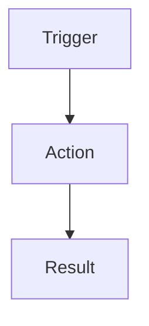

# 🚗 Roadtrip

**Roadtrip** is a local-first, prompt-first project operating system for people who build software with AI and want to keep context, decisions, features, chats, sprints, analyses and long-term project memory under control.

Roadtrip is not just a feature tracker. It is the structured layer between:

* projects and ideas
* planned and implemented features
* notes and source context
* main chats and sprint chats
* sprint starts and sprint handoffs
* AI prompts and human review
* code analysis and feature cleanup
* sync, backup and recovery
* documentation, audits and long-term project memory

The goal is simple:

> **Build iteratively without losing the map.**

---

## What Roadtrip is for

Roadtrip helps you:

* manage multiple software projects in one place
* keep planned features and implemented features separate
* enrich planned features with implementation context
* prepare sprint starts and sprint handoffs for AI-assisted work
* route context between Roadtrip, a main chat and sprint/execution chats
* preserve notes, decisions, resources, analyses and open questions
* generate structured prompts for GPT, Codex, Codex Cloud and similar tools
* review proposed features, duplicate candidates and analysis results deliberately
* export, back up and optionally sync your local project data
* avoid losing context across many small AI-assisted development conversations

Roadtrip is especially useful when an AI-assisted project has many conversations, small decisions, follow-up features and partial implementations that would otherwise be scattered across chat history.

Roadtrip does **not** try to replace human review. It is designed to keep the human in control:

> **AI proposes. Roadtrip structures. The user decides.**

---

## Core idea

Roadtrip treats software development as a loop of structured context:

```text
Idea
→ Structure
→ Sprint
→ Build
→ Analyze
→ Review
→ Learn
→ Build something slightly more complex
```

It is built for iterative AI-assisted development where the biggest risk is not only bad code, but losing the reasoning, decisions, feature intent and project memory behind that code.

Roadtrip’s job is to preserve the map.

---

## Core areas

### Projects

Projects are the main workspace. A project can hold:

* title and summary
* current focus
* next step
* status
* resources and repository references
* notes
* chats
* sprints
* handoffs
* feature context
* analysis results

Projects are the central unit for bringing together app ideas, sprint planning, technical decisions, feature state and open questions.

---

### Feature Database

Roadtrip separates:

* **planned features** — desired state, roadmap, ideas and future work
* **implemented features** — actual detected, imported or confirmed state

This enables Soll-/Ist thinking: what should exist vs. what already exists.

The Feature Database is one of Roadtrip’s core systems. It helps avoid mixing up:

* what was merely proposed
* what was selected for a sprint
* what Codex claimed to implement
* what was actually detected in the code
* what needs review
* what should be refined later

---

### Planned Features

Planned Features can be edited, enriched and refined inside Roadtrip.

Current workflow building blocks include:

* Planned Feature Editing
* detail fields for `purpose`, `workflowContext`, `acceptanceCriteria` and `sourceContext`
* open questions
* source / handoff context
* optional `featureFlow`
* Mermaid Preview for valid filled `featureFlow`
* Backfill / Hauptchat-Abgleich for enriching sparse planned features from main chat context
* use of detail fields in sprint-start, main-chat, Codex, analysis, import and cleanup prompts
* defensive updates through handoff imports
* protection against accidentally overwriting implemented features

Planned Feature detail fields are meant to make Codex prompts and sprint planning more precise. Instead of only sending a feature title to an AI tool, Roadtrip can include the purpose, workflow context, acceptance criteria and source context that explain what the feature is really supposed to do.

---

### FeatureFlow and Mermaid Preview

Roadtrip supports an optional `featureFlow` field for planned features.

This field is for Mermaid source code, preferably:



Rules for `featureFlow`:

* `featureFlow` may be empty.
* If filled, it should contain valid Mermaid code only.
* Prefer `flowchart TD`.
* Do not store prose, Markdown fences, pseudo-code or JSON in the `featureFlow` field.
* Mermaid Preview is visual only.
* Rendering should not change the saved source text.
* Render errors should be visible but non-destructive.
* Prose-like legacy values are guarded so they are not blindly rendered as Mermaid.

This field is useful for modeling workflows, data flows, UI flows and feature logic before implementation.

---

### Notes Workspace

The Notes Workspace keeps project notes and working context close to the projects and features they support.

It is intended to stay calm, minimal and useful for long-running project memory.

Possible note content includes:

* project ideas
* implementation notes
* source context
* architecture thoughts
* code analysis notes
* sprint observations
* manual decisions
* future feature candidates

The Notes Workspace is not meant to become a noisy dashboard. Its purpose is to keep useful context available without turning every thought into a feature immediately.

---

### Chats

Roadtrip tracks chat context so project memory is not trapped in one conversation.

It distinguishes:

* main chats
* sprint chats
* related working chats
* active contexts
* completed contexts
* hidden contexts
* legacy chat structures

The main chat is the long-running project context. Sprint chats are focused execution or planning chats for specific sprints. Roadtrip helps move information between them through structured handoffs.

---

### Sprints and Handoffs

Roadtrip supports a prompt-driven sprint loop:

```text
Roadtrip → Main Chat → Roadtrip → Sprint Chat → Roadtrip → Main Chat
```

Current sprint workflow building blocks include:

* Sprint-Dock / consolidated sprint cycle
* Sprintstart prompt generation
* Sprintabschluss / sprint completion handoff
* Next-Sprint-/Hauptchat-Handoff
* Rückführungs-/Hauptchat-Prompt after sprint completion
* Arbeitsmodus-Dropdown for Codex steering vs. direct mode
* structured JSON imports for sprint results
* defensive project focus / next-step updates

The Sprint-Dock is the primary sprint control surface inside the project workspace. Older manual sprint tools are kept as legacy/manual details but are no longer the main path.

---

## Main Chat Workflow

Roadtrip distinguishes between a long-running project main chat and smaller sprint or execution chats.

The project main chat is used for:

* long-term project context
* sprint selection
* architecture decisions
* feature direction
* next-step planning
* interpreting sprint handoffs
* deciding what to do next

Sprint chats are used for:

* tightly scoped sprint planning
* Codex prompt design
* review of Codex results
* sprint completion reports
* structured handoffs back into Roadtrip

Roadtrip can generate prompts for both directions:

* Roadtrip → main chat
* main chat → Roadtrip
* Roadtrip → sprint chat
* sprint chat → Roadtrip
* sprint chat → main chat

---

## Hauptchat-Abgleich and Sprintstart Carryover

Roadtrip currently has two different ways to bring main-chat context back into the Feature Database.

### Large Hauptchat-Abgleich

This is a deliberate, broader main-chat analysis. It is useful when the main chat has accumulated many decisions, feature ideas or architectural changes.

It can return:

* recommended next sprint
* planned feature updates
* new proposed features
* open questions
* deferred ideas
* project focus updates

### Small Sprintstart Carryover

The normal sprint start can also ask for a small carryover from the main chat.

This is not a full audit. It is meant to avoid context loss by regularly carrying small updates back into Roadtrip:

* small planned feature updates
* new proposed features
* open questions
* small context notes
* deferred ideas

The goal is to reduce the need for the user to remember to manually transfer every small idea from the main chat into Roadtrip.

---

## Duplicate Review

Roadtrip makes skipped feature candidates visible instead of silently losing them.

When an imported proposed feature looks like a duplicate, Roadtrip can show a review card comparing:

* the existing feature
* the imported candidate
* title
* description
* purpose
* workflow context
* acceptance criteria
* source context
* open questions
* `featureFlow`

Current actions include:

* ignore
* fill only empty fields on the existing planned feature
* create candidate as new planned feature
* save for later review
* adopt import candidate as the better version while preserving the existing feature ID

Implemented features are protected and should not be overwritten through planned-feature import workflows.

This pattern keeps Roadtrip conservative: possible duplicates are not blindly imported, but they are also not silently discarded.

---

## Import and Analysis Workspace

Roadtrip can process several kinds of external or AI-generated input:

* pasted HTML / code
* structured analysis JSON
* handoff JSON
* proposed features
* sprint completion reports
* main-chat handoffs
* code analysis results
* cleanup proposals

The Import Workspace also contains prompt generators for AI-assisted analysis workflows.

Known UX direction:

* the Import Workspace is powerful but increasingly crowded
* future polish should group tools more clearly
* after copying a Codex prompt, irrelevant fields should collapse or become less prominent
* the next relevant JSON input should be easier to find
* first imports should be able to handle proposal batches more efficiently

---

## Codex Code Analysis Prompt & Cloud JSON

Roadtrip can generate code-analysis prompts without calling Codex automatically.

There are currently two main prompt paths:

### 1. Fallback Prompt

Roadtrip generates a prompt that can be copied into a normal GPT or Codex steering chat.

### 2. Codex Cloud Prompt

Roadtrip generates a prompt for Codex Cloud working on a GitHub repository or branch.

The intended result is not an app-code change. The result should be Roadtrip-compatible analysis JSON that can be pasted back into the existing analysis JSON input.

The flow is:

```text
Roadtrip prompt
→ GPT / Codex / Codex Cloud
→ analysis JSON
→ Roadtrip analysis JSON input
→ cleanup / code-analysis import
→ Feature Database review
```

The MVP deliberately does **not** include:

* automatic Codex execution
* GitHub API integration
* local folder analysis
* a new import path
* automatic merging of analysis results without review

---

## Code Analysis Direction

Roadtrip’s future code-analysis workflow should distinguish between analysis modes.

Planned modes include:

* full analysis / first import
* planned-feature match
* sprint delta since last code analysis
* single-feature code check
* architecture / risk check

The standard after a reliable baseline should not be a full analysis every time. A more token-efficient default is:

```text
Use the known Roadtrip project state.
Check whether these planned features are implemented, partially implemented or still missing in the current code.
Report only meaningful changes, evidence and uncertainties.
```

A planned future direction is to include compact sprint-delta context:

* sprints since last completed code analysis
* sprint goals
* reported implementation results
* claimed changed areas
* features affected

This would let GPT or Codex verify whether reported sprint work is actually present in the code.

Important lifecycle rule:

A marker such as `lastCodeAnalysisCompletedAt` should only be updated after the analysis was imported, reviewed and deliberately marked as cleanly completed. A started or failed analysis must not hide still-unchecked sprints from future delta prompts.

---

## Sync and Backup

Roadtrip is local-first, but supports several safety and portability paths.

### Local persistence

Roadtrip uses:

* IndexedDB-first persistence
* localStorage fallback
* export and recovery paths

### Export and backup

Roadtrip supports or is designed around:

* JSON Export / Import
* ZIP Backup
* compact exports
* emergency / recovery exports
* recovery-oriented state transfer

### GitHub Gist Sync

Roadtrip supports optional GitHub-Gist-Sync.

Known sync characteristics include:

* encrypted main Gist
* passphrase gate
* local-first state
* No-Op fingerprinting
* Tombstone merge
* fresh / empty browser-state handling in the normal sync flow
* danger-zone separation for riskier remote overwrite actions

### Tombstones

Roadtrip uses tombstones to reduce the risk that deleted entities reappear during merge or sync.

Tombstones and trash / recovery are different concepts:

* Tombstones protect sync-stable deletion.
* Trash or backup paths support user recovery.

Tombstone lifecycle and pruning are active design topics.

---

## Sync-Safety Audits

Roadtrip has recently been analyzed against a detailed Daily-Log sync reference.

Relevant docs:

* `docs/reference/daily-log-sync-reference.md`
* `docs/audits/roadtrip-sync-safety-audit.md`
* `docs/handoffs/roadtrip-sync-safety-audit-handoff.md`

The audit found that Roadtrip sync is not simply broken, but several write paths need stronger safety semantics.

Key findings:

* direct remote overwrite / `gistPush()` needs stronger preflight, empty-state protection and revision protection
* normal read-merge-write sync needs protection against parallel-device writes between GET and PATCH
* remote writes should eventually be followed by readback and validation
* write failures must not produce false success messages
* runtime / freshness / dirty state should roll back or become clearly unsafe after write errors
* local persistence completion should be confirmed before reporting success
* destructive actions should create automatic snapshots
* whole-entity last-write-wins is not enough for Roadtrip’s complex linked entities
* raw backup recovery paths need clearer privacy and safety contracts

Current priority:

```text
Sync-Safety before more analysis features and before UI polish.
```

---

## Current Sync-Safety Roadmap

The current recommended Sync-Safety sequence is:

1. Structured Sync Results & Write Rollback
2. Remote Readback & Write Verification
3. Force Push with Preflight, Empty-State Gate and Snapshot
4. Optimistic Concurrency / Revision Protection
5. Awaitable Local Persistence Completion
6. Versioned Schema and Reference Validator
7. Automatic Pre-Destruction Snapshots
8. Entity-Specific Conflict Preview
9. Tombstone Lifecycle and Restore Contract
10. Protected Raw-Backup Recovery Path

The first planned code sprint is intentionally narrow:

```text
Structured Sync Results & Write Rollback
```

It should not turn into a full sync rewrite.

---

## Trello Integration

Roadtrip has optional Trello integration.

Trello is not the core data layer. It is an optional workflow channel.

Possible future directions:

* improved Trello labels / status names
* active sprint sync
* later connection with time tracking
* optional Toggl integration only after an internal time-tracking MVP exists

---

## Sprint Time Tracking Direction

A future Roadtrip feature may add internal sprint time tracking.

Preferred MVP direction:

* active sprints overview
* start / stop per active sprint
* only one running timer at a time
* local time segments
* sprint / project totals
* CSV export

External Toggl or Trello integrations should come later. An internal Roadtrip stopwatch is simpler and more robust.

---

## Documentation and Wiki Workflows

Roadtrip is also becoming a documentation and project-memory system.

Potential and partially documented directions include:

* GitHub Wiki setup prompts
* Wiki start prompts based on Roadtrip project data
* Codex-assisted local wiki generation
* Wiki update prompts based on handoffs since the last wiki update
* optional two-step update: code analysis plus handoff delta
* user-owned manual notes in wiki files
* frontmatter for AI-generated / manual / protected sections
* Roadtrip best practices and tutorials
* app-specific wiki styling through GitHub Wiki customization where useful

Roadtrip already has a GitHub Wiki with usage guides, mental models, workflows, architecture notes and feature explanations:

👉 [Open the Roadtrip Handbook](https://github.com/kerimm93/roadtrip/wiki)

---

## Roadmap — Direction, Not Finished Features

The following topics are intentionally documented as direction. They should **not** be treated as implemented until a future sprint explicitly builds and reviews them.

### Sync and safety

* Remote Readback & Write Verification
* Force Push Preflight / Snapshot
* Optimistic Concurrency / CAS / Revision Protection
* Schema and Reference Validator
* Entity-Specific Conflict Preview
* Tombstone Lifecycle and Restore Contract
* Protected Raw Backup Recovery

### Analysis

* Code Analysis Modes
* Sprint-Delta Code Analysis
* Markdown follow-up reports with recommendations and learnings
* local Codex analysis folder / CLI workflow
* risk-aware code-analysis import with stronger update classification

### Import and Feature Database

* Import Workspace UI polish
* first-import proposal batch acceptance
* Duplicate Review UI simplification
* Open Questions Workspace
* answers to open questions as feature cleanup input
* CSV export for planned / implemented features

### Project Memory and Migration

* Planned Feature Export / Migration Bundle
* Hauptchat Migration / Mainchat Rollover
* app-wide / ecosystem-wide meta main chat
* cross-project handoffs and prioritization
* project lineage / forks

### Documentation and Learning

* SOP extraction from sprint handoffs
* Developer Diary / Handoff Journal
* learning recommendations from project history
* Roadtrip tutorials and best-practice documentation
* GitHub Wiki maintenance workflow

### Visualization and UI

* Relationship Map / Project Graph
* Obsidian Canvas Export
* UI / button / view audit
* UI redesign briefing from prototype screenshots
* UI redesign in small stages

---

## Technical Direction

Roadtrip 1.x is intentionally lightweight:

* Single-file HTML app (`index.html`)
* Vanilla JavaScript
* CSS Custom Properties
* no framework
* no backend requirement
* no build step
* local-first storage
* IndexedDB-first with localStorage fallback
* JSON / ZIP backup paths
* optional encrypted Gist sync
* optional Trello integration

This makes Roadtrip portable, inspectable, easy to back up and friendly to small, minimal-invasive patches.

---

## Development Principles

Roadtrip development follows several practical rules:

* local-first before cloud-first
* prompt-first before hidden automation
* small reviewed sprints before large rewrites
* defensive imports before blind overwrite
* implemented features must be protected
* skipped candidates should be reviewable, not silently lost
* JSON is for machine import
* Markdown is for human review and planning
* sync is not backup
* backup and recovery need independent paths
* docs-only audits should precede risky code changes
* prompt contracts must be explicit when fields have machine meaning
* user review stays in the loop

---

## AI Workflow Philosophy

Roadtrip follows one core principle:

> **AI should accelerate learning — not replace understanding.**

The intended workflow is deliberate:

```text
Roadtrip structures context.
AI proposes.
The user reviews.
Roadtrip preserves the decision.
```

This reduces cognitive overload, preserves context, separates signal from noise and keeps learning attached to building.

---

## Repository Documentation

Important documentation areas include:

* `AGENTS.md` — rules for Codex / agent work
* `DECISIONS.md` — product and architecture decisions
* `docs/DESIGN.md` — design contract and visual direction
* `docs/ARCHITECTURE.md` — architecture, protected paths and technical contracts
* `docs/audits/` — audit reports
* `docs/handoffs/` — sprint and analysis handoffs
* `docs/reference/` — reusable reference reports
* `docs/sync/` — sync-specific documentation, if present
* `README.md` — project overview

These documents are part of the operating system. They are not only passive documentation; they help steer future Codex, GPT and sprint work.

---

## Installation / Usage

Roadtrip is a Single-File Web App.

Typical local usage:

1. Clone the repository.
2. Open `index.html` in a browser.
3. Optionally serve the folder through a local development server.
4. Use Roadtrip locally.
5. Export JSON or ZIP backups regularly.
6. Configure optional GitHub-Gist-Sync only when needed.

Example local server:

```bash
python3 -m http.server 8000
```

Then open:

```text
http://localhost:8000
```

---

## Development Checks

For code changes, run at least:

```bash
git status
git diff --name-only
git diff --check
```

Syntax-check inline scripts in the Single-File HTML app:

```bash
node -e "const fs=require('fs');const vm=require('vm');const c=fs.readFileSync('index.html','utf8');const scripts=[];let m;const re=/<script(?![^>]*src)[^>]*>([\\s\\S]*?)<\\/script>/gi;while((m=re.exec(c))!==null)scripts.push(m[1]);new vm.Script(scripts.join('\\n'));console.log('JS OK');"
```

For sync, import, backup or persistence changes:

* read the relevant audit / architecture docs first
* avoid productive Gist writes during tests
* do not test destructive actions without backups
* document scope, changed files, test results and remaining risks in a handoff
* keep Sync-Safety changes small and staged

---

## Current Status

Roadtrip is actively evolving.

It is both:

* a real daily project operating system
* a long-term architecture, workflow and learning experiment

Current product direction:

```text
Sync-Safety
→ Code Analysis Precision
→ Import Workspace Polish
→ Migration Bundle / Mainchat Rollover
→ Wiki and Documentation Workflows
→ UI Redesign in stages
```

Current immediate technical priority:

```text
Structured Sync Results & Write Rollback
```

---

## License

Not yet specified.

---

## Note

Roadtrip is a personal local-first project operating system for AI-assisted software development. It is not designed as a multi-user SaaS, team platform or general-purpose public project management tool.

Data integrity, backup and sync safety are actively being improved. Regular JSON / ZIP exports remain important.
